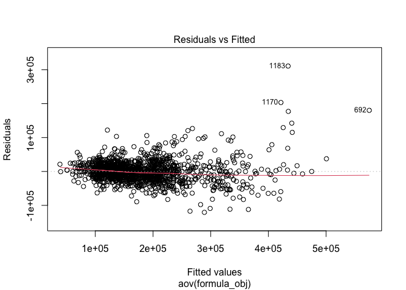
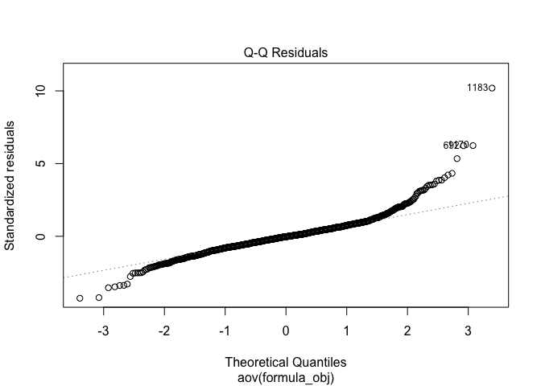
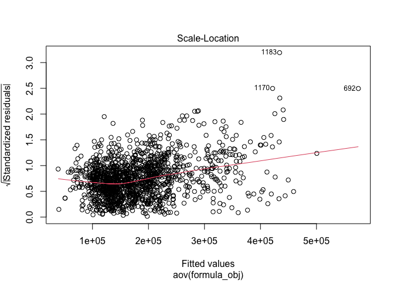
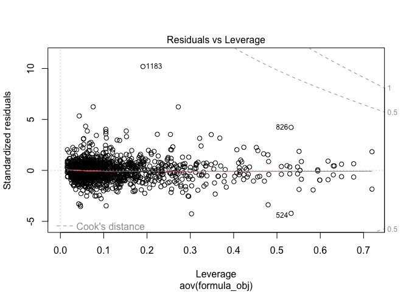

Housing Prices Regression
================
Christopher Thompson
2025-05-14

### Load Data Set

Load in the “House Prices - Advanced Regression Techniques” data set
from kaggle.

``` r
iowa.homes <- read.csv("../project/house-prices-data/train.csv", header=TRUE, sep=",") 
```

### Explore Missing Values Part 1

Below we can see that there are a number of variables with missing data.
The most concerning features are LotFrontage, FireplaceQu, Fence,
MiscFeature, as they have very large amounts (15% - 99%) of data absent.
For Alley, MiscFeature, PoolQC, FireplaceQu, Fence, these are homes that
do not have an alley, a miscelaneous feature (ie. elevator, 2nd Garage,
Shed, Tennis Court, other), a pool, fireplace, or a fence. LotFrontage
represents the amount of space between the street and the start of the
lot, and its possible that these NA values are due to no measurement
being made or no space between the lot and the street. The features with
40% or more missing data (Alley, MiscFeature, PoolQC, FireplaceQu, and
Fence) will be removed and new binary features (HasAlley,
HasMiscFeature, HasFireplace, HasFence) will be added.

``` r
# get percentage of missing data for each column
na.percentages <- sort(colMeans(is.na(iowa.homes)) * 100)

#create df of missing data percentage information
na.df <- data.frame(
  feature = names(na.percentages),
  percentage_na = na.percentages
)

#subset df to only contain features with some missing data
na.df <- na.df[na.df$percentage_na > 0,]

#plot feature by missing data percentage to visualize
ggplot(data=na.df, aes(x = reorder(feature, percentage_na), y = percentage_na)) + 
  geom_col(fill = "lightblue") +
  theme_dark() +
  theme(axis.text.x=element_text(angle=90), plot.title = element_text(hjust = 0.5)) +
  labs(x = "Feature Name", y = "% Missing", title = "Features With Missing Data")
```

<!-- -->

``` r
#print data frame to display numeric percentages for each feature
na.df
```

    ##                   feature percentage_na
    ## Electrical     Electrical    0.06849315
    ## MasVnrType     MasVnrType    0.54794521
    ## MasVnrArea     MasVnrArea    0.54794521
    ## BsmtQual         BsmtQual    2.53424658
    ## BsmtCond         BsmtCond    2.53424658
    ## BsmtFinType1 BsmtFinType1    2.53424658
    ## BsmtExposure BsmtExposure    2.60273973
    ## BsmtFinType2 BsmtFinType2    2.60273973
    ## GarageType     GarageType    5.54794521
    ## GarageYrBlt   GarageYrBlt    5.54794521
    ## GarageFinish GarageFinish    5.54794521
    ## GarageQual     GarageQual    5.54794521
    ## GarageCond     GarageCond    5.54794521
    ## LotFrontage   LotFrontage   17.73972603
    ## FireplaceQu   FireplaceQu   47.26027397
    ## Fence               Fence   80.75342466
    ## Alley               Alley   93.76712329
    ## MiscFeature   MiscFeature   96.30136986
    ## PoolQC             PoolQC   99.52054795

### Feature Engineer Part 1

Below I will be adding new binary features HasAlley, HasMiscFeature,
HasFireplace, HasFence and removing those with large amounts of missing
data (NA \> 40%).

``` r
features_to_remove <- na.df$feature[na.df$percentage_na > 40]

#add new binary feature "HasBsmt"
iowa.homes <- iowa.homes %>%
  mutate(HasAlley = case_when(
    is.na(Alley) ~ 'no', .default = 'yes')
  )

#add new binary feature "HasMiscFeature"
iowa.homes <- iowa.homes %>%
  mutate(HasMiscFeature = case_when(
    is.na(MiscFeature) ~ 'no', .default = 'yes')
  )

#add new binary feature "HasFireplace"
iowa.homes <- iowa.homes %>%
  mutate(HasFireplace = case_when(
    is.na(FireplaceQu) ~ 'no', .default = 'yes')
  )

#add new binary feature "HasFence"
iowa.homes <- iowa.homes %>%
  mutate(HasFence = case_when(
    is.na(Fence) ~ 'no', .default = 'yes')
  )

#add new binary feature "HasPool"
iowa.homes <- iowa.homes %>%
  mutate(HasPool = case_when(
    is.na(PoolQC) ~ 'no', .default = 'yes')
  )

#add new binary feature "HasBsmt"
iowa.homes <- iowa.homes %>%
  mutate(HasBsmt = case_when(
    is.na(BsmtQual) ~ 'no', .default = 'yes')
  )

#remove columns with large amounts of missing data
iowa.homes <- iowa.homes[, colMeans(is.na(iowa.homes)) <= 0.4]
```

### Visualize New Binary Features

From the visualizations below, we can see that there is not a huge
difference in means for a house having a miscellaneous feature or not,
having and alley or not, having a fence or not. However, there seems to
be a significant difference in means for a house that has a pool
vs. not, where homes with a pool seems to be significantly more
expensive, and homes with a fireplace are also more expensive. I will
therefore remove the HasAlley, HasFence, and HasMiscFeature columns, but
will keep the HasPool, and HasFireplace features.

I also decided to look at the other two binary vars, ‘Street’,
‘Utilities’, and ‘CentralAir’ to visualize any difference in the
saleprice between the two levels. Because there are so few values in the
NoSeWa and because the mean sale price of this variable appears to be
fairly close to the mean sale price of AllPub, I will remove this
feature from the data set. However, the difference in mean and variance
from analysis of the box plots for ‘Street’ and ‘CentralAir’ do seem to
be statistically significant and indicate that these features may be
associated with home sale price.

``` r
# turn new binary variable to factor type
iowa.homes$HasMiscFeature <- factor(iowa.homes$HasMiscFeature)
iowa.homes$HasAlley <- factor(iowa.homes$HasAlley)
iowa.homes$HasFence <- factor(iowa.homes$HasFence)
iowa.homes$HasFireplace <- factor(iowa.homes$HasFireplace)
iowa.homes$HasPool <- factor(iowa.homes$HasPool)
iowa.homes$HasBsmt <- factor(iowa.homes$HasBsmt)

#visualize data
ggplot(data = iowa.homes, aes(x=HasMiscFeature, y=SalePrice)) + geom_boxplot()
```

<!-- -->

``` r
ggplot(data = iowa.homes, aes(x=HasAlley, y=SalePrice)) + geom_boxplot()
```

<!-- -->

``` r
ggplot(data = iowa.homes, aes(x=HasFence, y=SalePrice)) + geom_boxplot()
```

<!-- -->

``` r
ggplot(data = iowa.homes, aes(x=HasFireplace, y=SalePrice)) + geom_boxplot()
```

<!-- -->

``` r
ggplot(data = iowa.homes, aes(x=HasPool, y=SalePrice)) + geom_boxplot()
```

<!-- -->

``` r
ggplot(data = iowa.homes, aes(x=HasBsmt, y=SalePrice)) + geom_boxplot()
```

<!-- -->

``` r
ggplot(data = iowa.homes, aes(x=Street, y=SalePrice)) + geom_boxplot()
```

<!-- -->

``` r
ggplot(data = iowa.homes, aes(x=Street, y=SalePrice)) + geom_boxplot()
```

<!-- -->

``` r
ggplot(data = iowa.homes, aes(x=Utilities, y=SalePrice)) + geom_boxplot()
```

<!-- -->

``` r
ggplot(data = iowa.homes, aes(x=CentralAir, y=SalePrice)) + geom_boxplot()
```

<!-- -->

``` r
#remove HasAlley, HasFence, HasMiscFeature
to_drop <- c("HasAlley", "HasMiscFeature", "HasFence", "Street")
iowa.homes <- iowa.homes %>% select(-any_of(to_drop))
```

``` r
numeric_cols <- iowa.homes %>% select(where(is.numeric), -SalePrice) %>% names()
categorical_cols <- iowa.homes %>% select(where(~ is.factor(.) || is.character(.))) %>% names()
# categorical_cols <- sapply(iowa.homes, negate(is.numeric))
```

### Replace Categorical NAs with ‘None’

Below I replace NA with “None” in remaining features that represent the
feature not being present so we do not remove features where this data
is missing.

``` r
to_replace <- c("GarageType","GarageFinish","GarageQual","GarageCond",
               "BsmtFinType1","BsmtFinType2","BsmtExposure","BsmtCond","BsmtQual",
               "MasVnrType")

# replace missing data with 'None' in specified columns
iowa.homes <- iowa.homes %>% 
  mutate_at(to_replace, ~replace_na(.,"None"))
```

### Remaining Features With Missing Data

As we can see, we have managed to take care of a large number of the
variables that had missing data, especially those with large percents of
missing data. However, we still have to decide how to treat missing data
in ‘Electrical’, ‘MassVnrArea’, ‘GarageYearBuilt’, and ‘LotFrontage’.

``` r
# get percentage of missing data for each column
na.percentages <- sort(colMeans(is.na(iowa.homes)) * 100)

#create df of missing data percentage information
na.df <- data.frame(
  feature = names(na.percentages),
  percentage_na = na.percentages
)

#subset df to only contain features with some missing data
na.df <- na.df[na.df$percentage_na > 0,]
na.df
```

    ##                 feature percentage_na
    ## Electrical   Electrical    0.06849315
    ## MasVnrArea   MasVnrArea    0.54794521
    ## GarageYrBlt GarageYrBlt    5.54794521
    ## LotFrontage LotFrontage   17.73972603

``` r
#plot feature by missing data percentage to visualize
ggplot(data=na.df, aes(x = reorder(feature, percentage_na), y = percentage_na)) + 
  geom_col(fill = "lightblue") +
  theme_dark() +
  theme(axis.text.x=element_text(angle=90), plot.title = element_text(hjust = 0.5)) +
  labs(x = "Feature Name", y = "% Missing", title = "Features With Missing Data")
```

<!-- -->

### Replace NA’s in Remaining Categorical Features

Read comments below to understand what NA’s get replaced by for the
remaining features with missing data.

``` r
# set to 0 representing homes without a garage
iowa.homes <- iowa.homes %>%
  mutate(GarageYrBlt=replace_na(GarageYrBlt, 0))

# replace missing data in 'Electrical' feature with "no_info"
iowa.homes <- iowa.homes %>%
  mutate(Electrical=replace_na(Electrical, "no_info"))

#replace missing data in 'MasVnrArea' with 0, as this is not part of home
iowa.homes <- iowa.homes %>%
  mutate(MasVnrArea=replace_na(MasVnrArea, 0))

#replace missing 'LotFrontage' data with median
iowa.homes <- iowa.homes %>%
  mutate(LotFrontage=replace_na(LotFrontage, median(iowa.homes$LotFrontage, na.rm = TRUE)))
```

### Check for Missing Data

Now we can see that there are no longer any columns with missing data.

``` r
# get percentage of missing data for each column
na.percentages <- sort(colMeans(is.na(iowa.homes)) * 100)

#create df of missing data percentage information
na.df <- data.frame(
  feature = names(na.percentages),
  percentage_na = na.percentages
)

#subset df to only contain features with some missing data
na.df <- na.df[na.df$percentage_na > 0,]
na.df
```

    ## [1] feature       percentage_na
    ## <0 rows> (or 0-length row.names)

### Set Categorical Variables to Factor Type

``` r
iowa.homes[categorical_cols] <- lapply(iowa.homes[categorical_cols], as.factor)
str(iowa.homes)
```

    ## 'data.frame':    1460 obs. of  78 variables:
    ##  $ Id           : int  1 2 3 4 5 6 7 8 9 10 ...
    ##  $ MSSubClass   : int  60 20 60 70 60 50 20 60 50 190 ...
    ##  $ MSZoning     : Factor w/ 5 levels "C (all)","FV",..: 4 4 4 4 4 4 4 4 5 4 ...
    ##  $ LotFrontage  : int  65 80 68 60 84 85 75 69 51 50 ...
    ##  $ LotArea      : int  8450 9600 11250 9550 14260 14115 10084 10382 6120 7420 ...
    ##  $ LotShape     : Factor w/ 4 levels "IR1","IR2","IR3",..: 4 4 1 1 1 1 4 1 4 4 ...
    ##  $ LandContour  : Factor w/ 4 levels "Bnk","HLS","Low",..: 4 4 4 4 4 4 4 4 4 4 ...
    ##  $ Utilities    : Factor w/ 2 levels "AllPub","NoSeWa": 1 1 1 1 1 1 1 1 1 1 ...
    ##  $ LotConfig    : Factor w/ 5 levels "Corner","CulDSac",..: 5 3 5 1 3 5 5 1 5 1 ...
    ##  $ LandSlope    : Factor w/ 3 levels "Gtl","Mod","Sev": 1 1 1 1 1 1 1 1 1 1 ...
    ##  $ Neighborhood : Factor w/ 25 levels "Blmngtn","Blueste",..: 6 25 6 7 14 12 21 17 18 4 ...
    ##  $ Condition1   : Factor w/ 9 levels "Artery","Feedr",..: 3 2 3 3 3 3 3 5 1 1 ...
    ##  $ Condition2   : Factor w/ 8 levels "Artery","Feedr",..: 3 3 3 3 3 3 3 3 3 1 ...
    ##  $ BldgType     : Factor w/ 5 levels "1Fam","2fmCon",..: 1 1 1 1 1 1 1 1 1 2 ...
    ##  $ HouseStyle   : Factor w/ 8 levels "1.5Fin","1.5Unf",..: 6 3 6 6 6 1 3 6 1 2 ...
    ##  $ OverallQual  : int  7 6 7 7 8 5 8 7 7 5 ...
    ##  $ OverallCond  : int  5 8 5 5 5 5 5 6 5 6 ...
    ##  $ YearBuilt    : int  2003 1976 2001 1915 2000 1993 2004 1973 1931 1939 ...
    ##  $ YearRemodAdd : int  2003 1976 2002 1970 2000 1995 2005 1973 1950 1950 ...
    ##  $ RoofStyle    : Factor w/ 6 levels "Flat","Gable",..: 2 2 2 2 2 2 2 2 2 2 ...
    ##  $ RoofMatl     : Factor w/ 8 levels "ClyTile","CompShg",..: 2 2 2 2 2 2 2 2 2 2 ...
    ##  $ Exterior1st  : Factor w/ 15 levels "AsbShng","AsphShn",..: 13 9 13 14 13 13 13 7 4 9 ...
    ##  $ Exterior2nd  : Factor w/ 16 levels "AsbShng","AsphShn",..: 14 9 14 16 14 14 14 7 16 9 ...
    ##  $ MasVnrType   : Factor w/ 4 levels "BrkCmn","BrkFace",..: 2 3 2 3 2 3 4 4 3 3 ...
    ##  $ MasVnrArea   : int  196 0 162 0 350 0 186 240 0 0 ...
    ##  $ ExterQual    : Factor w/ 4 levels "Ex","Fa","Gd",..: 3 4 3 4 3 4 3 4 4 4 ...
    ##  $ ExterCond    : Factor w/ 5 levels "Ex","Fa","Gd",..: 5 5 5 5 5 5 5 5 5 5 ...
    ##  $ Foundation   : Factor w/ 6 levels "BrkTil","CBlock",..: 3 2 3 1 3 6 3 2 1 1 ...
    ##  $ BsmtQual     : Factor w/ 5 levels "Ex","Fa","Gd",..: 3 3 3 5 3 3 1 3 5 5 ...
    ##  $ BsmtCond     : Factor w/ 5 levels "Fa","Gd","None",..: 5 5 5 2 5 5 5 5 5 5 ...
    ##  $ BsmtExposure : Factor w/ 5 levels "Av","Gd","Mn",..: 4 2 3 4 1 4 1 3 4 4 ...
    ##  $ BsmtFinType1 : Factor w/ 7 levels "ALQ","BLQ","GLQ",..: 3 1 3 1 3 3 3 1 7 3 ...
    ##  $ BsmtFinSF1   : int  706 978 486 216 655 732 1369 859 0 851 ...
    ##  $ BsmtFinType2 : Factor w/ 7 levels "ALQ","BLQ","GLQ",..: 7 7 7 7 7 7 7 2 7 7 ...
    ##  $ BsmtFinSF2   : int  0 0 0 0 0 0 0 32 0 0 ...
    ##  $ BsmtUnfSF    : int  150 284 434 540 490 64 317 216 952 140 ...
    ##  $ TotalBsmtSF  : int  856 1262 920 756 1145 796 1686 1107 952 991 ...
    ##  $ Heating      : Factor w/ 6 levels "Floor","GasA",..: 2 2 2 2 2 2 2 2 2 2 ...
    ##  $ HeatingQC    : Factor w/ 5 levels "Ex","Fa","Gd",..: 1 1 1 3 1 1 1 1 3 1 ...
    ##  $ CentralAir   : Factor w/ 2 levels "N","Y": 2 2 2 2 2 2 2 2 2 2 ...
    ##  $ Electrical   : Factor w/ 6 levels "FuseA","FuseF",..: 6 6 6 6 6 6 6 6 2 6 ...
    ##  $ X1stFlrSF    : int  856 1262 920 961 1145 796 1694 1107 1022 1077 ...
    ##  $ X2ndFlrSF    : int  854 0 866 756 1053 566 0 983 752 0 ...
    ##  $ LowQualFinSF : int  0 0 0 0 0 0 0 0 0 0 ...
    ##  $ GrLivArea    : int  1710 1262 1786 1717 2198 1362 1694 2090 1774 1077 ...
    ##  $ BsmtFullBath : int  1 0 1 1 1 1 1 1 0 1 ...
    ##  $ BsmtHalfBath : int  0 1 0 0 0 0 0 0 0 0 ...
    ##  $ FullBath     : int  2 2 2 1 2 1 2 2 2 1 ...
    ##  $ HalfBath     : int  1 0 1 0 1 1 0 1 0 0 ...
    ##  $ BedroomAbvGr : int  3 3 3 3 4 1 3 3 2 2 ...
    ##  $ KitchenAbvGr : int  1 1 1 1 1 1 1 1 2 2 ...
    ##  $ KitchenQual  : Factor w/ 4 levels "Ex","Fa","Gd",..: 3 4 3 3 3 4 3 4 4 4 ...
    ##  $ TotRmsAbvGrd : int  8 6 6 7 9 5 7 7 8 5 ...
    ##  $ Functional   : Factor w/ 7 levels "Maj1","Maj2",..: 7 7 7 7 7 7 7 7 3 7 ...
    ##  $ Fireplaces   : int  0 1 1 1 1 0 1 2 2 2 ...
    ##  $ GarageType   : Factor w/ 7 levels "2Types","Attchd",..: 2 2 2 6 2 2 2 2 6 2 ...
    ##  $ GarageYrBlt  : int  2003 1976 2001 1998 2000 1993 2004 1973 1931 1939 ...
    ##  $ GarageFinish : Factor w/ 4 levels "Fin","None","RFn",..: 3 3 3 4 3 4 3 3 4 3 ...
    ##  $ GarageCars   : int  2 2 2 3 3 2 2 2 2 1 ...
    ##  $ GarageArea   : int  548 460 608 642 836 480 636 484 468 205 ...
    ##  $ GarageQual   : Factor w/ 6 levels "Ex","Fa","Gd",..: 6 6 6 6 6 6 6 6 2 3 ...
    ##  $ GarageCond   : Factor w/ 6 levels "Ex","Fa","Gd",..: 6 6 6 6 6 6 6 6 6 6 ...
    ##  $ PavedDrive   : Factor w/ 3 levels "N","P","Y": 3 3 3 3 3 3 3 3 3 3 ...
    ##  $ WoodDeckSF   : int  0 298 0 0 192 40 255 235 90 0 ...
    ##  $ OpenPorchSF  : int  61 0 42 35 84 30 57 204 0 4 ...
    ##  $ EnclosedPorch: int  0 0 0 272 0 0 0 228 205 0 ...
    ##  $ X3SsnPorch   : int  0 0 0 0 0 320 0 0 0 0 ...
    ##  $ ScreenPorch  : int  0 0 0 0 0 0 0 0 0 0 ...
    ##  $ PoolArea     : int  0 0 0 0 0 0 0 0 0 0 ...
    ##  $ MiscVal      : int  0 0 0 0 0 700 0 350 0 0 ...
    ##  $ MoSold       : int  2 5 9 2 12 10 8 11 4 1 ...
    ##  $ YrSold       : int  2008 2007 2008 2006 2008 2009 2007 2009 2008 2008 ...
    ##  $ SaleType     : Factor w/ 9 levels "COD","Con","ConLD",..: 9 9 9 9 9 9 9 9 9 9 ...
    ##  $ SaleCondition: Factor w/ 6 levels "Abnorml","AdjLand",..: 5 5 5 1 5 5 5 5 1 5 ...
    ##  $ SalePrice    : int  208500 181500 223500 140000 250000 143000 307000 200000 129900 118000 ...
    ##  $ HasFireplace : Factor w/ 2 levels "no","yes": 1 2 2 2 2 1 2 2 2 2 ...
    ##  $ HasPool      : Factor w/ 2 levels "no","yes": 1 1 1 1 1 1 1 1 1 1 ...
    ##  $ HasBsmt      : Factor w/ 2 levels "no","yes": 2 2 2 2 2 2 2 2 2 2 ...

### Create New Numeric Features (TotalSF, HouseAge)

Below I have created a new feature “TotalSF” which represents the total
surface area of each home. I felt that this would be a good feature to
include in the correlation analysis in the next step.

``` r
# sum relevant square footage measurements
iowa.homes <- iowa.homes %>%
  mutate(TotalSF = rowSums(iowa.homes[, c("TotalBsmtSF", "X1stFlrSF", "X2ndFlrSF", "X3SsnPorch")]))

iowa.homes <- iowa.homes %>%
  mutate(HouseAge = YrSold - YearBuilt)

iowa.homes <- iowa.homes %>% 
  mutate(RemodelAge = YrSold - YearRemodAdd)
```

### Numeric Feature Correlation With SalePrice

Below I have run a correlation analysis on the numeric features with
sale price. All features with correlations greater than 0.5 will be
included in the step-wise model selection portion of this project. Given
that ‘HouseAge’ shows a stronger correlation than ‘YrSold’ or
‘YearBuilt’ on their own, I will use ‘HouseAge’ in their place.
Similarly, ‘RemodelAge’ shows a tighter correlation with ‘SalePrice’
than ‘YearRemodAdd’ alone, and I will use ‘RemodelAge’ in its place.
Finally, ‘TotalSF’ shows a stronger correlation with ‘TotalBsmtSF’,
‘X1stFlrSF’, X2ndFlrSF’, and ‘X3SsnPorch’ on their own and I will use
‘TotalSF’ in their place.

``` r
#create correlation matrix that focuses on variabels correlation to SalePrice
correlation_matrix <- iowa.homes %>% select(where(is.numeric)) %>% correlate() %>% focus(SalePrice)
```

    ## Correlation computed with
    ## • Method: 'pearson'
    ## • Missing treated using: 'pairwise.complete.obs'

``` r
#plot correlations on bar plot
correlation_matrix %>%
  ggplot(aes(x = term, y = SalePrice)) +
    geom_bar(stat = "identity") +
    ylab("Correlation with Sale Price") +
    xlab("Variable") +
    theme(axis.text.x = element_text(angle = 90, vjust = 1, hjust=1))
```

<!-- -->

``` r
#get list of features with correlation > 0.5 for numeric features
correlated_numeric_cols <- c(correlation_matrix$term[abs(correlation_matrix$SalePrice) >= 0.5]) 
correlated_numeric_cols
```

    ##  [1] "OverallQual"  "YearBuilt"    "YearRemodAdd" "TotalBsmtSF"  "X1stFlrSF"   
    ##  [6] "GrLivArea"    "FullBath"     "TotRmsAbvGrd" "GarageCars"   "GarageArea"  
    ## [11] "TotalSF"      "HouseAge"     "RemodelAge"

### Correlated Variables

Below I look at some variables to see their level of correlation with
one another to determine if one can be used in place of another to
reduce the number of starting variables in the step-wise selection
process. I would like to use best-subset selection and it is recommended
to have no more than 40 variables given that it is an exhaustive
algorithm. In particular, GarageCars and GarageArea seemingly measure
something similar, amount of space in the garage.

They have a correlation of 0.88. I will use GarageArea in place of
GarageCars.

``` r
cor(iowa.homes$GarageArea, iowa.homes$GarageCars)
```

    ## [1] 0.8824754

### Clean Data Frame of Unnecessary Numeric Features

``` r
to_drop <- c("YrSold", "YearBuilt", "YearRemodAdd", "TotalBsmtSF", "X1stFlrSF", "X2ndFlrSF", "X3SsnPorch", "GarageCars")
iowa.homes <- iowa.homes %>% select(-any_of(to_drop))

#create correlation matrix that focuses on variabels correlation to SalePrice
correlation_matrix <- iowa.homes %>% select(where(is.numeric)) %>% correlate() %>% focus(SalePrice)
```

    ## Correlation computed with
    ## • Method: 'pearson'
    ## • Missing treated using: 'pairwise.complete.obs'

``` r
#get list of features with correlation > 0.5 for numeric features
correlated_numeric_cols <- c(correlation_matrix$term[abs(correlation_matrix$SalePrice) >= 0.5]) 
correlated_numeric_cols
```

    ## [1] "OverallQual"  "GrLivArea"    "FullBath"     "TotRmsAbvGrd" "GarageArea"  
    ## [6] "TotalSF"      "HouseAge"     "RemodelAge"

### Analysis of Variance Between Mutli-Level Factors

#### Get all Muti-Level Factors

Below I wrote some code to get all the categorical features with more
than 2 levels to run an anova on these features in the next step.

``` r
res <- sapply(iowa.homes, nlevels)

res.df <- data.frame(
  feature = names(res),
  num_levels = res
)

# subset df to only contain features with more than 2 levels
res.df1 <- (res.df[res.df$num_levels > 2,])
# subset df to only contain binary features
res.df2 <- (res.df[res.df$num_levels == 2,])

# create list of numeric features with more than 2 levels
ml_categorical_cols <- res.df1$feature
# create list of binary numeric features
binary_categorical_cols <- res.df2$feature
```

#### ANOVA on all Multi-Level Categorical Variables

Below I run and ANOVA (without interaction) on all of the categorical
features with more than 2 levels (non-binary). I did this to try and
assess which categorical features show an association with sale price
based on an f-statistic with a p-value \> 0.05. All statisticall
significant features from this step are grouped into a list
“signif_ml_categorical_cols” to be used in the step-wise model selection
portion.

The qqplot indicates the residuals are normally distributed and the
residuals vs. fitted plot shows the residuals have mostly equal variance
with some outliers.

``` r
# create formula for anova to run (w/o) interaction on the multilevel 
# categorical columns
formula_str <- paste("SalePrice ~ ", paste(ml_categorical_cols[-1], collapse = "+"))
formula_obj <- as.formula(formula_str)

# run anova normally to view summary
cat.aov <- aov(formula_obj, data = iowa.homes)

# run with anova tidy to get a dataframe like object for parsing easier
cat.aov.df <- broom::tidy(aov(formula_obj, data = iowa.homes))
cat.aov.df <- drop_na(cat.aov.df)

# show output of anova
summary(cat.aov)
```

    ##                 Df    Sum Sq   Mean Sq F value   Pr(>F)    
    ## LotShape         3 7.033e+11 2.344e+11 203.946  < 2e-16 ***
    ## LandContour      3 1.558e+11 5.195e+10  45.195  < 2e-16 ***
    ## LotConfig        4 2.299e+10 5.747e+09   5.000 0.000532 ***
    ## LandSlope        2 5.888e+09 2.944e+09   2.561 0.077610 .  
    ## Neighborhood    24 4.302e+12 1.793e+11 155.950  < 2e-16 ***
    ## Condition1       8 6.150e+10 7.687e+09   6.688 1.33e-08 ***
    ## Condition2       7 5.154e+10 7.363e+09   6.406 2.00e-07 ***
    ## BldgType         4 2.904e+11 7.261e+10  63.168  < 2e-16 ***
    ## HouseStyle       7 1.461e+11 2.087e+10  18.156  < 2e-16 ***
    ## RoofStyle        5 1.792e+11 3.583e+10  31.173  < 2e-16 ***
    ## RoofMatl         7 1.872e+11 2.674e+10  23.261  < 2e-16 ***
    ## Exterior1st     14 2.454e+11 1.753e+10  15.249  < 2e-16 ***
    ## Exterior2nd     14 5.391e+10 3.851e+09   3.350 2.53e-05 ***
    ## MasVnrType       3 1.784e+11 5.947e+10  51.742  < 2e-16 ***
    ## ExterQual        3 3.771e+11 1.257e+11 109.347  < 2e-16 ***
    ## ExterCond        4 1.753e+10 4.384e+09   3.814 0.004351 ** 
    ## Foundation       5 5.729e+10 1.146e+10   9.968 2.28e-09 ***
    ## BsmtQual         4 2.291e+11 5.727e+10  49.824  < 2e-16 ***
    ## BsmtCond         3 3.468e+09 1.156e+09   1.006 0.389307    
    ## BsmtExposure     4 1.484e+11 3.710e+10  32.277  < 2e-16 ***
    ## BsmtFinType1     5 4.751e+10 9.503e+09   8.267 1.07e-07 ***
    ## BsmtFinType2     6 3.476e+09 5.794e+08   0.504 0.805655    
    ## Heating          5 1.578e+10 3.156e+09   2.746 0.017834 *  
    ## HeatingQC        4 3.120e+10 7.799e+09   6.785 2.11e-05 ***
    ## Electrical       5 6.752e+09 1.350e+09   1.175 0.319340    
    ## KitchenQual      3 1.223e+11 4.078e+10  35.480  < 2e-16 ***
    ## Functional       6 1.033e+10 1.721e+09   1.497 0.175453    
    ## GarageType       6 3.487e+10 5.812e+09   5.057 3.88e-05 ***
    ## GarageFinish     2 8.126e+09 4.063e+09   3.535 0.029454 *  
    ## GarageQual       4 1.186e+10 2.964e+09   2.579 0.035950 *  
    ## GarageCond       4 1.294e+10 3.235e+09   2.815 0.024227 *  
    ## PavedDrive       2 1.426e+08 7.131e+07   0.062 0.939851    
    ## SaleType         8 1.939e+10 2.423e+09   2.108 0.032309 *  
    ## SaleCondition    5 1.159e+10 2.318e+09   2.017 0.073655 .  
    ## Residuals     1266 1.455e+12 1.149e+09                     
    ## ---
    ## Signif. codes:  0 '***' 0.001 '**' 0.01 '*' 0.05 '.' 0.1 ' ' 1

``` r
#creat list of statistically significant categorical columns
signif_ml_categrorical_cols <- cat.aov.df$term[cat.aov.df$p.value < 0.05]

#check plots for assumptions
plot(cat.aov)
```

    ## Warning: not plotting observations with leverage one:
    ##   121, 186, 251, 272, 326, 333, 376, 399, 584, 596, 667, 949, 1004, 1012, 1188, 1231, 1271, 1276, 1299, 1322, 1371, 1380

<!-- --><!-- --><!-- --><!-- -->

``` r
# show significant multi-level categorical features
signif_ml_categrorical_cols
```

    ##  [1] "LotShape"     "LandContour"  "LotConfig"    "Neighborhood" "Condition1"  
    ##  [6] "Condition2"   "BldgType"     "HouseStyle"   "RoofStyle"    "RoofMatl"    
    ## [11] "Exterior1st"  "Exterior2nd"  "MasVnrType"   "ExterQual"    "ExterCond"   
    ## [16] "Foundation"   "BsmtQual"     "BsmtExposure" "BsmtFinType1" "Heating"     
    ## [21] "HeatingQC"    "KitchenQual"  "GarageType"   "GarageFinish" "GarageQual"  
    ## [26] "GarageCond"   "SaleType"

### Subset Data Frame

Below I subset the data to only contain the correlated numeric features,
associated categorical features, and binary features selected above.

``` r
key_features_list <- append(correlated_numeric_cols, signif_ml_categrorical_cols)
key_features_list <- append(key_features_list, binary_categorical_cols)
key_features_list <- append(key_features_list, "SalePrice")

iowa.homes <- subset(iowa.homes, select = names(iowa.homes) %in% key_features_list)

key_features_list <- key_features_list[key_features_list != "SalePrice"]  
```

### Best Subset Selection

Below was the code (taken out) intended to be used for best subset
selection. However, with 40 independent variables, this process was
taking too long and I decided to try forward and backward step-wise
selection for the time being. It is possible that I will go back and try
to remove more features if possible, or use a different selection method
such as ridge or lasso.

### Forward Model Selection

``` r
 full.model_str <- paste("SalePrice ~ ", paste(key_features_list[-1], collapse = "+"))
 full.model <- as.formula(full.model_str)
 
 intercept.model <- lm(SalePrice ~ 1, data = iowa.homes)
 
 forward.model <-step(intercept.model,scope=full.model,direction="forward",trace=1)
```

    ## Start:  AIC=32946.74
    ## SalePrice ~ 1
    ## 
    ##                Df  Sum of Sq        RSS   AIC
    ## + TotalSF       1 5.6369e+12 3.5710e+12 31566
    ## + Neighborhood 24 5.0236e+12 4.1843e+12 31843
    ## + GrLivArea     1 4.6237e+12 4.5842e+12 31930
    ## + ExterQual     3 4.3957e+12 4.8122e+12 32005
    ## + BsmtQual      4 4.2816e+12 4.9263e+12 32042
    ## + KitchenQual   3 4.2043e+12 5.0036e+12 32062
    ## + GarageArea    1 3.5788e+12 5.6291e+12 32230
    ## + FullBath      1 2.8945e+12 6.3135e+12 32398
    ## + GarageFinish  3 2.8165e+12 6.3915e+12 32420
    ## + TotRmsAbvGrd  1 2.6230e+12 6.5849e+12 32459
    ## + HouseAge      1 2.5220e+12 6.6859e+12 32481
    ## + RemodelAge    1 2.3863e+12 6.8216e+12 32511
    ## + Foundation    5 2.3606e+12 6.8473e+12 32524
    ## + GarageType    6 2.2947e+12 6.9133e+12 32540
    ## + HasFireplace  1 2.0506e+12 7.1573e+12 32581
    ## + BsmtFinType1  6 1.9411e+12 7.2668e+12 32613
    ## + HeatingQC     4 1.8002e+12 7.4078e+12 32637
    ## + MasVnrType    3 1.6876e+12 7.5203e+12 32657
    ## + BsmtExposure  4 1.3766e+12 7.8313e+12 32718
    ## + Exterior1st  14 1.4067e+12 7.8012e+12 32733
    ## + Exterior2nd  15 1.4165e+12 7.7915e+12 32733
    ## + SaleType      8 1.2641e+12 7.9438e+12 32747
    ## + HouseStyle    7 7.9476e+11 8.4132e+12 32829
    ## + GarageQual    5 7.4972e+11 8.4582e+12 32833
    ## + GarageCond    5 7.4903e+11 8.4589e+12 32833
    ## + LotShape      3 7.0326e+11 8.5047e+12 32837
    ## + CentralAir    1 5.8163e+11 8.6263e+12 32853
    ## + RoofStyle     5 5.3127e+11 8.6766e+12 32870
    ## + BldgType      4 3.1799e+11 8.8899e+12 32903
    ## + RoofMatl      7 2.8925e+11 8.9187e+12 32914
    ## + HasBsmt       1 2.1507e+11 8.9928e+12 32914
    ## + Condition1    8 3.0046e+11 8.9075e+12 32914
    ## + LandContour   3 2.3751e+11 8.9704e+12 32915
    ## + ExterCond     4 2.1747e+11 8.9904e+12 32920
    ## + LotConfig     4 1.9354e+11 9.0144e+12 32924
    ## + Heating       5 1.3294e+11 9.0750e+12 32936
    ## + HasPool       1 8.0857e+10 9.1271e+12 32936
    ## + Condition2    7 9.1151e+10 9.1168e+12 32946
    ## <none>                       9.2079e+12 32947
    ## + Utilities     1 1.8867e+09 9.2060e+12 32948
    ## 
    ## Step:  AIC=31565.8
    ## SalePrice ~ TotalSF
    ## 
    ##                Df  Sum of Sq        RSS   AIC
    ## + Neighborhood 24 1.3510e+12 2.2199e+12 30920
    ## + BsmtQual      4 9.9175e+11 2.5792e+12 31099
    ## + KitchenQual   3 9.3286e+11 2.6381e+12 31130
    ## + ExterQual     3 9.2950e+11 2.6415e+12 31132
    ## + HouseAge      1 6.5917e+11 2.9118e+12 31270
    ## + RemodelAge    1 5.9499e+11 2.9760e+12 31302
    ## + RoofMatl      7 6.0068e+11 2.9703e+12 31311
    ## + Foundation    5 5.4319e+11 3.0278e+12 31335
    ## + GarageFinish  3 5.1274e+11 3.0582e+12 31346
    ## + BsmtFinType1  6 4.8711e+11 3.0839e+12 31364
    ## + GarageArea    1 4.4810e+11 3.1229e+12 31372
    ## + HeatingQC     4 3.8054e+11 3.1904e+12 31409
    ## + Exterior2nd  15 4.0986e+11 3.1611e+12 31418
    ## + GarageType    6 3.6389e+11 3.2071e+12 31421
    ## + Exterior1st  14 3.7492e+11 3.1961e+12 31432
    ## + SaleType      8 3.0556e+11 3.2654e+12 31451
    ## + BsmtExposure  4 2.7110e+11 3.2999e+12 31458
    ## + MasVnrType    3 2.2428e+11 3.3467e+12 31477
    ## + FullBath      1 1.6676e+11 3.4042e+12 31498
    ## + HasFireplace  1 1.6149e+11 3.4095e+12 31500
    ## + BldgType      4 1.7086e+11 3.4001e+12 31502
    ## + GarageQual    5 1.5727e+11 3.4137e+12 31510
    ## + HouseStyle    7 1.6538e+11 3.4056e+12 31511
    ## + LotShape      3 1.4415e+11 3.4268e+12 31512
    ## + Condition1    8 1.6314e+11 3.4078e+12 31514
    ## + LandContour   3 1.3830e+11 3.4327e+12 31514
    ## + CentralAir    1 1.2487e+11 3.4461e+12 31516
    ## + GarageCond    5 1.3651e+11 3.4345e+12 31519
    ## + Condition2    7 8.0451e+10 3.4905e+12 31546
    ## + LotConfig     4 5.3070e+10 3.5179e+12 31552
    ## + HasPool       1 3.4959e+10 3.5360e+12 31553
    ## + Heating       5 4.4244e+10 3.5267e+12 31558
    ## + GrLivArea     1 2.4614e+10 3.5464e+12 31558
    ## + ExterCond     4 3.7366e+10 3.5336e+12 31558
    ## + HasBsmt       1 1.8212e+10 3.5528e+12 31560
    ## + RoofStyle     5 2.6369e+10 3.5446e+12 31565
    ## <none>                       3.5710e+12 31566
    ## + TotRmsAbvGrd  1 1.2436e+09 3.5697e+12 31567
    ## + Utilities     1 1.6031e+08 3.5708e+12 31568
    ## 
    ## Step:  AIC=30919.77
    ## SalePrice ~ TotalSF + Neighborhood
    ## 
    ##                Df  Sum of Sq        RSS   AIC
    ## + RoofMatl      7 3.4033e+11 1.8796e+12 30691
    ## + KitchenQual   3 2.9812e+11 1.9218e+12 30715
    ## + BsmtQual      4 2.6618e+11 1.9538e+12 30741
    ## + ExterQual     3 2.0681e+11 2.0131e+12 30783
    ## + BsmtExposure  4 1.5046e+11 2.0695e+12 30825
    ## + GarageFinish  3 1.1770e+11 2.1022e+12 30846
    ## + RemodelAge    1 1.0754e+11 2.1124e+12 30849
    ## + BldgType      4 1.1543e+11 2.1045e+12 30850
    ## + GarageArea    1 9.9388e+10 2.1205e+12 30855
    ## + BsmtFinType1  6 9.7407e+10 2.1225e+12 30866
    ## + GrLivArea     1 7.1003e+10 2.1489e+12 30874
    ## + GarageType    6 7.5908e+10 2.1440e+12 30881
    ## + HasFireplace  1 5.5773e+10 2.1642e+12 30885
    ## + GarageQual    5 6.6216e+10 2.1537e+12 30886
    ## + HouseAge      1 4.9228e+10 2.1707e+12 30889
    ## + HeatingQC     4 5.3197e+10 2.1667e+12 30892
    ## + SaleType      8 6.3382e+10 2.1566e+12 30894
    ## + Exterior2nd  15 7.6474e+10 2.1435e+12 30899
    ## + CentralAir    1 3.1026e+10 2.1889e+12 30901
    ## + LandContour   3 3.6277e+10 2.1837e+12 30902
    ## + TotRmsAbvGrd  1 2.6687e+10 2.1932e+12 30904
    ## + Condition2    7 4.4275e+10 2.1757e+12 30904
    ## + Exterior1st  14 6.4881e+10 2.1551e+12 30904
    ## + LotShape      3 3.1802e+10 2.1881e+12 30905
    ## + GarageCond    5 3.6944e+10 2.1830e+12 30905
    ## + ExterCond     4 2.9952e+10 2.1900e+12 30908
    ## + HouseStyle    7 3.7681e+10 2.1823e+12 30909
    ## + MasVnrType    3 2.5189e+10 2.1947e+12 30909
    ## + LotConfig     4 2.7397e+10 2.1925e+12 30910
    ## + Foundation    5 2.9944e+10 2.1900e+12 30910
    ## + RoofStyle     5 2.6004e+10 2.1939e+12 30913
    ## + HasBsmt       1 1.1281e+10 2.2087e+12 30914
    ## + Condition1    8 3.2129e+10 2.1878e+12 30914
    ## + FullBath      1 1.0842e+10 2.2091e+12 30915
    ## <none>                       2.2199e+12 30920
    ## + Utilities     1 2.9930e+09 2.2169e+12 30920
    ## + HasPool       1 1.0710e+09 2.2189e+12 30921
    ## + Heating       5 8.2090e+09 2.2117e+12 30924
    ## 
    ## Step:  AIC=30690.8
    ## SalePrice ~ TotalSF + Neighborhood + RoofMatl
    ## 
    ##                Df  Sum of Sq        RSS   AIC
    ## + KitchenQual   3 2.7890e+11 1.6007e+12 30462
    ## + BsmtQual      4 2.6045e+11 1.6192e+12 30481
    ## + ExterQual     3 2.1359e+11 1.6660e+12 30521
    ## + BsmtExposure  4 1.4646e+11 1.7331e+12 30580
    ## + RemodelAge    1 1.0729e+11 1.7723e+12 30607
    ## + GarageFinish  3 1.0850e+11 1.7711e+12 30610
    ## + BsmtFinType1  6 1.1191e+11 1.7677e+12 30613
    ## + GarageArea    1 9.9409e+10 1.7802e+12 30614
    ## + BldgType      4 1.0271e+11 1.7769e+12 30617
    ## + HouseAge      1 6.5118e+10 1.8145e+12 30641
    ## + SaleType      8 7.8512e+10 1.8011e+12 30644
    ## + GarageType    6 6.6364e+10 1.8132e+12 30650
    ## + HeatingQC     4 5.2264e+10 1.8273e+12 30658
    ## + GrLivArea     1 4.1534e+10 1.8381e+12 30660
    ## + Condition2    7 5.5640e+10 1.8240e+12 30661
    ## + HasFireplace  1 3.7457e+10 1.8421e+12 30663
    ## + GarageQual    5 4.6035e+10 1.8336e+12 30665
    ## + MasVnrType    3 3.4288e+10 1.8453e+12 30670
    ## + CentralAir    1 2.9185e+10 1.8504e+12 30670
    ## + Foundation    5 3.7552e+10 1.8420e+12 30671
    ## + HouseStyle    7 3.9826e+10 1.8398e+12 30674
    ## + GarageCond    5 3.4360e+10 1.8452e+12 30674
    ## + Exterior2nd  15 5.7570e+10 1.8220e+12 30675
    ## + Exterior1st  14 5.4396e+10 1.8252e+12 30676
    ## + HasPool       1 2.1375e+10 1.8582e+12 30676
    ## + HasBsmt       1 1.9836e+10 1.8598e+12 30677
    ## + ExterCond     4 2.6512e+10 1.8531e+12 30678
    ## + LandContour   3 2.1868e+10 1.8577e+12 30680
    ## + LotConfig     4 2.3853e+10 1.8557e+12 30680
    ## + RoofStyle     5 2.2747e+10 1.8569e+12 30683
    ## + LotShape      3 1.7563e+10 1.8620e+12 30683
    ## + TotRmsAbvGrd  1 8.8871e+09 1.8707e+12 30686
    ## + Condition1    8 2.2220e+10 1.8574e+12 30689
    ## <none>                       1.8796e+12 30691
    ## + Utilities     1 2.3311e+09 1.8773e+12 30691
    ## + FullBath      1 1.6160e+09 1.8780e+12 30692
    ## + Heating       5 9.9090e+09 1.8697e+12 30693
    ## 
    ## Step:  AIC=30462.3
    ## SalePrice ~ TotalSF + Neighborhood + RoofMatl + KitchenQual
    ## 
    ##                Df  Sum of Sq        RSS   AIC
    ## + BsmtQual      4 1.4806e+11 1.4526e+12 30329
    ## + BsmtExposure  4 1.2776e+11 1.4729e+12 30349
    ## + GarageArea    1 7.2120e+10 1.5286e+12 30397
    ## + ExterQual     3 7.3832e+10 1.5269e+12 30399
    ## + BldgType      4 7.5072e+10 1.5256e+12 30400
    ## + BsmtFinType1  6 7.1001e+10 1.5297e+12 30408
    ## + Condition2    7 6.5759e+10 1.5349e+12 30415
    ## + GarageFinish  3 5.5779e+10 1.5449e+12 30416
    ## + RemodelAge    1 4.1844e+10 1.5589e+12 30426
    ## + GrLivArea     1 3.9287e+10 1.5614e+12 30428
    ## + GarageType    6 4.8964e+10 1.5517e+12 30429
    ## + HouseAge      1 3.5212e+10 1.5655e+12 30432
    ## + SaleType      8 4.9521e+10 1.5512e+12 30432
    ## + GarageQual    5 3.9885e+10 1.5608e+12 30436
    ## + HasFireplace  1 2.7516e+10 1.5732e+12 30439
    ## + GarageCond    5 3.0572e+10 1.5701e+12 30444
    ## + LotConfig     4 2.6745e+10 1.5740e+12 30446
    ## + CentralAir    1 1.8353e+10 1.5824e+12 30448
    ## + HasPool       1 1.6568e+10 1.5841e+12 30449
    ## + HouseStyle    7 2.9268e+10 1.5714e+12 30449
    ## + LandContour   3 1.9869e+10 1.5808e+12 30450
    ## + MasVnrType    3 1.9860e+10 1.5808e+12 30450
    ## + HasBsmt       1 1.4937e+10 1.5858e+12 30451
    ## + LotShape      3 1.8568e+10 1.5821e+12 30451
    ## + HeatingQC     4 1.9522e+10 1.5812e+12 30452
    ## + ExterCond     4 1.7332e+10 1.5834e+12 30454
    ## + Foundation    5 1.9153e+10 1.5816e+12 30455
    ## + TotRmsAbvGrd  1 9.5399e+09 1.5912e+12 30456
    ## + RoofStyle     5 1.4831e+10 1.5859e+12 30459
    ## + FullBath      1 3.2682e+09 1.5974e+12 30461
    ## + Utilities     1 2.7573e+09 1.5979e+12 30462
    ## + Condition1    8 1.7610e+10 1.5831e+12 30462
    ## <none>                       1.6007e+12 30462
    ## + Exterior1st  14 2.4182e+10 1.5765e+12 30468
    ## + Heating       5 4.3358e+09 1.5964e+12 30468
    ## + Exterior2nd  15 2.4086e+10 1.5766e+12 30470
    ## 
    ## Step:  AIC=30328.59
    ## SalePrice ~ TotalSF + Neighborhood + RoofMatl + KitchenQual + 
    ##     BsmtQual
    ## 
    ##                Df  Sum of Sq        RSS   AIC
    ## + BsmtExposure  4 8.5788e+10 1.3669e+12 30248
    ## + BldgType      4 7.8821e+10 1.3738e+12 30255
    ## + Condition2    7 7.4187e+10 1.3785e+12 30266
    ## + GarageArea    1 5.3279e+10 1.3994e+12 30276
    ## + BsmtFinType1  5 4.7242e+10 1.4054e+12 30290
    ## + GrLivArea     1 3.6019e+10 1.4166e+12 30294
    ## + GarageType    6 4.4368e+10 1.4083e+12 30295
    ## + GarageFinish  3 3.6005e+10 1.4166e+12 30298
    ## + RemodelAge    1 3.1959e+10 1.4207e+12 30298
    ## + GarageQual    5 3.9247e+10 1.4134e+12 30299
    ## + ExterQual     3 3.3273e+10 1.4194e+12 30301
    ## + HasFireplace  1 2.5684e+10 1.4270e+12 30304
    ## + CentralAir    1 2.5345e+10 1.4273e+12 30305
    ## + HouseStyle    7 3.5208e+10 1.4174e+12 30307
    ## + GarageCond    5 2.7543e+10 1.4251e+12 30311
    ## + LotConfig     4 2.3864e+10 1.4288e+12 30312
    ## + HasPool       1 1.6810e+10 1.4358e+12 30314
    ## + ExterCond     4 2.1167e+10 1.4315e+12 30315
    ## + HouseAge      1 1.3818e+10 1.4388e+12 30317
    ## + LotShape      3 1.7588e+10 1.4351e+12 30317
    ## + SaleType      8 2.6453e+10 1.4262e+12 30318
    ## + LandContour   3 1.3806e+10 1.4388e+12 30321
    ## + HeatingQC     4 1.4353e+10 1.4383e+12 30322
    ## + TotRmsAbvGrd  1 8.2471e+09 1.4444e+12 30322
    ## + MasVnrType    3 9.1875e+09 1.4435e+12 30325
    ## + Condition1    8 1.8053e+10 1.4346e+12 30326
    ## <none>                       1.4526e+12 30329
    ## + Utilities     1 1.4278e+09 1.4512e+12 30329
    ## + FullBath      1 1.0946e+09 1.4515e+12 30330
    ## + RoofStyle     5 6.2885e+09 1.4464e+12 30332
    ## + Foundation    5 3.8874e+09 1.4488e+12 30335
    ## + Heating       5 3.5532e+09 1.4491e+12 30335
    ## + Exterior1st  14 1.8212e+10 1.4344e+12 30338
    ## + Exterior2nd  15 1.7100e+10 1.4355e+12 30341
    ## 
    ## Step:  AIC=30247.72
    ## SalePrice ~ TotalSF + Neighborhood + RoofMatl + KitchenQual + 
    ##     BsmtQual + BsmtExposure
    ## 
    ##                Df  Sum of Sq        RSS   AIC
    ## + BldgType      4 8.9573e+10 1.2773e+12 30157
    ## + Condition2    7 7.7646e+10 1.2892e+12 30176
    ## + GrLivArea     1 5.5493e+10 1.3114e+12 30189
    ## + GarageArea    1 4.5836e+10 1.3210e+12 30200
    ## + GarageType    6 4.6340e+10 1.3205e+12 30209
    ## + GarageQual    5 4.1132e+10 1.3257e+12 30213
    ## + RemodelAge    1 3.0476e+10 1.3364e+12 30217
    ## + GarageFinish  3 3.3577e+10 1.3333e+12 30217
    ## + ExterQual     3 3.0904e+10 1.3360e+12 30220
    ## + CentralAir    1 2.5191e+10 1.3417e+12 30223
    ## + HasFireplace  1 2.3538e+10 1.3433e+12 30224
    ## + GarageCond    5 3.0553e+10 1.3363e+12 30225
    ## + BsmtFinType1  5 2.7535e+10 1.3393e+12 30228
    ## + HouseStyle    7 3.1157e+10 1.3357e+12 30228
    ## + HasPool       1 2.0001e+10 1.3469e+12 30228
    ## + TotRmsAbvGrd  1 1.8572e+10 1.3483e+12 30230
    ## + LotConfig     4 2.2441e+10 1.3444e+12 30232
    ## + ExterCond     4 2.1856e+10 1.3450e+12 30232
    ## + HeatingQC     4 1.8368e+10 1.3485e+12 30236
    ## + LotShape      3 1.4666e+10 1.3522e+12 30238
    ## + HouseAge      1 1.0390e+10 1.3565e+12 30239
    ## + SaleType      8 2.2903e+10 1.3440e+12 30239
    ## + LandContour   3 8.0016e+09 1.3589e+12 30245
    ## + Condition1    8 1.6260e+10 1.3506e+12 30246
    ## + FullBath      1 3.1111e+09 1.3637e+12 30246
    ## <none>                       1.3669e+12 30248
    ## + MasVnrType    3 4.6665e+09 1.3622e+12 30249
    ## + Utilities     1 8.2593e+08 1.3660e+12 30249
    ## + RoofStyle     5 5.7166e+09 1.3611e+12 30252
    ## + Exterior1st  14 2.1469e+10 1.3454e+12 30253
    ## + Heating       5 3.0485e+09 1.3638e+12 30254
    ## + Foundation    5 2.9957e+09 1.3639e+12 30254
    ## + Exterior2nd  15 1.6191e+10 1.3507e+12 30260
    ## 
    ## Step:  AIC=30156.76
    ## SalePrice ~ TotalSF + Neighborhood + RoofMatl + KitchenQual + 
    ##     BsmtQual + BsmtExposure + BldgType
    ## 
    ##                Df  Sum of Sq        RSS   AIC
    ## + Condition2    7 7.3171e+10 1.2041e+12 30085
    ## + GrLivArea     1 5.5654e+10 1.2216e+12 30094
    ## + GarageArea    1 3.4412e+10 1.2429e+12 30119
    ## + RemodelAge    1 3.1294e+10 1.2460e+12 30122
    ## + GarageQual    5 3.7432e+10 1.2398e+12 30123
    ## + ExterQual     3 3.0029e+10 1.2473e+12 30128
    ## + BsmtFinType1  5 3.3377e+10 1.2439e+12 30128
    ## + HouseStyle    7 3.4121e+10 1.2432e+12 30131
    ## + GarageFinish  3 2.4570e+10 1.2527e+12 30134
    ## + HasPool       1 1.9699e+10 1.2576e+12 30136
    ## + GarageCond    5 2.6053e+10 1.2512e+12 30137
    ## + TotRmsAbvGrd  1 1.8850e+10 1.2584e+12 30137
    ## + HouseAge      1 1.8601e+10 1.2587e+12 30137
    ## + CentralAir    1 1.7929e+10 1.2594e+12 30138
    ## + GarageType    6 2.5908e+10 1.2514e+12 30139
    ## + ExterCond     4 1.9099e+10 1.2582e+12 30143
    ## + HasFireplace  1 1.2062e+10 1.2652e+12 30145
    ## + LotConfig     4 1.6040e+10 1.2612e+12 30146
    ## + FullBath      1 9.8726e+09 1.2674e+12 30147
    ## + HeatingQC     4 1.4812e+10 1.2625e+12 30148
    ## + LotShape      3 1.2879e+10 1.2644e+12 30148
    ## + LandContour   3 8.3668e+09 1.2689e+12 30153
    ## + MasVnrType    3 7.5780e+09 1.2697e+12 30154
    ## + SaleType      8 1.6153e+10 1.2611e+12 30154
    ## + Condition1    8 1.4589e+10 1.2627e+12 30156
    ## <none>                       1.2773e+12 30157
    ## + Utilities     1 7.0894e+08 1.2766e+12 30158
    ## + RoofStyle     5 5.2632e+09 1.2720e+12 30161
    ## + Foundation    5 4.7428e+09 1.2725e+12 30161
    ## + Heating       5 4.1264e+09 1.2732e+12 30162
    ## + Exterior1st  14 1.8275e+10 1.2590e+12 30164
    ## + Exterior2nd  15 1.1476e+10 1.2658e+12 30174
    ## 
    ## Step:  AIC=30084.63
    ## SalePrice ~ TotalSF + Neighborhood + RoofMatl + KitchenQual + 
    ##     BsmtQual + BsmtExposure + BldgType + Condition2
    ## 
    ##                Df  Sum of Sq        RSS   AIC
    ## + GrLivArea     1 5.3365e+10 1.1507e+12 30020
    ## + GarageArea    1 3.5449e+10 1.1687e+12 30043
    ## + BsmtFinType1  5 3.7650e+10 1.1665e+12 30048
    ## + RemodelAge    1 3.1180e+10 1.1729e+12 30048
    ## + ExterQual     3 3.3395e+10 1.1707e+12 30050
    ## + GarageQual    5 3.4807e+10 1.1693e+12 30052
    ## + HouseStyle    7 3.5348e+10 1.1688e+12 30055
    ## + HouseAge      1 2.4039e+10 1.1801e+12 30057
    ## + GarageFinish  3 2.5326e+10 1.1788e+12 30060
    ## + GarageType    6 2.8389e+10 1.1757e+12 30062
    ## + GarageCond    5 2.5335e+10 1.1788e+12 30064
    ## + CentralAir    1 1.8789e+10 1.1853e+12 30064
    ## + HasPool       1 1.8200e+10 1.1859e+12 30064
    ## + TotRmsAbvGrd  1 1.3326e+10 1.1908e+12 30070
    ## + LotConfig     4 1.5571e+10 1.1885e+12 30074
    ## + HeatingQC     4 1.5514e+10 1.1886e+12 30074
    ## + HasFireplace  1 9.8107e+09 1.1943e+12 30075
    ## + SaleType      8 2.0946e+10 1.1832e+12 30075
    ## + LotShape      3 1.2278e+10 1.1918e+12 30076
    ## + FullBath      1 7.3566e+09 1.1968e+12 30078
    ## + ExterCond     4 1.1562e+10 1.1925e+12 30078
    ## + MasVnrType    3 7.4434e+09 1.1967e+12 30082
    ## + LandContour   3 5.9236e+09 1.1982e+12 30083
    ## <none>                       1.2041e+12 30085
    ## + Exterior1st  14 2.2854e+10 1.1813e+12 30085
    ## + Utilities     1 5.5388e+08 1.2036e+12 30086
    ## + RoofStyle     5 6.8189e+09 1.1973e+12 30086
    ## + Foundation    5 6.0362e+09 1.1981e+12 30087
    ## + Heating       5 3.8307e+09 1.2003e+12 30090
    ## + Condition1    8 8.2206e+09 1.1959e+12 30091
    ## + Exterior2nd  15 1.4312e+10 1.1898e+12 30097
    ## 
    ## Step:  AIC=30020.45
    ## SalePrice ~ TotalSF + Neighborhood + RoofMatl + KitchenQual + 
    ##     BsmtQual + BsmtExposure + BldgType + Condition2 + GrLivArea
    ## 
    ##                Df  Sum of Sq        RSS   AIC
    ## + BsmtFinType1  5 4.9459e+10 1.1013e+12 29966
    ## + HouseAge      1 3.9365e+10 1.1114e+12 29972
    ## + GarageArea    1 3.4165e+10 1.1166e+12 29978
    ## + ExterQual     3 3.6908e+10 1.1138e+12 29979
    ## + RemodelAge    1 2.6941e+10 1.1238e+12 29988
    ## + GarageQual    5 3.0369e+10 1.1204e+12 29991
    ## + GarageFinish  3 2.2812e+10 1.1279e+12 29997
    ## + CentralAir    1 1.8311e+10 1.1324e+12 29999
    ## + GarageCond    5 2.4487e+10 1.1263e+12 29999
    ## + HasPool       1 1.3824e+10 1.1369e+12 30005
    ## + HeatingQC     4 1.6050e+10 1.1347e+12 30008
    ## + SaleType      8 2.1994e+10 1.1288e+12 30008
    ## + LotConfig     4 1.5510e+10 1.1352e+12 30009
    ## + GarageType    6 1.8613e+10 1.1321e+12 30009
    ## + LotShape      3 1.0667e+10 1.1401e+12 30013
    ## + MasVnrType    3 1.0622e+10 1.1401e+12 30013
    ## + ExterCond     4 1.1712e+10 1.1390e+12 30014
    ## + RoofStyle     5 1.2360e+10 1.1384e+12 30015
    ## + HasFireplace  1 5.7408e+09 1.1450e+12 30015
    ## + Exterior1st  14 2.5142e+10 1.1256e+12 30016
    ## + LandContour   3 5.6572e+09 1.1451e+12 30019
    ## + Foundation    5 8.2447e+09 1.1425e+12 30020
    ## + TotRmsAbvGrd  1 1.7710e+09 1.1490e+12 30020
    ## <none>                       1.1507e+12 30020
    ## + Utilities     1 6.9211e+08 1.1501e+12 30022
    ## + FullBath      1 5.5388e+08 1.1502e+12 30022
    ## + HouseStyle    7 8.8839e+09 1.1419e+12 30023
    ## + Condition1    8 1.0063e+10 1.1407e+12 30024
    ## + Heating       5 5.1753e+09 1.1456e+12 30024
    ## + Exterior2nd  15 1.7019e+10 1.1337e+12 30029
    ## 
    ## Step:  AIC=29966.31
    ## SalePrice ~ TotalSF + Neighborhood + RoofMatl + KitchenQual + 
    ##     BsmtQual + BsmtExposure + BldgType + Condition2 + GrLivArea + 
    ##     BsmtFinType1
    ## 
    ##                Df  Sum of Sq        RSS   AIC
    ## + HouseAge      1 3.2445e+10 1.0688e+12 29925
    ## + ExterQual     3 3.3954e+10 1.0673e+12 29927
    ## + GarageArea    1 3.0772e+10 1.0705e+12 29927
    ## + RemodelAge    1 2.3977e+10 1.0773e+12 29936
    ## + GarageQual    5 2.8091e+10 1.0732e+12 29939
    ## + CentralAir    1 1.7111e+10 1.0842e+12 29945
    ## + SaleType      8 2.7107e+10 1.0742e+12 29946
    ## + GarageCond    5 2.1938e+10 1.0793e+12 29947
    ## + GarageFinish  3 1.8930e+10 1.0824e+12 29947
    ## + LotConfig     4 1.7738e+10 1.0835e+12 29951
    ## + HasPool       1 1.2868e+10 1.0884e+12 29951
    ## + GarageType    6 1.7878e+10 1.0834e+12 29954
    ## + HeatingQC     4 1.4573e+10 1.0867e+12 29955
    ## + LotShape      3 1.0980e+10 1.0903e+12 29958
    ## + RoofStyle     5 1.2335e+10 1.0890e+12 29960
    ## + ExterCond     4 1.0417e+10 1.0909e+12 29960
    ## + Exterior1st  14 2.5238e+10 1.0760e+12 29960
    ## + MasVnrType    3 8.5998e+09 1.0927e+12 29961
    ## + HasFireplace  1 5.3671e+09 1.0959e+12 29961
    ## + LandContour   3 5.9131e+09 1.0954e+12 29964
    ## <none>                       1.1013e+12 29966
    ## + Utilities     1 1.3394e+09 1.0999e+12 29966
    ## + FullBath      1 1.2841e+09 1.1000e+12 29967
    ## + TotRmsAbvGrd  1 8.1081e+08 1.1005e+12 29967
    ## + Foundation    5 6.5992e+09 1.0947e+12 29968
    ## + Condition1    8 1.0968e+10 1.0903e+12 29968
    ## + Heating       5 4.8029e+09 1.0965e+12 29970
    ## + HouseStyle    7 7.3902e+09 1.0939e+12 29970
    ## + Exterior2nd  15 1.7298e+10 1.0840e+12 29973
    ## 
    ## Step:  AIC=29924.65
    ## SalePrice ~ TotalSF + Neighborhood + RoofMatl + KitchenQual + 
    ##     BsmtQual + BsmtExposure + BldgType + Condition2 + GrLivArea + 
    ##     BsmtFinType1 + HouseAge
    ## 
    ##                Df  Sum of Sq        RSS   AIC
    ## + ExterQual     3 3.1579e+10 1.0373e+12 29887
    ## + GarageArea    1 2.2429e+10 1.0464e+12 29896
    ## + RemodelAge    1 1.6916e+10 1.0519e+12 29903
    ## + GarageQual    5 2.1404e+10 1.0474e+12 29905
    ## + HasPool       1 1.4143e+10 1.0547e+12 29907
    ## + LotConfig     4 1.6791e+10 1.0520e+12 29910
    ## + SaleType      8 2.0387e+10 1.0485e+12 29912
    ## + CentralAir    1 9.3183e+09 1.0595e+12 29914
    ## + LotShape      3 1.1607e+10 1.0572e+12 29915
    ## + GarageCond    5 1.4240e+10 1.0546e+12 29915
    ## + GarageFinish  3 1.0976e+10 1.0579e+12 29916
    ## + Exterior1st  14 2.6540e+10 1.0423e+12 29916
    ## + ExterCond     4 1.0993e+10 1.0578e+12 29918
    ## + RoofStyle     5 1.1340e+10 1.0575e+12 29919
    ## + HasFireplace  1 5.1412e+09 1.0637e+12 29920
    ## + GarageType    6 1.1981e+10 1.0569e+12 29920
    ## + HeatingQC     4 9.0638e+09 1.0598e+12 29920
    ## + MasVnrType    3 5.3983e+09 1.0634e+12 29923
    ## <none>                       1.0688e+12 29925
    ## + LandContour   3 4.2697e+09 1.0646e+12 29925
    ## + Utilities     1 7.3810e+08 1.0681e+12 29926
    ## + TotRmsAbvGrd  1 6.6682e+08 1.0682e+12 29926
    ## + FullBath      1 1.6624e+08 1.0687e+12 29926
    ## + Condition1    8 1.0116e+10 1.0587e+12 29927
    ## + Heating       5 3.1374e+09 1.0657e+12 29930
    ## + HouseStyle    7 5.1905e+09 1.0636e+12 29932
    ## + Exterior2nd  15 1.5946e+10 1.0529e+12 29933
    ## + Foundation    5 9.9711e+08 1.0678e+12 29933
    ## 
    ## Step:  AIC=29886.86
    ## SalePrice ~ TotalSF + Neighborhood + RoofMatl + KitchenQual + 
    ##     BsmtQual + BsmtExposure + BldgType + Condition2 + GrLivArea + 
    ##     BsmtFinType1 + HouseAge + ExterQual
    ## 
    ##                Df  Sum of Sq        RSS   AIC
    ## + GarageArea    1 2.2656e+10 1.0146e+12 29857
    ## + GarageQual    5 2.1437e+10 1.0158e+12 29866
    ## + HasPool       1 1.5492e+10 1.0218e+12 29867
    ## + RemodelAge    1 1.4662e+10 1.0226e+12 29868
    ## + LotConfig     4 1.5479e+10 1.0218e+12 29873
    ## + CentralAir    1 9.1639e+09 1.0281e+12 29876
    ## + GarageCond    5 1.4148e+10 1.0231e+12 29877
    ## + SaleType      8 1.7605e+10 1.0197e+12 29878
    ## + GarageFinish  3 9.5797e+09 1.0277e+12 29879
    ## + LotShape      3 9.3778e+09 1.0279e+12 29880
    ## + HasFireplace  1 5.3411e+09 1.0319e+12 29881
    ## + ExterCond     4 9.4399e+09 1.0278e+12 29882
    ## + Exterior1st  14 2.2888e+10 1.0144e+12 29882
    ## + RoofStyle     5 9.1213e+09 1.0281e+12 29884
    ## + HeatingQC     4 7.6505e+09 1.0296e+12 29884
    ## + GarageType    6 9.8258e+09 1.0274e+12 29885
    ## + MasVnrType    3 5.0805e+09 1.0322e+12 29886
    ## + TotRmsAbvGrd  1 1.6165e+09 1.0356e+12 29887
    ## <none>                       1.0373e+12 29887
    ## + Utilities     1 6.7873e+08 1.0366e+12 29888
    ## + LandContour   3 3.1050e+09 1.0342e+12 29888
    ## + FullBath      1 4.0029e+07 1.0372e+12 29889
    ## + Condition1    8 9.3340e+09 1.0279e+12 29890
    ## + Heating       5 3.1069e+09 1.0342e+12 29892
    ## + HouseStyle    7 4.8720e+09 1.0324e+12 29894
    ## + Foundation    5 8.8620e+08 1.0364e+12 29896
    ## + Exterior2nd  15 1.3344e+10 1.0239e+12 29898
    ## 
    ## Step:  AIC=29856.62
    ## SalePrice ~ TotalSF + Neighborhood + RoofMatl + KitchenQual + 
    ##     BsmtQual + BsmtExposure + BldgType + Condition2 + GrLivArea + 
    ##     BsmtFinType1 + HouseAge + ExterQual + GarageArea
    ## 
    ##                Df  Sum of Sq        RSS   AIC
    ## + HasPool       1 1.6167e+10 9.9844e+11 29835
    ## + RemodelAge    1 1.5861e+10 9.9874e+11 29836
    ## + LotConfig     4 1.4775e+10 9.9983e+11 29843
    ## + CentralAir    1 7.9486e+09 1.0067e+12 29847
    ## + GarageQual    5 1.3407e+10 1.0012e+12 29847
    ## + SaleType      8 1.7492e+10 9.9711e+11 29847
    ## + Exterior1st  14 2.4153e+10 9.9045e+11 29849
    ## + LotShape      3 8.9959e+09 1.0056e+12 29850
    ## + GarageType    6 1.1746e+10 1.0029e+12 29852
    ## + HeatingQC     4 8.7603e+09 1.0058e+12 29852
    ## + HasFireplace  1 4.5134e+09 1.0101e+12 29852
    ## + ExterCond     4 8.4669e+09 1.0061e+12 29852
    ## + GarageFinish  3 6.1689e+09 1.0084e+12 29854
    ## + RoofStyle     5 8.2484e+09 1.0064e+12 29855
    ## + GarageCond    5 7.8246e+09 1.0068e+12 29855
    ## + MasVnrType    3 4.2944e+09 1.0103e+12 29856
    ## <none>                       1.0146e+12 29857
    ## + TotRmsAbvGrd  1 1.1602e+09 1.0134e+12 29857
    ## + Utilities     1 7.6263e+08 1.0138e+12 29858
    ## + FullBath      1 1.6119e+08 1.0144e+12 29858
    ## + Condition1    8 9.8265e+09 1.0048e+12 29858
    ## + LandContour   3 2.8910e+09 1.0117e+12 29858
    ## + Heating       5 2.3370e+09 1.0123e+12 29863
    ## + Foundation    5 1.3482e+09 1.0133e+12 29865
    ## + HouseStyle    7 4.0816e+09 1.0105e+12 29865
    ## + Exterior2nd  15 1.4435e+10 1.0002e+12 29866
    ## 
    ## Step:  AIC=29835.17
    ## SalePrice ~ TotalSF + Neighborhood + RoofMatl + KitchenQual + 
    ##     BsmtQual + BsmtExposure + BldgType + Condition2 + GrLivArea + 
    ##     BsmtFinType1 + HouseAge + ExterQual + GarageArea + HasPool
    ## 
    ##                Df  Sum of Sq        RSS   AIC
    ## + RemodelAge    1 1.6643e+10 9.8180e+11 29813
    ## + LotConfig     4 1.4632e+10 9.8381e+11 29822
    ## + SaleType      8 1.7586e+10 9.8085e+11 29825
    ## + CentralAir    1 7.8039e+09 9.9063e+11 29826
    ## + GarageQual    5 1.2510e+10 9.8593e+11 29827
    ## + Exterior1st  14 2.4321e+10 9.7412e+11 29827
    ## + LotShape      3 9.3440e+09 9.8909e+11 29827
    ## + HeatingQC     4 1.0657e+10 9.8778e+11 29828
    ## + GarageType    6 1.1807e+10 9.8663e+11 29830
    ## + HasFireplace  1 4.4550e+09 9.9398e+11 29831
    ## + ExterCond     4 8.2180e+09 9.9022e+11 29831
    ## + GarageFinish  3 6.2822e+09 9.9216e+11 29832
    ## + RoofStyle     5 7.7803e+09 9.9066e+11 29834
    ## + GarageCond    5 7.4852e+09 9.9095e+11 29834
    ## + MasVnrType    3 4.3936e+09 9.9404e+11 29835
    ## <none>                       9.9844e+11 29835
    ## + Utilities     1 7.5561e+08 9.9768e+11 29836
    ## + Condition1    8 1.0214e+10 9.8822e+11 29836
    ## + TotRmsAbvGrd  1 6.1981e+08 9.9782e+11 29836
    ## + FullBath      1 2.1808e+08 9.9822e+11 29837
    ## + LandContour   3 2.7409e+09 9.9570e+11 29837
    ## + Heating       5 2.2780e+09 9.9616e+11 29842
    ## + Foundation    5 1.1573e+09 9.9728e+11 29844
    ## + Exterior2nd  15 1.4526e+10 9.8391e+11 29844
    ## + HouseStyle    7 3.6372e+09 9.9480e+11 29844
    ## 
    ## Step:  AIC=29812.63
    ## SalePrice ~ TotalSF + Neighborhood + RoofMatl + KitchenQual + 
    ##     BsmtQual + BsmtExposure + BldgType + Condition2 + GrLivArea + 
    ##     BsmtFinType1 + HouseAge + ExterQual + GarageArea + HasPool + 
    ##     RemodelAge
    ## 
    ##                Df  Sum of Sq        RSS   AIC
    ## + LotConfig     4 1.4397e+10 9.6740e+11 29799
    ## + Exterior1st  14 2.6195e+10 9.5560e+11 29801
    ## + GarageQual    5 1.1511e+10 9.7028e+11 29805
    ## + HasFireplace  1 6.0361e+09 9.7576e+11 29806
    ## + LotShape      3 8.1789e+09 9.7362e+11 29806
    ## + SaleType      8 1.4790e+10 9.6701e+11 29806
    ## + CentralAir    1 5.3158e+09 9.7648e+11 29807
    ## + GarageType    6 1.1134e+10 9.7066e+11 29808
    ## + HeatingQC     4 6.8264e+09 9.7497e+11 29810
    ## + GarageFinish  3 5.0116e+09 9.7678e+11 29811
    ## + ExterCond     4 6.0663e+09 9.7573e+11 29812
    ## + RoofStyle     5 7.2210e+09 9.7457e+11 29812
    ## + MasVnrType    3 4.3309e+09 9.7746e+11 29812
    ## <none>                       9.8180e+11 29813
    ## + GarageCond    5 6.6960e+09 9.7510e+11 29813
    ## + Condition1    8 1.0319e+10 9.7148e+11 29813
    ## + TotRmsAbvGrd  1 8.4575e+08 9.8095e+11 29813
    ## + Utilities     1 3.9188e+08 9.8140e+11 29814
    ## + FullBath      1 6.1190e+07 9.8173e+11 29814
    ## + LandContour   3 2.5911e+09 9.7920e+11 29815
    ## + Heating       5 2.1415e+09 9.7965e+11 29819
    ## + Foundation    5 1.4721e+09 9.8032e+11 29820
    ## + Exterior2nd  15 1.4491e+10 9.6730e+11 29821
    ## + HouseStyle    7 3.6917e+09 9.7810e+11 29821
    ## 
    ## Step:  AIC=29799.06
    ## SalePrice ~ TotalSF + Neighborhood + RoofMatl + KitchenQual + 
    ##     BsmtQual + BsmtExposure + BldgType + Condition2 + GrLivArea + 
    ##     BsmtFinType1 + HouseAge + ExterQual + GarageArea + HasPool + 
    ##     RemodelAge + LotConfig
    ## 
    ##                Df  Sum of Sq        RSS   AIC
    ## + Exterior1st  14 2.5696e+10 9.4170e+11 29788
    ## + GarageQual    5 1.1356e+10 9.5604e+11 29792
    ## + CentralAir    1 5.8308e+09 9.6157e+11 29792
    ## + HasFireplace  1 5.6636e+09 9.6174e+11 29792
    ## + SaleType      8 1.3947e+10 9.5345e+11 29794
    ## + GarageType    6 1.0726e+10 9.5667e+11 29795
    ## + LotShape      3 6.5448e+09 9.6085e+11 29795
    ## + HeatingQC     4 7.2984e+09 9.6010e+11 29796
    ## + GarageFinish  3 5.2541e+09 9.6214e+11 29797
    ## + RoofStyle     5 7.7713e+09 9.5963e+11 29797
    ## + ExterCond     4 5.9383e+09 9.6146e+11 29798
    ## + MasVnrType    3 4.6013e+09 9.6280e+11 29798
    ## + Condition1    8 1.0932e+10 9.5647e+11 29798
    ## <none>                       9.6740e+11 29799
    ## + GarageCond    5 6.5695e+09 9.6083e+11 29799
    ## + Utilities     1 9.4793e+08 9.6645e+11 29800
    ## + TotRmsAbvGrd  1 5.7507e+08 9.6682e+11 29800
    ## + FullBath      1 3.4336e+08 9.6706e+11 29800
    ## + LandContour   3 2.6437e+09 9.6476e+11 29801
    ## + Exterior2nd  15 1.5247e+10 9.5215e+11 29806
    ## + Heating       5 2.1043e+09 9.6529e+11 29806
    ## + Foundation    5 1.2950e+09 9.6610e+11 29807
    ## + HouseStyle    7 3.3879e+09 9.6401e+11 29808
    ## 
    ## Step:  AIC=29787.76
    ## SalePrice ~ TotalSF + Neighborhood + RoofMatl + KitchenQual + 
    ##     BsmtQual + BsmtExposure + BldgType + Condition2 + GrLivArea + 
    ##     BsmtFinType1 + HouseAge + ExterQual + GarageArea + HasPool + 
    ##     RemodelAge + LotConfig + Exterior1st
    ## 
    ##                Df  Sum of Sq        RSS   AIC
    ## + GarageQual    5 1.1289e+10 9.3041e+11 29780
    ## + CentralAir    1 5.7003e+09 9.3600e+11 29781
    ## + HasFireplace  1 5.0812e+09 9.3662e+11 29782
    ## + GarageType    6 1.0459e+10 9.3124e+11 29783
    ## + MasVnrType    3 5.5884e+09 9.3611e+11 29785
    ## + LotShape      3 5.4274e+09 9.3628e+11 29785
    ## + Condition1    8 1.1775e+10 9.2993e+11 29785
    ## + ExterCond     4 6.5457e+09 9.3516e+11 29786
    ## + SaleType      8 1.1448e+10 9.3026e+11 29786
    ## + HeatingQC     4 5.6798e+09 9.3602e+11 29787
    ## + GarageFinish  3 4.0886e+09 9.3761e+11 29787
    ## <none>                       9.4170e+11 29788
    ## + Utilities     1 8.1291e+08 9.4089e+11 29788
    ## + TotRmsAbvGrd  1 5.7246e+08 9.4113e+11 29789
    ## + RoofStyle     5 5.5572e+09 9.3615e+11 29789
    ## + LandContour   3 2.9685e+09 9.3873e+11 29789
    ## + FullBath      1 1.2042e+08 9.4158e+11 29790
    ## + GarageCond    5 5.1680e+09 9.3653e+11 29790
    ## + Foundation    5 1.8593e+09 9.3984e+11 29795
    ## + Heating       5 9.7977e+08 9.4072e+11 29796
    ## + HouseStyle    7 2.8203e+09 9.3888e+11 29797
    ## + Exterior2nd  14 8.1665e+09 9.3354e+11 29803
    ## 
    ## Step:  AIC=29780.15
    ## SalePrice ~ TotalSF + Neighborhood + RoofMatl + KitchenQual + 
    ##     BsmtQual + BsmtExposure + BldgType + Condition2 + GrLivArea + 
    ##     BsmtFinType1 + HouseAge + ExterQual + GarageArea + HasPool + 
    ##     RemodelAge + LotConfig + Exterior1st + GarageQual
    ## 
    ##                Df  Sum of Sq        RSS   AIC
    ## + CentralAir    1 4.9879e+09 9.2543e+11 29774
    ## + GarageCond    4 8.1418e+09 9.2227e+11 29775
    ## + HasFireplace  1 4.2636e+09 9.2615e+11 29775
    ## + GarageType    5 9.2790e+09 9.2113e+11 29776
    ## + Condition1    8 1.2098e+10 9.1832e+11 29777
    ## + MasVnrType    3 5.6891e+09 9.2472e+11 29777
    ## + GarageFinish  2 3.7549e+09 9.2666e+11 29778
    ## + ExterCond     4 6.1809e+09 9.2423e+11 29778
    ## + SaleType      8 1.1227e+10 9.1919e+11 29778
    ## + LotShape      3 4.6542e+09 9.2576e+11 29779
    ## <none>                       9.3041e+11 29780
    ## + HeatingQC     4 4.8318e+09 9.2558e+11 29780
    ## + Utilities     1 7.8890e+08 9.2962e+11 29781
    ## + TotRmsAbvGrd  1 4.3737e+08 9.2998e+11 29782
    ## + LandContour   3 2.6948e+09 9.2772e+11 29782
    ## + FullBath      1 7.1487e+07 9.3034e+11 29782
    ## + RoofStyle     5 5.0586e+09 9.2536e+11 29782
    ## + Foundation    5 1.4629e+09 9.2895e+11 29788
    ## + HouseStyle    7 3.9597e+09 9.2645e+11 29788
    ## + Heating       5 7.9676e+08 9.2962e+11 29789
    ## + Exterior2nd  14 8.0471e+09 9.2237e+11 29796
    ## 
    ## Step:  AIC=29774.3
    ## SalePrice ~ TotalSF + Neighborhood + RoofMatl + KitchenQual + 
    ##     BsmtQual + BsmtExposure + BldgType + Condition2 + GrLivArea + 
    ##     BsmtFinType1 + HouseAge + ExterQual + GarageArea + HasPool + 
    ##     RemodelAge + LotConfig + Exterior1st + GarageQual + CentralAir
    ## 
    ##                Df  Sum of Sq        RSS   AIC
    ## + GarageCond    4 7.5634e+09 9.1786e+11 29770
    ## + GarageType    5 8.7650e+09 9.1666e+11 29770
    ## + HasFireplace  1 3.4506e+09 9.2198e+11 29771
    ## + MasVnrType    3 5.8064e+09 9.1962e+11 29771
    ## + SaleType      8 1.1922e+10 9.1350e+11 29771
    ## + Condition1    8 1.1873e+10 9.1355e+11 29771
    ## + GarageFinish  2 3.9046e+09 9.2152e+11 29772
    ## + ExterCond     4 6.4253e+09 9.1900e+11 29772
    ## + LotShape      3 4.8777e+09 9.2055e+11 29773
    ## <none>                       9.2543e+11 29774
    ## + Utilities     1 8.3414e+08 9.2459e+11 29775
    ## + HeatingQC     4 4.2470e+09 9.2118e+11 29776
    ## + TotRmsAbvGrd  1 4.4547e+08 9.2498e+11 29776
    ## + RoofStyle     5 5.3080e+09 9.2012e+11 29776
    ## + FullBath      1 1.7872e+08 9.2525e+11 29776
    ## + LandContour   3 2.7027e+09 9.2272e+11 29776
    ## + HouseStyle    7 4.6607e+09 9.2077e+11 29781
    ## + Foundation    5 1.2332e+09 9.2419e+11 29782
    ## + Heating       5 1.0299e+09 9.2440e+11 29783
    ## + Exterior2nd  14 7.5266e+09 9.1790e+11 29790
    ## 
    ## Step:  AIC=29770.32
    ## SalePrice ~ TotalSF + Neighborhood + RoofMatl + KitchenQual + 
    ##     BsmtQual + BsmtExposure + BldgType + Condition2 + GrLivArea + 
    ##     BsmtFinType1 + HouseAge + ExterQual + GarageArea + HasPool + 
    ##     RemodelAge + LotConfig + Exterior1st + GarageQual + CentralAir + 
    ##     GarageCond
    ## 
    ##                Df  Sum of Sq        RSS   AIC
    ## + GarageType    5 8.9417e+09 9.0892e+11 29766
    ## + Condition1    8 1.2492e+10 9.0537e+11 29766
    ## + HasFireplace  1 3.4676e+09 9.1439e+11 29767
    ## + MasVnrType    3 5.7216e+09 9.1214e+11 29767
    ## + SaleType      8 1.1927e+10 9.0594e+11 29767
    ## + GarageFinish  2 4.4277e+09 9.1343e+11 29767
    ## + ExterCond     4 6.2250e+09 9.1164e+11 29768
    ## <none>                       9.1786e+11 29770
    ## + LotShape      3 3.7521e+09 9.1411e+11 29770
    ## + Utilities     1 8.4486e+08 9.1702e+11 29771
    ## + RoofStyle     5 5.8480e+09 9.1201e+11 29771
    ## + TotRmsAbvGrd  1 4.5141e+08 9.1741e+11 29772
    ## + HeatingQC     4 4.1708e+09 9.1369e+11 29772
    ## + FullBath      1 1.7381e+08 9.1769e+11 29772
    ## + LandContour   3 2.5233e+09 9.1534e+11 29772
    ## + HouseStyle    7 6.8129e+09 9.1105e+11 29773
    ## + Foundation    5 1.3424e+09 9.1652e+11 29778
    ## + Heating       5 9.6651e+08 9.1690e+11 29779
    ## + Exterior2nd  14 7.6545e+09 9.1021e+11 29786
    ## 
    ## Step:  AIC=29766.02
    ## SalePrice ~ TotalSF + Neighborhood + RoofMatl + KitchenQual + 
    ##     BsmtQual + BsmtExposure + BldgType + Condition2 + GrLivArea + 
    ##     BsmtFinType1 + HouseAge + ExterQual + GarageArea + HasPool + 
    ##     RemodelAge + LotConfig + Exterior1st + GarageQual + CentralAir + 
    ##     GarageCond + GarageType
    ## 
    ##                Df  Sum of Sq        RSS   AIC
    ## + Condition1    8 1.2344e+10 8.9658e+11 29762
    ## + MasVnrType    3 5.8648e+09 9.0306e+11 29763
    ## + SaleType      8 1.1880e+10 8.9704e+11 29763
    ## + HasFireplace  1 3.1624e+09 9.0576e+11 29763
    ## + GarageFinish  2 3.9433e+09 9.0498e+11 29764
    ## + ExterCond     4 6.3250e+09 9.0260e+11 29764
    ## <none>                       9.0892e+11 29766
    ## + LotShape      3 3.5381e+09 9.0538e+11 29766
    ## + TotRmsAbvGrd  1 4.7053e+08 9.0845e+11 29767
    ## + RoofStyle     5 5.3976e+09 9.0352e+11 29767
    ## + HeatingQC     4 4.1481e+09 9.0477e+11 29767
    ## + Utilities     1 3.2978e+08 9.0859e+11 29768
    ## + FullBath      1 2.1072e+08 9.0871e+11 29768
    ## + LandContour   3 2.4805e+09 9.0644e+11 29768
    ## + HouseStyle    7 6.2923e+09 9.0263e+11 29770
    ## + Heating       5 1.1618e+09 9.0776e+11 29774
    ## + Foundation    5 1.1489e+09 9.0777e+11 29774
    ## + Exterior2nd  14 7.6562e+09 9.0126e+11 29782
    ## 
    ## Step:  AIC=29762.06
    ## SalePrice ~ TotalSF + Neighborhood + RoofMatl + KitchenQual + 
    ##     BsmtQual + BsmtExposure + BldgType + Condition2 + GrLivArea + 
    ##     BsmtFinType1 + HouseAge + ExterQual + GarageArea + HasPool + 
    ##     RemodelAge + LotConfig + Exterior1st + GarageQual + CentralAir + 
    ##     GarageCond + GarageType + Condition1
    ## 
    ##                Df  Sum of Sq        RSS   AIC
    ## + SaleType      8 1.2792e+10 8.8378e+11 29757
    ## + MasVnrType    3 5.9824e+09 8.9059e+11 29758
    ## + HasFireplace  1 3.4067e+09 8.9317e+11 29758
    ## + GarageFinish  2 3.7309e+09 8.9285e+11 29760
    ## + ExterCond     4 6.0663e+09 8.9051e+11 29760
    ## + LotShape      3 4.1600e+09 8.9242e+11 29761
    ## + HeatingQC     4 5.1574e+09 8.9142e+11 29762
    ## <none>                       8.9658e+11 29762
    ## + LandContour   3 2.9453e+09 8.9363e+11 29763
    ## + Utilities     1 4.1075e+08 8.9617e+11 29763
    ## + TotRmsAbvGrd  1 3.8637e+08 8.9619e+11 29763
    ## + FullBath      1 1.0126e+08 8.9648e+11 29764
    ## + RoofStyle     5 4.8031e+09 8.9177e+11 29764
    ## + HouseStyle    7 7.2268e+09 8.8935e+11 29764
    ## + Foundation    5 1.3895e+09 8.9519e+11 29770
    ## + Heating       5 1.2866e+09 8.9529e+11 29770
    ## + Exterior2nd  14 8.2341e+09 8.8834e+11 29777
    ## 
    ## Step:  AIC=29757.08
    ## SalePrice ~ TotalSF + Neighborhood + RoofMatl + KitchenQual + 
    ##     BsmtQual + BsmtExposure + BldgType + Condition2 + GrLivArea + 
    ##     BsmtFinType1 + HouseAge + ExterQual + GarageArea + HasPool + 
    ##     RemodelAge + LotConfig + Exterior1st + GarageQual + CentralAir + 
    ##     GarageCond + GarageType + Condition1 + SaleType
    ## 
    ##                Df  Sum of Sq        RSS   AIC
    ## + HasFireplace  1 3358950884 8.8043e+11 29754
    ## + ExterCond     4 6293486800 8.7749e+11 29755
    ## + MasVnrType    3 4992316738 8.7879e+11 29755
    ## + GarageFinish  2 3664219942 8.8012e+11 29755
    ## + LotShape      3 4133215419 8.7965e+11 29756
    ## + HeatingQC     4 5095087730 8.7869e+11 29757
    ## <none>                       8.8378e+11 29757
    ## + TotRmsAbvGrd  1  494559743 8.8329e+11 29758
    ## + Utilities     1  313201031 8.8347e+11 29759
    ## + RoofStyle     5 5061314830 8.7872e+11 29759
    ## + FullBath      1   91089894 8.8369e+11 29759
    ## + LandContour   3 2387377438 8.8140e+11 29759
    ## + HouseStyle    7 7183656506 8.7660e+11 29759
    ## + Foundation    5 1688444076 8.8210e+11 29764
    ## + Heating       5 1129881844 8.8265e+11 29765
    ## + Exterior2nd  14 8263048430 8.7552e+11 29771
    ## 
    ## Step:  AIC=29753.52
    ## SalePrice ~ TotalSF + Neighborhood + RoofMatl + KitchenQual + 
    ##     BsmtQual + BsmtExposure + BldgType + Condition2 + GrLivArea + 
    ##     BsmtFinType1 + HouseAge + ExterQual + GarageArea + HasPool + 
    ##     RemodelAge + LotConfig + Exterior1st + GarageQual + CentralAir + 
    ##     GarageCond + GarageType + Condition1 + SaleType + HasFireplace
    ## 
    ##                Df  Sum of Sq        RSS   AIC
    ## + ExterCond     4 5834229275 8.7459e+11 29752
    ## + MasVnrType    3 4573701088 8.7585e+11 29752
    ## + GarageFinish  2 3271771324 8.7715e+11 29752
    ## + LotShape      3 4242656287 8.7618e+11 29752
    ## <none>                       8.8043e+11 29754
    ## + HeatingQC     4 4758959849 8.7567e+11 29754
    ## + TotRmsAbvGrd  1  484479448 8.7994e+11 29755
    ## + Utilities     1  397482632 8.8003e+11 29755
    ## + FullBath      1  183470767 8.8024e+11 29755
    ## + RoofStyle     5 4945280455 8.7548e+11 29755
    ## + LandContour   3 2495407477 8.7793e+11 29755
    ## + HouseStyle    7 7102765675 8.7332e+11 29756
    ## + Foundation    5 1462413856 8.7896e+11 29761
    ## + Heating       5 1185337668 8.7924e+11 29762
    ## + Exterior2nd  14 8226748075 8.7220e+11 29768
    ## 
    ## Step:  AIC=29751.81
    ## SalePrice ~ TotalSF + Neighborhood + RoofMatl + KitchenQual + 
    ##     BsmtQual + BsmtExposure + BldgType + Condition2 + GrLivArea + 
    ##     BsmtFinType1 + HouseAge + ExterQual + GarageArea + HasPool + 
    ##     RemodelAge + LotConfig + Exterior1st + GarageQual + CentralAir + 
    ##     GarageCond + GarageType + Condition1 + SaleType + HasFireplace + 
    ##     ExterCond
    ## 
    ##                Df  Sum of Sq        RSS   AIC
    ## + MasVnrType    3 4628233301 8.6996e+11 29750
    ## + GarageFinish  2 3237731307 8.7135e+11 29750
    ## + LotShape      3 4165170395 8.7043e+11 29751
    ## <none>                       8.7459e+11 29752
    ## + HeatingQC     4 4732361694 8.6986e+11 29752
    ## + TotRmsAbvGrd  1  469130984 8.7412e+11 29753
    ## + Utilities     1  378942367 8.7421e+11 29753
    ## + LandContour   3 2607894170 8.7198e+11 29754
    ## + FullBath      1   86115032 8.7451e+11 29754
    ## + RoofStyle     5 4572463156 8.7002e+11 29754
    ## + HouseStyle    7 6767133513 8.6782e+11 29754
    ## + Foundation    5 1531874856 8.7306e+11 29759
    ## + Heating       5  941697299 8.7365e+11 29760
    ## + Exterior2nd  14 7923476130 8.6667e+11 29766
    ## 
    ## Step:  AIC=29750.07
    ## SalePrice ~ TotalSF + Neighborhood + RoofMatl + KitchenQual + 
    ##     BsmtQual + BsmtExposure + BldgType + Condition2 + GrLivArea + 
    ##     BsmtFinType1 + HouseAge + ExterQual + GarageArea + HasPool + 
    ##     RemodelAge + LotConfig + Exterior1st + GarageQual + CentralAir + 
    ##     GarageCond + GarageType + Condition1 + SaleType + HasFireplace + 
    ##     ExterCond + MasVnrType
    ## 
    ##                Df  Sum of Sq        RSS   AIC
    ## + LotShape      3 5006980987 8.6496e+11 29748
    ## + GarageFinish  2 3072555866 8.6689e+11 29749
    ## <none>                       8.6996e+11 29750
    ## + HeatingQC     4 4395468261 8.6557e+11 29751
    ## + TotRmsAbvGrd  1  638321744 8.6933e+11 29751
    ## + Utilities     1  412331408 8.6955e+11 29751
    ## + FullBath      1   75596974 8.6989e+11 29752
    ## + LandContour   3 2327181527 8.6764e+11 29752
    ## + HouseStyle    7 6893886849 8.6307e+11 29752
    ## + RoofStyle     5 4232123717 8.6573e+11 29753
    ## + Foundation    5 1477009031 8.6849e+11 29758
    ## + Heating       5  971202472 8.6899e+11 29758
    ## + Exterior2nd  14 8077998228 8.6189e+11 29764
    ## 
    ## Step:  AIC=29747.64
    ## SalePrice ~ TotalSF + Neighborhood + RoofMatl + KitchenQual + 
    ##     BsmtQual + BsmtExposure + BldgType + Condition2 + GrLivArea + 
    ##     BsmtFinType1 + HouseAge + ExterQual + GarageArea + HasPool + 
    ##     RemodelAge + LotConfig + Exterior1st + GarageQual + CentralAir + 
    ##     GarageCond + GarageType + Condition1 + SaleType + HasFireplace + 
    ##     ExterCond + MasVnrType + LotShape
    ## 
    ##                Df  Sum of Sq        RSS   AIC
    ## + GarageFinish  2 3022381617 8.6193e+11 29746
    ## <none>                       8.6496e+11 29748
    ## + HeatingQC     4 4411934025 8.6054e+11 29748
    ## + TotRmsAbvGrd  1  562301270 8.6439e+11 29749
    ## + LandContour   3 2805913304 8.6215e+11 29749
    ## + Utilities     1  386773330 8.6457e+11 29749
    ## + FullBath      1   65351833 8.6489e+11 29750
    ## + HouseStyle    7 6495545220 8.5846e+11 29751
    ## + RoofStyle     5 3970772954 8.6099e+11 29751
    ## + Foundation    5 1742735578 8.6321e+11 29755
    ## + Heating       5  876542468 8.6408e+11 29756
    ## + Exterior2nd  14 7989870197 8.5697e+11 29762
    ## 
    ## Step:  AIC=29746.53
    ## SalePrice ~ TotalSF + Neighborhood + RoofMatl + KitchenQual + 
    ##     BsmtQual + BsmtExposure + BldgType + Condition2 + GrLivArea + 
    ##     BsmtFinType1 + HouseAge + ExterQual + GarageArea + HasPool + 
    ##     RemodelAge + LotConfig + Exterior1st + GarageQual + CentralAir + 
    ##     GarageCond + GarageType + Condition1 + SaleType + HasFireplace + 
    ##     ExterCond + MasVnrType + LotShape + GarageFinish
    ## 
    ##                Df  Sum of Sq        RSS   AIC
    ## <none>                       8.6193e+11 29746
    ## + LandContour   3 3124287442 8.5881e+11 29747
    ## + HeatingQC     4 4250716592 8.5768e+11 29747
    ## + TotRmsAbvGrd  1  667599789 8.6127e+11 29747
    ## + Utilities     1  326103530 8.6161e+11 29748
    ## + FullBath      1  119923351 8.6181e+11 29748
    ## + HouseStyle    7 6517295527 8.5542e+11 29749
    ## + RoofStyle     5 3573598279 8.5836e+11 29750
    ## + Foundation    5 1729439545 8.6020e+11 29754
    ## + Heating       5  898341248 8.6104e+11 29755
    ## + Exterior2nd  14 8463767508 8.5347e+11 29760

### Explanation of Forward Subset Selection

As shown above, the forward subset selection method suggests that the 28
feature model is best suited for this. Below I create the best linear
model (based on AIC score) and show the summary and plots. The first
thing I noticed is that the adjusted R squared value for this model was
.89. that is good, but there is definitely room for improvement. The
second thing I noticed was that there are many non statistically
significant levels within the categorical variables used, for example,
many of the neighborhoods do not have statistically significant
coefficients, and this is an area of improvement. Perhaps organizing the
neighborhoods (and other categorical variables) so that there are less
levels being measured would be useful. This could be done by conducting
an anova on these categorical variables and then a post-hoc (Tukey HSD)
test to see which levels are significant.

Finally, the plots show that the data is somewhat normal, but there are
some tail offs at the lower and higher quantiles. Perhaps a box-cox
transformation could help here. The residuals vs. fitted looks shows a
decently equal variance across the data set. However, the residuals
vs. leverage shows some outliers that can possibly be removed. All in
all, I’m okay with this model, but there is still work to be done. I
would like to avoid over fitting as well and that is another reason to
possibly remove some features where adequate.

``` r
#Model selected by forward subset seleciton
best.model <- lm(SalePrice ~ TotalSF + Neighborhood + RoofMatl + KitchenQual + 
    BsmtQual + BsmtExposure + BldgType + Condition2 + GrLivArea + 
    BsmtFinType1 + HouseAge + ExterQual + GarageArea + HasPool + 
    RemodelAge + LotConfig + Exterior1st + GarageQual + CentralAir + 
    GarageCond + GarageType + Condition1 + SaleType + HasFireplace + 
    ExterCond + MasVnrType + LotShape + GarageFinish, data = iowa.homes)

summary(best.model)
```

    ## 
    ## Call:
    ## lm(formula = SalePrice ~ TotalSF + Neighborhood + RoofMatl + 
    ##     KitchenQual + BsmtQual + BsmtExposure + BldgType + Condition2 + 
    ##     GrLivArea + BsmtFinType1 + HouseAge + ExterQual + GarageArea + 
    ##     HasPool + RemodelAge + LotConfig + Exterior1st + GarageQual + 
    ##     CentralAir + GarageCond + GarageType + Condition1 + SaleType + 
    ##     HasFireplace + ExterCond + MasVnrType + LotShape + GarageFinish, 
    ##     data = iowa.homes)
    ## 
    ## Residuals:
    ##     Min      1Q  Median      3Q     Max 
    ## -172274  -10996     972   11655  172274 
    ## 
    ## Coefficients: (4 not defined because of singularities)
    ##                       Estimate Std. Error t value Pr(>|t|)    
    ## (Intercept)         -4.941e+05  5.148e+04  -9.597  < 2e-16 ***
    ## TotalSF              2.419e+01  2.676e+00   9.038  < 2e-16 ***
    ## NeighborhoodBlueste  4.502e+03  1.993e+04   0.226 0.821331    
    ## NeighborhoodBrDale   2.652e+03  1.051e+04   0.252 0.800892    
    ## NeighborhoodBrkSide -1.952e+03  8.877e+03  -0.220 0.826003    
    ## NeighborhoodClearCr -1.078e+04  9.215e+03  -1.170 0.242335    
    ## NeighborhoodCollgCr -5.180e+03  7.502e+03  -0.691 0.489978    
    ## NeighborhoodCrawfor  2.206e+04  8.637e+03   2.554 0.010775 *  
    ## NeighborhoodEdwards -1.849e+04  8.119e+03  -2.277 0.022951 *  
    ## NeighborhoodGilbert -5.690e+03  7.994e+03  -0.712 0.476757    
    ## NeighborhoodIDOTRR  -1.724e+04  9.341e+03  -1.845 0.065210 .  
    ## NeighborhoodMeadowV -1.977e+04  1.076e+04  -1.837 0.066372 .  
    ## NeighborhoodMitchel -1.738e+04  8.357e+03  -2.079 0.037777 *  
    ## NeighborhoodNAmes   -1.402e+04  7.925e+03  -1.769 0.077169 .  
    ## NeighborhoodNoRidge  4.486e+04  8.490e+03   5.284 1.48e-07 ***
    ## NeighborhoodNPkVill  2.020e+04  1.177e+04   1.716 0.086413 .  
    ## NeighborhoodNridgHt  2.696e+04  7.847e+03   3.436 0.000608 ***
    ## NeighborhoodNWAmes  -1.010e+04  8.244e+03  -1.225 0.220663    
    ## NeighborhoodOldTown -1.765e+04  8.594e+03  -2.053 0.040221 *  
    ## NeighborhoodSawyer  -9.190e+03  8.343e+03  -1.102 0.270858    
    ## NeighborhoodSawyerW  1.960e+02  8.100e+03   0.024 0.980694    
    ## NeighborhoodSomerst  1.078e+04  7.674e+03   1.405 0.160248    
    ## NeighborhoodStoneBr  4.728e+04  8.648e+03   5.467 5.46e-08 ***
    ## NeighborhoodSWISU   -1.434e+04  9.732e+03  -1.473 0.140940    
    ## NeighborhoodTimber  -3.323e+03  8.367e+03  -0.397 0.691297    
    ## NeighborhoodVeenker  1.575e+04  1.110e+04   1.419 0.156003    
    ## RoofMatlCompShg      6.216e+05  3.239e+04  19.193  < 2e-16 ***
    ## RoofMatlMembran      6.727e+05  4.218e+04  15.951  < 2e-16 ***
    ## RoofMatlMetal        6.298e+05  4.218e+04  14.931  < 2e-16 ***
    ## RoofMatlRoll         6.232e+05  4.240e+04  14.698  < 2e-16 ***
    ## RoofMatlTar&Grv      6.079e+05  3.328e+04  18.268  < 2e-16 ***
    ## RoofMatlWdShake      6.445e+05  3.492e+04  18.455  < 2e-16 ***
    ## RoofMatlWdShngl      6.853e+05  3.396e+04  20.180  < 2e-16 ***
    ## KitchenQualFa       -2.848e+04  6.380e+03  -4.464 8.71e-06 ***
    ## KitchenQualGd       -2.914e+04  3.700e+03  -7.875 7.01e-15 ***
    ## KitchenQualTA       -3.183e+04  4.131e+03  -7.704 2.56e-14 ***
    ## BsmtQualFa          -2.411e+04  6.442e+03  -3.743 0.000190 ***
    ## BsmtQualGd          -2.577e+04  3.507e+03  -7.347 3.51e-13 ***
    ## BsmtQualNone        -2.231e+04  2.662e+04  -0.838 0.402202    
    ## BsmtQualTA          -2.626e+04  4.272e+03  -6.148 1.04e-09 ***
    ## BsmtExposureGd       2.394e+04  3.101e+03   7.720 2.28e-14 ***
    ## BsmtExposureMn      -1.322e+03  3.150e+03  -0.420 0.674744    
    ## BsmtExposureNo      -6.631e+03  2.160e+03  -3.070 0.002183 ** 
    ## BsmtExposureNone    -5.759e+03  2.574e+04  -0.224 0.823005    
    ## BldgType2fmCon      -7.554e+03  5.488e+03  -1.376 0.168914    
    ## BldgTypeDuplex      -2.490e+04  4.588e+03  -5.427 6.81e-08 ***
    ## BldgTypeTwnhs       -3.122e+04  5.590e+03  -5.586 2.82e-08 ***
    ## BldgTypeTwnhsE      -2.549e+04  3.538e+03  -7.206 9.61e-13 ***
    ## Condition2Feedr      2.041e+04  2.424e+04   0.842 0.400127    
    ## Condition2Norm       1.604e+04  2.096e+04   0.765 0.444303    
    ## Condition2PosA       5.545e+04  3.807e+04   1.456 0.145549    
    ## Condition2PosN      -1.858e+05  2.911e+04  -6.382 2.41e-10 ***
    ## Condition2RRAe      -2.810e+03  3.387e+04  -0.083 0.933878    
    ## Condition2RRAn       4.958e+02  3.378e+04   0.015 0.988290    
    ## Condition2RRNn       3.627e+04  2.834e+04   1.280 0.200767    
    ## GrLivArea            3.230e+01  3.677e+00   8.785  < 2e-16 ***
    ## BsmtFinType1BLQ     -1.179e+02  2.866e+03  -0.041 0.967205    
    ## BsmtFinType1GLQ      6.171e+03  2.588e+03   2.385 0.017236 *  
    ## BsmtFinType1LwQ     -1.085e+04  3.680e+03  -2.948 0.003258 ** 
    ## BsmtFinType1None            NA         NA      NA       NA    
    ## BsmtFinType1Rec     -3.608e+03  3.069e+03  -1.176 0.239852    
    ## BsmtFinType1Unf     -9.155e+03  2.480e+03  -3.691 0.000232 ***
    ## HouseAge            -2.411e+02  6.525e+01  -3.695 0.000229 ***
    ## ExterQualFa         -3.943e+04  1.032e+04  -3.823 0.000138 ***
    ## ExterQualGd         -2.737e+04  5.114e+03  -5.352 1.02e-07 ***
    ## ExterQualTA         -2.896e+04  5.625e+03  -5.148 3.03e-07 ***
    ## GarageArea           2.924e+01  5.608e+00   5.214 2.14e-07 ***
    ## HasPoolyes           5.784e+04  1.107e+04   5.224 2.03e-07 ***
    ## RemodelAge          -2.077e+02  5.288e+01  -3.928 8.99e-05 ***
    ## LotConfigCulDSac     9.030e+03  3.401e+03   2.655 0.008015 ** 
    ## LotConfigFR2        -9.846e+03  4.253e+03  -2.315 0.020757 *  
    ## LotConfigFR3        -1.566e+04  1.378e+04  -1.137 0.255912    
    ## LotConfigInside     -2.825e+03  1.883e+03  -1.500 0.133797    
    ## Exterior1stAsphShn   7.812e+03  2.683e+04   0.291 0.771012    
    ## Exterior1stBrkComm  -2.248e+04  2.029e+04  -1.108 0.268070    
    ## Exterior1stBrkFace   1.878e+04  7.470e+03   2.514 0.012059 *  
    ## Exterior1stCBlock   -1.873e+02  2.860e+04  -0.007 0.994776    
    ## Exterior1stCemntBd   5.390e+03  7.859e+03   0.686 0.492941    
    ## Exterior1stHdBoard  -3.621e+03  6.776e+03  -0.534 0.593091    
    ## Exterior1stImStucc  -1.045e+04  2.683e+04  -0.390 0.696917    
    ## Exterior1stMetalSd   1.602e+03  6.612e+03   0.242 0.808610    
    ## Exterior1stPlywood  -6.070e+03  7.109e+03  -0.854 0.393359    
    ## Exterior1stStone    -2.073e+04  2.076e+04  -0.998 0.318305    
    ## Exterior1stStucco    1.017e+04  8.325e+03   1.222 0.222094    
    ## Exterior1stVinylSd  -7.208e+02  6.667e+03  -0.108 0.913928    
    ## Exterior1stWd Sdng   1.212e+03  6.564e+03   0.185 0.853495    
    ## Exterior1stWdShing  -2.539e+03  8.207e+03  -0.309 0.757097    
    ## GarageQualFa        -1.257e+05  3.010e+04  -4.176 3.17e-05 ***
    ## GarageQualGd        -1.144e+05  3.084e+04  -3.709 0.000217 ***
    ## GarageQualNone       1.784e+04  2.234e+04   0.799 0.424533    
    ## GarageQualPo        -1.218e+05  3.685e+04  -3.306 0.000971 ***
    ## GarageQualTA        -1.219e+05  2.980e+04  -4.092 4.53e-05 ***
    ## CentralAirY          9.109e+03  3.501e+03   2.602 0.009383 ** 
    ## GarageCondFa         1.017e+05  3.548e+04   2.865 0.004234 ** 
    ## GarageCondGd         1.013e+05  3.636e+04   2.787 0.005398 ** 
    ## GarageCondNone              NA         NA      NA       NA    
    ## GarageCondPo         9.623e+04  3.808e+04   2.527 0.011608 *  
    ## GarageCondTA         1.065e+05  3.508e+04   3.037 0.002435 ** 
    ## GarageTypeAttchd     3.428e+04  1.127e+04   3.042 0.002392 ** 
    ## GarageTypeBasment    2.216e+04  1.287e+04   1.722 0.085246 .  
    ## GarageTypeBuiltIn    3.503e+04  1.176e+04   2.979 0.002941 ** 
    ## GarageTypeCarPort    3.157e+04  1.470e+04   2.148 0.031870 *  
    ## GarageTypeDetchd     3.415e+04  1.124e+04   3.037 0.002437 ** 
    ## GarageTypeNone              NA         NA      NA       NA    
    ## Condition1Feedr      3.154e+03  5.277e+03   0.598 0.550212    
    ## Condition1Norm       1.058e+04  4.374e+03   2.419 0.015691 *  
    ## Condition1PosA       5.823e+03  1.050e+04   0.555 0.579266    
    ## Condition1PosN       4.630e+03  7.815e+03   0.592 0.553666    
    ## Condition1RRAe      -1.522e+04  9.344e+03  -1.629 0.103609    
    ## Condition1RRAn       3.931e+03  7.172e+03   0.548 0.583767    
    ## Condition1RRNe      -3.004e+03  1.918e+04  -0.157 0.875532    
    ## Condition1RRNn       8.730e+03  1.335e+04   0.654 0.513119    
    ## SaleTypeCon          2.780e+04  1.936e+04   1.435 0.151389    
    ## SaleTypeConLD        4.228e+03  1.007e+04   0.420 0.674714    
    ## SaleTypeConLI        3.529e+03  1.252e+04   0.282 0.778070    
    ## SaleTypeConLw        1.179e+04  1.272e+04   0.927 0.353903    
    ## SaleTypeCWD          1.296e+04  1.381e+04   0.938 0.348197    
    ## SaleTypeNew          1.410e+04  5.221e+03   2.701 0.006994 ** 
    ## SaleTypeOth         -7.267e+03  1.571e+04  -0.462 0.643848    
    ## SaleTypeWD           2.500e+03  4.262e+03   0.587 0.557501    
    ## HasFireplaceyes      3.304e+03  1.793e+03   1.843 0.065495 .  
    ## ExterCondFa         -4.142e+04  1.923e+04  -2.154 0.031389 *  
    ## ExterCondGd         -3.072e+04  1.842e+04  -1.668 0.095542 .  
    ## ExterCondPo         -7.897e+04  3.209e+04  -2.461 0.013972 *  
    ## ExterCondTA         -3.243e+04  1.835e+04  -1.768 0.077336 .  
    ## MasVnrTypeBrkFace    1.247e+04  7.141e+03   1.746 0.080999 .  
    ## MasVnrTypeNone       9.599e+03  7.046e+03   1.362 0.173302    
    ## MasVnrTypeStone      1.668e+04  7.559e+03   2.206 0.027543 *  
    ## LotShapeIR2          8.644e+03  4.463e+03   1.937 0.052978 .  
    ## LotShapeIR3          1.767e+04  8.956e+03   1.973 0.048705 *  
    ## LotShapeReg          1.832e+03  1.725e+03   1.062 0.288399    
    ## GarageFinishNone            NA         NA      NA       NA    
    ## GarageFinishRFn     -4.551e+03  2.108e+03  -2.159 0.031036 *  
    ## GarageFinishUnf     -3.138e+03  2.554e+03  -1.229 0.219443    
    ## ---
    ## Signif. codes:  0 '***' 0.001 '**' 0.01 '*' 0.05 '.' 0.1 ' ' 1
    ## 
    ## Residual standard error: 25460 on 1330 degrees of freedom
    ## Multiple R-squared:  0.9064, Adjusted R-squared:  0.8973 
    ## F-statistic: 99.83 on 129 and 1330 DF,  p-value: < 2.2e-16

``` r
plot(best.model)
```

    ## Warning: not plotting observations with leverage one:
    ##   121, 186, 251, 272, 584, 949, 1004, 1012, 1188, 1231, 1276, 1299, 1371

<!-- --><!-- --><!-- --><!-- -->

Below I create a simpler model where I remove categorical variables that
had p-values greater than 0.000001 in the anova conducted earlier.
(HasFireplace, BsmtExposure, HasPool, LotConfig, GarageQual, GarageCond,
GarageType, SaleType, ExterCond, GarageFinish). We get a similar
adjusted R squared and plots as compared to the more complex model
above.

``` r
#simpler model
simpler.model <- lm(SalePrice ~ TotalSF + Neighborhood + RoofMatl + KitchenQual + 
    BsmtQual + BldgType + Condition2 + GrLivArea + 
    BsmtFinType1 + HouseAge + ExterQual + GarageArea +
    RemodelAge + Exterior1st + CentralAir + Condition1 + 
    MasVnrType + LotShape, data = iowa.homes)
summary(simpler.model)
```

    ## 
    ## Call:
    ## lm(formula = SalePrice ~ TotalSF + Neighborhood + RoofMatl + 
    ##     KitchenQual + BsmtQual + BldgType + Condition2 + GrLivArea + 
    ##     BsmtFinType1 + HouseAge + ExterQual + GarageArea + RemodelAge + 
    ##     Exterior1st + CentralAir + Condition1 + MasVnrType + LotShape, 
    ##     data = iowa.homes)
    ## 
    ## Residuals:
    ##     Min      1Q  Median      3Q     Max 
    ## -170141  -12421     454   11967  212378 
    ## 
    ## Coefficients: (1 not defined because of singularities)
    ##                       Estimate Std. Error t value Pr(>|t|)    
    ## (Intercept)         -4.495e+05  4.301e+04 -10.450  < 2e-16 ***
    ## TotalSF              2.709e+01  2.668e+00  10.151  < 2e-16 ***
    ## NeighborhoodBlueste  1.558e+03  2.106e+04   0.074 0.941059    
    ## NeighborhoodBrDale  -3.527e+03  1.108e+04  -0.318 0.750384    
    ## NeighborhoodBrkSide -9.647e+03  9.271e+03  -1.041 0.298241    
    ## NeighborhoodClearCr -1.415e+04  9.723e+03  -1.455 0.145938    
    ## NeighborhoodCollgCr -1.581e+04  7.770e+03  -2.035 0.042048 *  
    ## NeighborhoodCrawfor  1.151e+04  9.043e+03   1.273 0.203391    
    ## NeighborhoodEdwards -2.577e+04  8.449e+03  -3.051 0.002328 ** 
    ## NeighborhoodGilbert -1.508e+04  8.418e+03  -1.792 0.073406 .  
    ## NeighborhoodIDOTRR  -2.480e+04  9.762e+03  -2.541 0.011174 *  
    ## NeighborhoodMeadowV -2.085e+04  1.135e+04  -1.837 0.066388 .  
    ## NeighborhoodMitchel -2.554e+04  8.725e+03  -2.927 0.003475 ** 
    ## NeighborhoodNAmes   -2.290e+04  8.254e+03  -2.775 0.005597 ** 
    ## NeighborhoodNoRidge  3.280e+04  8.876e+03   3.696 0.000228 ***
    ## NeighborhoodNPkVill  6.801e+03  1.239e+04   0.549 0.583088    
    ## NeighborhoodNridgHt  1.539e+04  8.113e+03   1.897 0.057988 .  
    ## NeighborhoodNWAmes  -2.187e+04  8.574e+03  -2.551 0.010862 *  
    ## NeighborhoodOldTown -2.658e+04  8.959e+03  -2.966 0.003065 ** 
    ## NeighborhoodSawyer  -1.838e+04  8.738e+03  -2.103 0.035618 *  
    ## NeighborhoodSawyerW -1.326e+04  8.434e+03  -1.572 0.116208    
    ## NeighborhoodSomerst -8.871e+02  7.945e+03  -0.112 0.911114    
    ## NeighborhoodStoneBr  4.178e+04  9.111e+03   4.586 4.93e-06 ***
    ## NeighborhoodSWISU   -2.405e+04  1.020e+04  -2.358 0.018490 *  
    ## NeighborhoodTimber  -6.854e+03  8.821e+03  -0.777 0.437268    
    ## NeighborhoodVeenker  1.638e+04  1.140e+04   1.437 0.150909    
    ## RoofMatlCompShg      5.706e+05  3.277e+04  17.413  < 2e-16 ***
    ## RoofMatlMembran      6.490e+05  4.351e+04  14.916  < 2e-16 ***
    ## RoofMatlMetal        6.092e+05  4.350e+04  14.003  < 2e-16 ***
    ## RoofMatlRoll         5.707e+05  4.353e+04  13.110  < 2e-16 ***
    ## RoofMatlTar&Grv      5.795e+05  3.395e+04  17.069  < 2e-16 ***
    ## RoofMatlWdShake      5.937e+05  3.559e+04  16.683  < 2e-16 ***
    ## RoofMatlWdShngl      6.603e+05  3.420e+04  19.308  < 2e-16 ***
    ## KitchenQualFa       -3.317e+04  6.679e+03  -4.966 7.69e-07 ***
    ## KitchenQualGd       -2.843e+04  3.845e+03  -7.393 2.50e-13 ***
    ## KitchenQualTA       -3.300e+04  4.336e+03  -7.611 5.05e-14 ***
    ## BsmtQualFa          -3.261e+04  6.719e+03  -4.853 1.35e-06 ***
    ## BsmtQualGd          -3.144e+04  3.651e+03  -8.611  < 2e-16 ***
    ## BsmtQualNone        -2.881e+04  7.541e+03  -3.820 0.000139 ***
    ## BsmtQualTA          -3.323e+04  4.417e+03  -7.523 9.64e-14 ***
    ## BldgType2fmCon      -5.426e+03  5.596e+03  -0.970 0.332379    
    ## BldgTypeDuplex      -2.540e+04  4.567e+03  -5.561 3.22e-08 ***
    ## BldgTypeTwnhs       -3.698e+04  5.771e+03  -6.408 2.02e-10 ***
    ## BldgTypeTwnhsE      -2.794e+04  3.667e+03  -7.620 4.73e-14 ***
    ## Condition2Feedr      2.014e+04  2.419e+04   0.833 0.405187    
    ## Condition2Norm       2.262e+04  2.082e+04   1.087 0.277324    
    ## Condition2PosA       8.808e+04  3.494e+04   2.521 0.011817 *  
    ## Condition2PosN      -1.728e+05  2.983e+04  -5.793 8.58e-09 ***
    ## Condition2RRAe      -9.985e+03  3.497e+04  -0.286 0.775254    
    ## Condition2RRAn       6.642e+03  3.499e+04   0.190 0.849454    
    ## Condition2RRNn       4.247e+04  2.905e+04   1.462 0.143953    
    ## GrLivArea            3.203e+01  3.552e+00   9.016  < 2e-16 ***
    ## BsmtFinType1BLQ     -3.548e+02  3.019e+03  -0.118 0.906464    
    ## BsmtFinType1GLQ      7.710e+03  2.724e+03   2.831 0.004710 ** 
    ## BsmtFinType1LwQ     -1.171e+04  3.887e+03  -3.012 0.002640 ** 
    ## BsmtFinType1None            NA         NA      NA       NA    
    ## BsmtFinType1Rec     -4.917e+03  3.224e+03  -1.525 0.127458    
    ## BsmtFinType1Unf     -1.075e+04  2.595e+03  -4.141 3.67e-05 ***
    ## HouseAge            -2.860e+02  6.599e+01  -4.334 1.57e-05 ***
    ## ExterQualFa         -3.802e+04  1.051e+04  -3.618 0.000308 ***
    ## ExterQualGd         -3.167e+04  5.381e+03  -5.886 4.97e-09 ***
    ## ExterQualTA         -3.303e+04  5.932e+03  -5.568 3.10e-08 ***
    ## GarageArea           2.881e+01  4.760e+00   6.053 1.83e-09 ***
    ## RemodelAge          -2.538e+02  5.478e+01  -4.632 3.97e-06 ***
    ## Exterior1stAsphShn   1.280e+04  2.862e+04   0.447 0.654910    
    ## Exterior1stBrkComm  -3.584e+04  2.117e+04  -1.693 0.090652 .  
    ## Exterior1stBrkFace   2.297e+04  7.785e+03   2.951 0.003226 ** 
    ## Exterior1stCBlock   -1.935e+03  3.000e+04  -0.065 0.948566    
    ## Exterior1stCemntBd   8.332e+03  8.210e+03   1.015 0.310334    
    ## Exterior1stHdBoard   6.858e+02  7.042e+03   0.097 0.922430    
    ## Exterior1stImStucc  -1.192e+04  2.857e+04  -0.417 0.676486    
    ## Exterior1stMetalSd   4.958e+03  6.855e+03   0.723 0.469645    
    ## Exterior1stPlywood   1.202e+03  7.434e+03   0.162 0.871617    
    ## Exterior1stStone    -2.243e+04  2.197e+04  -1.021 0.307420    
    ## Exterior1stStucco    1.579e+04  8.597e+03   1.837 0.066456 .  
    ## Exterior1stVinylSd   1.960e+03  6.960e+03   0.282 0.778235    
    ## Exterior1stWd Sdng   6.074e+03  6.809e+03   0.892 0.372510    
    ## Exterior1stWdShing   2.353e+03  8.600e+03   0.274 0.784458    
    ## CentralAirY          1.024e+04  3.640e+03   2.812 0.004999 ** 
    ## Condition1Feedr     -3.720e+03  5.477e+03  -0.679 0.497141    
    ## Condition1Norm       4.902e+03  4.516e+03   1.086 0.277880    
    ## Condition1PosA       1.708e+02  1.110e+04   0.015 0.987729    
    ## Condition1PosN      -2.736e+03  8.194e+03  -0.334 0.738549    
    ## Condition1RRAe      -1.797e+04  9.757e+03  -1.842 0.065762 .  
    ## Condition1RRAn       2.598e+03  7.511e+03   0.346 0.729462    
    ## Condition1RRNe      -1.262e+04  2.033e+04  -0.621 0.534954    
    ## Condition1RRNn       1.272e+01  1.369e+04   0.001 0.999259    
    ## MasVnrTypeBrkFace    1.463e+04  7.483e+03   1.955 0.050739 .  
    ## MasVnrTypeNone       1.184e+04  7.402e+03   1.600 0.109899    
    ## MasVnrTypeStone      2.169e+04  7.933e+03   2.734 0.006347 ** 
    ## LotShapeIR2          1.311e+04  4.621e+03   2.837 0.004625 ** 
    ## LotShapeIR3          2.106e+04  9.475e+03   2.223 0.026365 *  
    ## LotShapeReg         -1.359e+03  1.751e+03  -0.776 0.438071    
    ## ---
    ## Signif. codes:  0 '***' 0.001 '**' 0.01 '*' 0.05 '.' 0.1 ' ' 1
    ## 
    ## Residual standard error: 27260 on 1368 degrees of freedom
    ## Multiple R-squared:  0.8896, Adjusted R-squared:  0.8822 
    ## F-statistic: 121.1 on 91 and 1368 DF,  p-value: < 2.2e-16

``` r
plot(simpler.model)
```

    ## Warning: not plotting observations with leverage one:
    ##   121, 272, 584, 1004, 1012, 1188, 1231, 1276, 1299, 1371

<!-- --><!-- --><!-- --><!-- -->

### Nested Model Anova

Below I conduct an anova on the nested model to see if the simpler model
should be used or if the more complex model that was suggested by
forward subset selection is better.

``` r
anova(best.model,simpler.model)
```

    ## Analysis of Variance Table
    ## 
    ## Model 1: SalePrice ~ TotalSF + Neighborhood + RoofMatl + KitchenQual + 
    ##     BsmtQual + BsmtExposure + BldgType + Condition2 + GrLivArea + 
    ##     BsmtFinType1 + HouseAge + ExterQual + GarageArea + HasPool + 
    ##     RemodelAge + LotConfig + Exterior1st + GarageQual + CentralAir + 
    ##     GarageCond + GarageType + Condition1 + SaleType + HasFireplace + 
    ##     ExterCond + MasVnrType + LotShape + GarageFinish
    ## Model 2: SalePrice ~ TotalSF + Neighborhood + RoofMatl + KitchenQual + 
    ##     BsmtQual + BldgType + Condition2 + GrLivArea + BsmtFinType1 + 
    ##     HouseAge + ExterQual + GarageArea + RemodelAge + Exterior1st + 
    ##     CentralAir + Condition1 + MasVnrType + LotShape
    ##   Res.Df        RSS  Df   Sum of Sq     F    Pr(>F)    
    ## 1   1330 8.6193e+11                                    
    ## 2   1368 1.0167e+12 -38 -1.5475e+11 6.284 < 2.2e-16 ***
    ## ---
    ## Signif. codes:  0 '***' 0.001 '**' 0.01 '*' 0.05 '.' 0.1 ' ' 1

### Conclusion

Based on the anova above the more complex model is suggested here. As
far as next steps go, I would like to conduct the best model step-wise
selection, but in order to do so I am going to need to remove some more
features due to the computational needs of the exhaustive best subset
selection method. I would also like to compare the results of the
forward selection method to a backward step wise selection method.
Possibly transforming SalePrice via a box-cox transformation could help
improve the accuracy of the model after a model is selected. I would not
say this is the final model I will be working with, and I would still
like to work on this problem. Finally, training the model and testing
the model of choice will be the last steps and area where I can make
some more changes to the model.
