### Load Data Set

Load in the “House Prices - Advanced Regression Techniques” data set
from kaggle.

``` r
# training data set
iowa.homes <- read.csv("data/train.csv", header=TRUE, sep=",") 
```

### Explore Missing Values Part 1

Below we can see that there are a number of variables with missing data.
The most concerning features are Alley, LotFrontage, FireplaceQu, Fence,
MiscFeature, as they have very large amounts (15% - 99%) of data absent.
For Alley, MiscFeature, PoolQC, FireplaceQu, Fence, these are homes that
do not have an alley, a miscelaneous feature (ie. elevator, 2nd Garage,
Shed, Tennis Court, other), a pool, fireplace, or a fence. LotFrontage
represents the amount of space between the street and the start of the
lot, and its possible that these NA values are due to no measurement
being made or no space between the lot and the street. The features with
40% or more missing data (Alley, MiscFeature, PoolQC, FireplaceQu, and
Fence) will be removed and new binary features (HasAlley,
HasMiscFeature, HasFireplace, HasFence) will be added.

``` r
# get percentage of missing data for each column
na.percentages <- sort(colMeans(is.na(iowa.homes)) * 100)

#create df of missing data percentage information
na.df <- data.frame(
  feature = names(na.percentages),
  percentage_na = na.percentages
)

#subset df to only contain features with some missing data
na.df <- na.df[na.df$percentage_na > 0,]

#plot feature by missing data percentage to visualize
ggplot(data=na.df, aes(x = reorder(feature, percentage_na), y = percentage_na)) + 
  geom_col(fill = "lightblue") +
  theme_dark() +
  theme(axis.text.x=element_text(angle=90), plot.title = element_text(hjust = 0.5)) +
  labs(x = "Feature Name", y = "% Missing", title = "Features With Missing Data")
```


``` r
#print data frame to display numeric percentages for each feature
na.df
```

    ##                   feature percentage_na
    ## Electrical     Electrical    0.06849315
    ## MasVnrType     MasVnrType    0.54794521
    ## MasVnrArea     MasVnrArea    0.54794521
    ## BsmtQual         BsmtQual    2.53424658
    ## BsmtCond         BsmtCond    2.53424658
    ## BsmtFinType1 BsmtFinType1    2.53424658
    ## BsmtExposure BsmtExposure    2.60273973
    ## BsmtFinType2 BsmtFinType2    2.60273973
    ## GarageType     GarageType    5.54794521
    ## GarageYrBlt   GarageYrBlt    5.54794521
    ## GarageFinish GarageFinish    5.54794521
    ## GarageQual     GarageQual    5.54794521
    ## GarageCond     GarageCond    5.54794521
    ## LotFrontage   LotFrontage   17.73972603
    ## FireplaceQu   FireplaceQu   47.26027397
    ## Fence               Fence   80.75342466
    ## Alley               Alley   93.76712329
    ## MiscFeature   MiscFeature   96.30136986
    ## PoolQC             PoolQC   99.52054795

### Feature Engineer Part 1

Below I will be adding new binary features HasAlley, HasMiscFeature,
HasFireplace, HasFence, HasPool, HasBasement and removing those with
large amounts of missing data (NA \>= 40%).

``` r
features_to_remove <- na.df$feature[na.df$percentage_na > 40]

func_new_binary_vars <- function(df){
  #add new binary feature "HasBsmt"
  df <- df %>%
    mutate(HasAlley = case_when(
      is.na(Alley) ~ 'no', .default = 'yes')
    )
  
  #add new binary feature "HasMiscFeature"
  df <- df %>%
    mutate(HasMiscFeature = case_when(
      is.na(MiscFeature) ~ 'no', .default = 'yes')
    )
  
  #add new binary feature "HasFireplace"
  df <- df %>%
    mutate(HasFireplace = case_when(
      is.na(FireplaceQu) ~ 'no', .default = 'yes')
    )
  
  #add new binary feature "HasFence"
  df <- df %>%
    mutate(HasFence = case_when(
      is.na(Fence) ~ 'no', .default = 'yes')
    )
  
  #add new binary feature "HasPool"
  df <- df %>%
    mutate(HasPool = case_when(
      is.na(PoolQC) ~ 'no', .default = 'yes')
    )
  
  #add new binary feature "HasBsmt"
  df <- df %>%
    mutate(HasBsmt = case_when(
      is.na(BsmtQual) ~ 'no', .default = 'yes')
    )
  
  #remove columns with large amounts of missing data
  df <- df[, colMeans(is.na(df)) <= 0.4]

  return(df)
}

iowa.homes <- func_new_binary_vars(iowa.homes)
```

### Visualize New Binary Features And Other Categorical Features with Missing Data

From the visualizations below, we can see that there is not a huge
difference in means for a house having a miscellaneous feature or not,
having an alley or not, having a fence or not. However, there seems to
be a significant difference in means for a house that has a pool vs.
not, where homes with a pool seems to be significantly more expensive,
and homes with a fireplace are also more expensive. I will therefore
remove the HasAlley, HasFence, and HasMiscFeature columns, but will keep
the HasBsmt, HasPool, and HasFireplace features.

I also decided to look at the other two binary vars, ‘Street’,
‘Utilities’, and ‘CentralAir’ to visualize any difference in the
saleprice between the two levels. Because there are so few values in the
NoSeWa and because the mean sale price of this variable appears to be
fairly close to the mean sale price of AllPub, I will remove this
feature from the data set. However, the difference in mean and variance
from analysis of the box plots for ‘Street’ and ‘CentralAir’ do seem to
be statistically significant and indicate that these features may be
associated with home sale price.

``` r
# create list of variables to plot
bin_cols_to_plot = c("HasMiscFeature", "HasAlley", "HasFence", "HasFireplace", "HasPool", "HasBsmt", "Street", "Utilities", "CentralAir")

# turn new binary variables to factor type
iowa.homes[bin_cols_to_plot] <- lapply(iowa.homes[bin_cols_to_plot], as.factor)

# create box plots for binary variables of interest
lapply(bin_cols_to_plot, 
      function(n)
        ggplot(data=iowa.homes, aes_string(x=n, y='SalePrice')) + geom_boxplot()
      )
```

    ## Warning: `aes_string()` was deprecated in ggplot2 3.0.0.
    ## ℹ Please use tidy evaluation idioms with `aes()`.
    ## ℹ See also `vignette("ggplot2-in-packages")` for more information.
    ## This warning is displayed once every 8 hours.
    ## Call `lifecycle::last_lifecycle_warnings()` to see where this warning was
    ## generated.

    ## [[1]]


    ## 
    ## [[2]]


    ## 
    ## [[3]]


    ## 
    ## [[4]]


    ## 
    ## [[5]]


    ## 
    ## [[6]]


    ## 
    ## [[7]]


    ## 
    ## [[8]]


    ## 
    ## [[9]]


``` r
func_remove_features_pt2 <- function(df){
  df <- subset(df, select = -c(HasAlley, HasFence, HasMiscFeature, Street, Utilities))
  return(df)
}

iowa.homes <- func_remove_features_pt2(iowa.homes)
```

``` r
numeric_cols <- iowa.homes %>% select(where(is.numeric), -SalePrice) %>% names()
categorical_cols <- iowa.homes %>% select(where(~ is.factor(.) || is.character(.))) %>% names()
# categorical_cols <- sapply(iowa.homes, negate(is.numeric))
```

### Replace Categorical NAs with ‘None’

Below I replace NA with “None” in remaining features that represent the
feature not being present so we do not remove homes where this data is
missing.

``` r
func_replace_miss_data <- function(df){
  to_replace <- c("GarageType","GarageFinish","GarageQual","GarageCond",
                 "BsmtFinType1","BsmtFinType2","BsmtExposure","BsmtCond","BsmtQual",
                 "MasVnrType")
  
  # replace missing data with 'None' in specified columns
  df <- df %>% 
    mutate_at(to_replace, ~replace_na(.,"None"))
  
  return(df) 
  }

iowa.homes <- func_replace_miss_data(iowa.homes)
```

### Remaining Features With Missing Data

As we can see, we have managed to take care of a large number of the
variables that had missing data, especially those with large percents of
missing data. However, we still have to decide how to treat missing data
in ‘Electrical’, ‘MassVnrArea’, ‘GarageYearBuilt’, and ‘LotFrontage’.

``` r
# get percentage of missing data for each column
na.percentages <- sort(colMeans(is.na(iowa.homes)) * 100)

#create df of missing data percentage information
na.df <- data.frame(
  feature = names(na.percentages),
  percentage_na = na.percentages
)

#subset df to only contain features with some missing data
na.df <- na.df[na.df$percentage_na > 0,]
na.df
```

    ##                 feature percentage_na
    ## Electrical   Electrical    0.06849315
    ## MasVnrArea   MasVnrArea    0.54794521
    ## GarageYrBlt GarageYrBlt    5.54794521
    ## LotFrontage LotFrontage   17.73972603

``` r
#plot feature by missing data percentage to visualize
ggplot(data=na.df, aes(x = reorder(feature, percentage_na), y = percentage_na)) + 
  geom_col(fill = "lightblue") +
  theme_dark() +
  theme(axis.text.x=element_text(angle=90), plot.title = element_text(hjust = 0.5)) +
  labs(x = "Feature Name", y = "% Missing", title = "Features With Missing Data")
```


### Replace NA’s in Remaining Categorical Features and Some Numerical Features

Below I replace NA’s in the categorical features with NA’s in the
training data set listed above. I also went ahead and replaced missing
data for features that have missing data in the validate and test set in
order to clean these data sets.

I replace many of the categorical features with the mode of the feature.
I also replace NA in some of the numerical features with 0, (as a 0
represents the feature not being present such as GarageArea, if this is
NA, it means the home does not have a garage and therefore its area can
be represented with 0).

``` r
# create function to get mode of categorical column of interest
func_mode<-function(x){
 
  z<-data.frame(Var=x)%>%
    group_by(Var)%>%
    summarise(Total_Count=n())%>%
    ungroup()%>%
    head(1)%>%
    select(Var)%>%
    pull(Var)
  
  return(z)
}

func_replace_miss_data_pt2 <- function(df){
  # set to 0 representing homes without a garage
  df <- df %>%
    mutate(GarageYrBlt=replace_na(GarageYrBlt, 0))

  df <- df %>%
    mutate(GarageArea=replace_na(GarageArea, 0))
  
  df <- df %>%
    mutate(Exterior1st=replace_na(Exterior1st, func_mode(Exterior1st)))

  df <- df %>%
    mutate(Exterior2nd=replace_na(Exterior2nd, func_mode(Exterior2nd)))
  
  df <- df %>%
    mutate(MSZoning=replace_na(MSZoning, func_mode(MSZoning)))

  df <- df %>%
    mutate(KitchenQual=replace_na(KitchenQual, func_mode(KitchenQual)))
    
  df <- df %>%
    mutate(GarageArea=replace_na(GarageArea, 0))
  # replace missing data in 'Electrical' feature with "no_info"
  df <- df %>%
    mutate(Electrical=replace_na(Electrical, "no_info"))
  
  #replace missing data in 'MasVnrArea' with 0, as this is not part of home
  df <- df %>%
    mutate(MasVnrArea=replace_na(MasVnrArea, 0))
  
  df <- df %>%
    mutate(TotalBsmtSF = replace_na(TotalBsmtSF, 0))
  
  #replace missing 'LotFrontage' data with median
  df <- df %>%
    mutate(LotFrontage=replace_na(LotFrontage, median(df$LotFrontage, na.rm = TRUE)))
  
  return(df)
}

iowa.homes <- func_replace_miss_data_pt2(iowa.homes)
```

### Check for Missing Data

Now we can see that there are no longer any columns with missing data in
the training data.

``` r
# get percentage of missing data for each column
na.percentages <- sort(colMeans(is.na(iowa.homes)) * 100)

#create df of missing data percentage information
na.df <- data.frame(
  feature = names(na.percentages),
  percentage_na = na.percentages
)

#subset df to only contain features with some missing data
na.df <- na.df[na.df$percentage_na > 0,]
na.df
```

    ## [1] feature       percentage_na
    ## <0 rows> (or 0-length row.names)

### Set Categorical Variables to Factor Type

Below I create a function to set the categorical features to factor type
for modeling later on.

``` r
func_cat_to_factor<-function(df){
  categorical_cols <- df %>% select(where(~ is.factor(.) || is.character(.))) %>% names()
  df[categorical_cols] <- lapply(df[categorical_cols], as.factor)
  
  return(df)
}

iowa.homes<-func_cat_to_factor(iowa.homes)
```

### Create New Numeric Features (TotalSF, HouseAge, RemodelAge)

Below I have created a new feature “TotalSF” which represents the total
surface area of each home. I felt that this would be a good feature to
include in the correlation analysis in the next step. I also create a
feature called ‘HouseAge’ representing the age of the house, and
‘RemodelAge’ representing the age of the remodel if one was done.

``` r
# sum relevant square footage measurements
func_feature_eng <- function(df){
  df <- df %>%
    mutate(TotalSF = rowSums(df[, c("TotalBsmtSF", "X1stFlrSF", "X2ndFlrSF", "X3SsnPorch")]))
  
  df <- df%>%
    mutate(HouseAge = YrSold - YearBuilt)
  
  df <- df %>% 
    mutate(RemodelAge = YrSold - YearRemodAdd)
  
  return(df)
}

iowa.homes <- func_feature_eng(iowa.homes)
```

### Numeric Feature Correlation With SalePrice

Below I have run a correlation analysis on the numeric features with
sale price. All features with correlations greater than 0.5 will be
included in the step-wise model selection portion of this project. Given
that ‘HouseAge’ shows a stronger correlation than ‘YrSold’ or
‘YearBuilt’ on their own, I will use ‘HouseAge’ in their place.
Similarly, ‘RemodelAge’ shows a tighter correlation with ‘SalePrice’
than ‘YearRemodAdd’ alone, and I will use ‘RemodelAge’ in its place.
Finally, ‘TotalSF’ shows a stronger correlation with ‘TotalBsmtSF’,
‘X1stFlrSF’, X2ndFlrSF’, and ‘X3SsnPorch’ on their own and I will use
‘TotalSF’ in their place.

``` r
#create correlation matrix that focuses on variables correlation to SalePrice
correlation_matrix <- iowa.homes %>% select(where(is.numeric)) %>% correlate() %>% focus(SalePrice)
```

    ## Correlation computed with
    ## • Method: 'pearson'
    ## • Missing treated using: 'pairwise.complete.obs'

``` r
#plot correlations on bar plot
correlation_matrix %>%
  ggplot(aes(x = term, y = SalePrice)) +
    geom_bar(stat = "identity") +
    ylab("Correlation with Sale Price") +
    xlab("Variable") +
    theme(axis.text.x = element_text(angle = 90, vjust = 1, hjust=1))
```


``` r
#get list of features with correlation > 0.5 for numeric features
correlated_numeric_cols <- c(correlation_matrix$term[abs(correlation_matrix$SalePrice) >= 0.5]) 
correlated_numeric_cols
```

    ##  [1] "OverallQual"  "YearBuilt"    "YearRemodAdd" "TotalBsmtSF"  "X1stFlrSF"   
    ##  [6] "GrLivArea"    "FullBath"     "TotRmsAbvGrd" "GarageCars"   "GarageArea"  
    ## [11] "TotalSF"      "HouseAge"     "RemodelAge"

### Correlated Variables

Below I look at the correlation between GarageArea and GarageCars to see
if one can be used in place of the other. Indeed, they have a
correlation of 0.88. I will use GarageArea in place of GarageCars.

``` r
cor(iowa.homes$GarageArea, iowa.homes$GarageCars)
```

    ## [1] 0.8824754

### Get List of Unnecessary Numeric Features

Below, using the correlation matrix focused on SalePrice, I get a list
of numerical features that are less correlated (corr \< 0.5) with
SalePrice to remove these features at a later step.

``` r
correlation_matrix <- iowa.homes %>% select(where(is.numeric)) %>% correlate() %>% focus(SalePrice)
```

    ## Correlation computed with
    ## • Method: 'pearson'
    ## • Missing treated using: 'pairwise.complete.obs'

``` r
#get list of features with correlation > 0.5 for numeric features
un_correlated_numeric_cols <- c(correlation_matrix$term[abs(correlation_matrix$SalePrice) < 0.5]) 

un_correlated_numeric_cols
```

    ##  [1] "Id"            "MSSubClass"    "LotFrontage"   "LotArea"      
    ##  [5] "OverallCond"   "MasVnrArea"    "BsmtFinSF1"    "BsmtFinSF2"   
    ##  [9] "BsmtUnfSF"     "X2ndFlrSF"     "LowQualFinSF"  "BsmtFullBath" 
    ## [13] "BsmtHalfBath"  "HalfBath"      "BedroomAbvGr"  "KitchenAbvGr" 
    ## [17] "Fireplaces"    "GarageYrBlt"   "WoodDeckSF"    "OpenPorchSF"  
    ## [21] "EnclosedPorch" "X3SsnPorch"    "ScreenPorch"   "PoolArea"     
    ## [25] "MiscVal"       "MoSold"        "YrSold"

### Analysis of Variance Between Mutli-Level Factors

#### Get all Muti-Level Factors

Below I wrote some code to get all the categorical features with more
than 2 levels to run an anova on these features in the next step.

``` r
res <- sapply(iowa.homes, nlevels)

res.df <- data.frame(
  feature = names(res),
  num_levels = res
)

# subset df to only contain features with more than 2 levels
res.df1 <- (res.df[res.df$num_levels > 2,])
# subset df to only contain binary features
res.df2 <- (res.df[res.df$num_levels == 2,])

# create list of numeric features with more than 2 levels
ml_categorical_cols <- res.df1$feature
# create list of binary numeric features
binary_categorical_cols <- res.df2$feature
```

#### ANOVA on all Multi-Level Categorical Variables

Below I run and ANOVA (without interaction) on all of the categorical
features with more than 2 levels (non-binary). I did this to try and
assess which categorical features show an association with sale price
based on an f-statistic with a p-value \> 0.01. All non-statistically
significant features from this step (based on an alpha of 0.01) will be
removed from the df.

The qqplot indicates the residuals are normally distributed and the
residuals vs. fitted plot shows the residuals have mostly equal variance
with some outliers.

``` r
# create formula for anova to run (w/o) interaction on the multilevel 
# categorical columns
formula_str <- paste("SalePrice ~ ", paste(ml_categorical_cols[-1], collapse = "+"))
formula_obj <- as.formula(formula_str)

# run anova normally to view summary
cat.aov <- aov(formula_obj, data = iowa.homes)

# run with anova tidy to get a dataframe like object for parsing easier
cat.aov.df <- broom::tidy(aov(formula_obj, data = iowa.homes))
cat.aov.df <- drop_na(cat.aov.df)

# show output of anova
summary(cat.aov)
```

    ##                 Df    Sum Sq   Mean Sq F value   Pr(>F)    
    ## LotShape         3 7.033e+11 2.344e+11 203.946  < 2e-16 ***
    ## LandContour      3 1.558e+11 5.195e+10  45.195  < 2e-16 ***
    ## LotConfig        4 2.299e+10 5.747e+09   5.000 0.000532 ***
    ## LandSlope        2 5.888e+09 2.944e+09   2.561 0.077610 .  
    ## Neighborhood    24 4.302e+12 1.793e+11 155.950  < 2e-16 ***
    ## Condition1       8 6.150e+10 7.687e+09   6.688 1.33e-08 ***
    ## Condition2       7 5.154e+10 7.363e+09   6.406 2.00e-07 ***
    ## BldgType         4 2.904e+11 7.261e+10  63.168  < 2e-16 ***
    ## HouseStyle       7 1.461e+11 2.087e+10  18.156  < 2e-16 ***
    ## RoofStyle        5 1.792e+11 3.583e+10  31.173  < 2e-16 ***
    ## RoofMatl         7 1.872e+11 2.674e+10  23.261  < 2e-16 ***
    ## Exterior1st     14 2.454e+11 1.753e+10  15.249  < 2e-16 ***
    ## Exterior2nd     14 5.391e+10 3.851e+09   3.350 2.53e-05 ***
    ## MasVnrType       3 1.784e+11 5.947e+10  51.742  < 2e-16 ***
    ## ExterQual        3 3.771e+11 1.257e+11 109.347  < 2e-16 ***
    ## ExterCond        4 1.753e+10 4.384e+09   3.814 0.004351 ** 
    ## Foundation       5 5.729e+10 1.146e+10   9.968 2.28e-09 ***
    ## BsmtQual         4 2.291e+11 5.727e+10  49.824  < 2e-16 ***
    ## BsmtCond         3 3.468e+09 1.156e+09   1.006 0.389307    
    ## BsmtExposure     4 1.484e+11 3.710e+10  32.277  < 2e-16 ***
    ## BsmtFinType1     5 4.751e+10 9.503e+09   8.267 1.07e-07 ***
    ## BsmtFinType2     6 3.476e+09 5.794e+08   0.504 0.805655    
    ## Heating          5 1.578e+10 3.156e+09   2.746 0.017834 *  
    ## HeatingQC        4 3.120e+10 7.799e+09   6.785 2.11e-05 ***
    ## Electrical       5 6.752e+09 1.350e+09   1.175 0.319340    
    ## KitchenQual      3 1.223e+11 4.078e+10  35.480  < 2e-16 ***
    ## Functional       6 1.033e+10 1.721e+09   1.497 0.175453    
    ## GarageType       6 3.487e+10 5.812e+09   5.057 3.88e-05 ***
    ## GarageFinish     2 8.126e+09 4.063e+09   3.535 0.029454 *  
    ## GarageQual       4 1.186e+10 2.964e+09   2.579 0.035950 *  
    ## GarageCond       4 1.294e+10 3.235e+09   2.815 0.024227 *  
    ## PavedDrive       2 1.426e+08 7.131e+07   0.062 0.939851    
    ## SaleType         8 1.939e+10 2.423e+09   2.108 0.032309 *  
    ## SaleCondition    5 1.159e+10 2.318e+09   2.017 0.073655 .  
    ## Residuals     1266 1.455e+12 1.149e+09                     
    ## ---
    ## Signif. codes:  0 '***' 0.001 '**' 0.01 '*' 0.05 '.' 0.1 ' ' 1

``` r
#creat list of statistically significant categorical columns
un_signif_ml_categrorical_cols <- cat.aov.df$term[cat.aov.df$p.value > 0.001]

#check plots for assumptions
plot(cat.aov)
```

    ## Warning: not plotting observations with leverage one:
    ##   121, 186, 251, 272, 326, 333, 376, 399, 584, 596, 667, 949, 1004, 1012, 1188, 1231, 1271, 1276, 1299, 1322, 1371, 1380

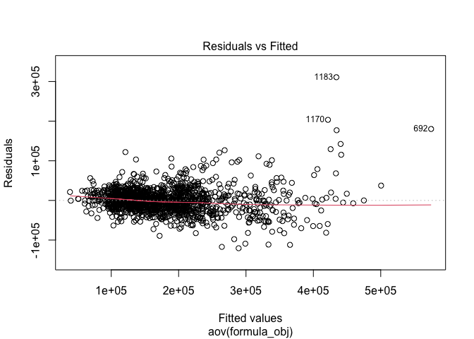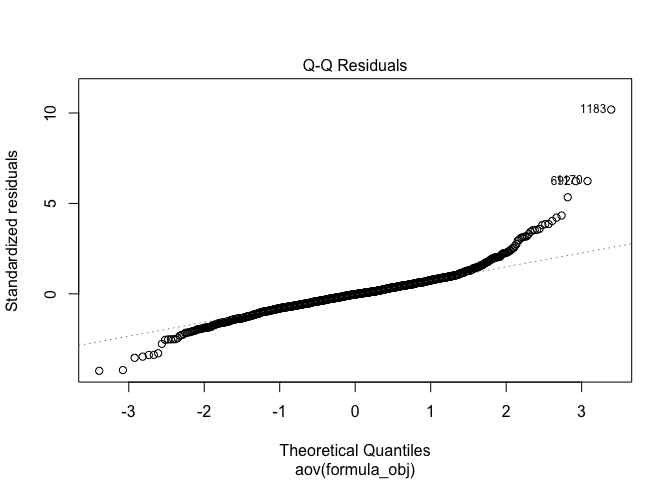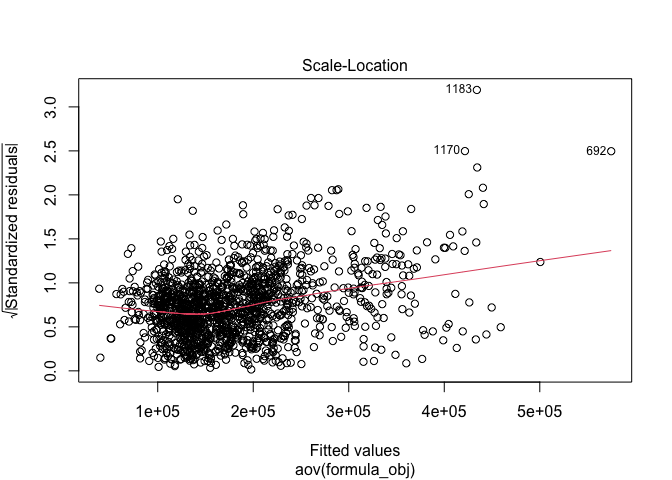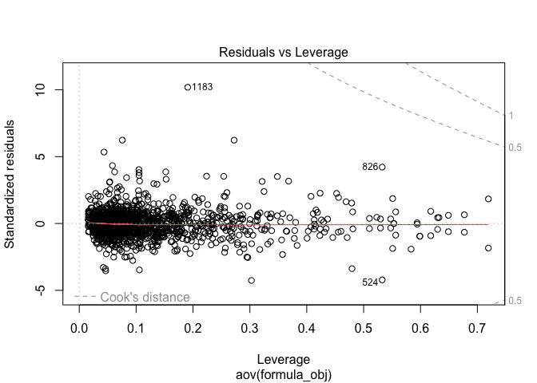

``` r
# show significant multi-level categorical features
un_signif_ml_categrorical_cols
```

    ##  [1] "LandSlope"     "ExterCond"     "BsmtCond"      "BsmtFinType2" 
    ##  [5] "Heating"       "Electrical"    "Functional"    "GarageFinish" 
    ##  [9] "GarageQual"    "GarageCond"    "PavedDrive"    "SaleType"     
    ## [13] "SaleCondition"

### Remove less associated and correlated columns

Below I created a list of all the insignificant numerical features and
non-associated categorical features to be removed from the data frame, I
then remove all of these features from the data frame.

``` r
func_remove_features_pt3<-function(df){
  to_drop <- c("LandSlope", "BsmtCond", "BsmtFinType2", "Heating", "Electrical", "Functional", "GarageFinish", "GarageQual", "GarageCond","GarageCars", "PavedDrive", "SaleType", "SaleCondition", "MSSubClass", "LotFrontage", "LotArea", "OverallCond", "MasVnrArea", "BsmtFinSF1", "BsmtFinSF2", "BsmtUnfSF", "LowQualFinSF", "BsmtFullBath", "BsmtHalfBath", "HalfBath", "BedroomAbvGr", "KitchenAbvGr", "Fireplaces", "GarageYrBlt", "WoodDeckSF", "OpenPorchSF", "EnclosedPorch", "ScreenPorch", "PoolArea", "MiscVal", "MoSold", "Condition2", "HouseStyle", "RoofMatl", "Exterior1st", "Exterior2nd")
  
  df <- df %>% select(-any_of(to_drop))
  
  return(df)
}

iowa.homes <- func_remove_features_pt3(iowa.homes)
```

### Model Selection

Below I perform a backward model selection, cross validated lasso, and
cross validated ridge regression model selection. I took both the lambda
= min, and lambda = 1se models for ridge and lasso. I then apply these
models to predict values on the validate data set to decide which model
to use on the test data set. I made the decision for the ‘best’ model
based on the lowest root mean squared error.

### Create full model and intercept model

``` r
full.model_str <- paste("SalePrice ~ .") 
full.model <- as.formula(full.model_str)

full.model.new <- lm(SalePrice ~ ., data = iowa.homes)
intercept.model <- lm(SalePrice ~ 1, data = iowa.homes)
```

### Backward Subset Selection

``` r
backward.model <-step(full.model.new,scope=intercept.model,direction="backward",trace=1, data=iowa.homes)
```

    ## Start:  AIC=30159.87
    ## SalePrice ~ Id + MSZoning + LotShape + LandContour + LotConfig + 
    ##     Neighborhood + Condition1 + BldgType + OverallQual + YearBuilt + 
    ##     YearRemodAdd + RoofStyle + MasVnrType + ExterQual + ExterCond + 
    ##     Foundation + BsmtQual + BsmtExposure + BsmtFinType1 + TotalBsmtSF + 
    ##     HeatingQC + CentralAir + X1stFlrSF + X2ndFlrSF + GrLivArea + 
    ##     FullBath + KitchenQual + TotRmsAbvGrd + GarageType + GarageArea + 
    ##     X3SsnPorch + YrSold + HasFireplace + HasPool + HasBsmt + 
    ##     TotalSF + HouseAge + RemodelAge
    ## 
    ## 
    ## Step:  AIC=30159.87
    ## SalePrice ~ Id + MSZoning + LotShape + LandContour + LotConfig + 
    ##     Neighborhood + Condition1 + BldgType + OverallQual + YearBuilt + 
    ##     YearRemodAdd + RoofStyle + MasVnrType + ExterQual + ExterCond + 
    ##     Foundation + BsmtQual + BsmtExposure + BsmtFinType1 + TotalBsmtSF + 
    ##     HeatingQC + CentralAir + X1stFlrSF + X2ndFlrSF + GrLivArea + 
    ##     FullBath + KitchenQual + TotRmsAbvGrd + GarageType + GarageArea + 
    ##     X3SsnPorch + YrSold + HasFireplace + HasPool + HasBsmt + 
    ##     TotalSF + HouseAge
    ## 
    ## 
    ## Step:  AIC=30159.87
    ## SalePrice ~ Id + MSZoning + LotShape + LandContour + LotConfig + 
    ##     Neighborhood + Condition1 + BldgType + OverallQual + YearBuilt + 
    ##     YearRemodAdd + RoofStyle + MasVnrType + ExterQual + ExterCond + 
    ##     Foundation + BsmtQual + BsmtExposure + BsmtFinType1 + TotalBsmtSF + 
    ##     HeatingQC + CentralAir + X1stFlrSF + X2ndFlrSF + GrLivArea + 
    ##     FullBath + KitchenQual + TotRmsAbvGrd + GarageType + GarageArea + 
    ##     X3SsnPorch + YrSold + HasFireplace + HasPool + HasBsmt + 
    ##     TotalSF
    ## 
    ## 
    ## Step:  AIC=30159.87
    ## SalePrice ~ Id + MSZoning + LotShape + LandContour + LotConfig + 
    ##     Neighborhood + Condition1 + BldgType + OverallQual + YearBuilt + 
    ##     YearRemodAdd + RoofStyle + MasVnrType + ExterQual + ExterCond + 
    ##     Foundation + BsmtQual + BsmtExposure + BsmtFinType1 + TotalBsmtSF + 
    ##     HeatingQC + CentralAir + X1stFlrSF + X2ndFlrSF + GrLivArea + 
    ##     FullBath + KitchenQual + TotRmsAbvGrd + GarageType + GarageArea + 
    ##     X3SsnPorch + YrSold + HasFireplace + HasPool + HasBsmt
    ## 
    ## 
    ## Step:  AIC=30159.87
    ## SalePrice ~ Id + MSZoning + LotShape + LandContour + LotConfig + 
    ##     Neighborhood + Condition1 + BldgType + OverallQual + YearBuilt + 
    ##     YearRemodAdd + RoofStyle + MasVnrType + ExterQual + ExterCond + 
    ##     Foundation + BsmtQual + BsmtExposure + BsmtFinType1 + TotalBsmtSF + 
    ##     HeatingQC + CentralAir + X1stFlrSF + X2ndFlrSF + GrLivArea + 
    ##     FullBath + KitchenQual + TotRmsAbvGrd + GarageType + GarageArea + 
    ##     X3SsnPorch + YrSold + HasFireplace + HasPool
    ## 
    ##                Df  Sum of Sq        RSS   AIC
    ## - Foundation    5 4.0627e+09 1.1750e+12 30155
    ## - GarageType    6 6.7679e+09 1.1777e+12 30156
    ## - MasVnrType    3 2.9735e+09 1.1739e+12 30158
    ## - HeatingQC     4 4.7179e+09 1.1757e+12 30158
    ## - RoofStyle     5 6.4474e+09 1.1774e+12 30158
    ## - HasPool       1 1.2653e+08 1.1711e+12 30158
    ## - TotalBsmtSF   1 5.4167e+08 1.1715e+12 30158
    ## - TotRmsAbvGrd  1 5.6050e+08 1.1715e+12 30159
    ## - ExterCond     4 5.4360e+09 1.1764e+12 30159
    ## - YearBuilt     1 6.1377e+08 1.1716e+12 30159
    ## - YrSold        1 6.2851e+08 1.1716e+12 30159
    ## - Id            1 7.2731e+08 1.1717e+12 30159
    ## - X2ndFlrSF     1 8.4616e+08 1.1718e+12 30159
    ## - MSZoning      4 5.8243e+09 1.1768e+12 30159
    ## - X3SsnPorch    1 1.4167e+09 1.1724e+12 30160
    ## - X1stFlrSF     1 1.4374e+09 1.1724e+12 30160
    ## - GrLivArea     1 1.5524e+09 1.1725e+12 30160
    ## <none>                       1.1710e+12 30160
    ## - CentralAir    1 1.9342e+09 1.1729e+12 30160
    ## - ExterQual     3 5.4247e+09 1.1764e+12 30161
    ## - HasFireplace  1 4.1018e+09 1.1751e+12 30163
    ## - FullBath      1 4.5502e+09 1.1755e+12 30164
    ## - YearRemodAdd  1 5.0440e+09 1.1760e+12 30164
    ## - Condition1    8 1.7932e+10 1.1889e+12 30166
    ## - LotShape      3 1.0614e+10 1.1816e+12 30167
    ## - LandContour   3 1.1823e+10 1.1828e+12 30168
    ## - LotConfig     4 1.6067e+10 1.1870e+12 30172
    ## - GarageArea    1 1.7658e+10 1.1886e+12 30180
    ## - BsmtFinType1  5 3.8872e+10 1.2098e+12 30198
    ## - BsmtQual      3 4.3219e+10 1.2142e+12 30207
    ## - KitchenQual   3 4.8033e+10 1.2190e+12 30213
    ## - BldgType      4 5.4875e+10 1.2258e+12 30219
    ## - OverallQual   1 5.0412e+10 1.2214e+12 30219
    ## - BsmtExposure  4 6.4470e+10 1.2354e+12 30230
    ## - Neighborhood 24 2.2105e+11 1.3920e+12 30364
    ## 
    ## Step:  AIC=30154.92
    ## SalePrice ~ Id + MSZoning + LotShape + LandContour + LotConfig + 
    ##     Neighborhood + Condition1 + BldgType + OverallQual + YearBuilt + 
    ##     YearRemodAdd + RoofStyle + MasVnrType + ExterQual + ExterCond + 
    ##     BsmtQual + BsmtExposure + BsmtFinType1 + TotalBsmtSF + HeatingQC + 
    ##     CentralAir + X1stFlrSF + X2ndFlrSF + GrLivArea + FullBath + 
    ##     KitchenQual + TotRmsAbvGrd + GarageType + GarageArea + X3SsnPorch + 
    ##     YrSold + HasFireplace + HasPool
    ## 
    ##                Df  Sum of Sq        RSS   AIC
    ## - GarageType    6 6.6128e+09 1.1816e+12 30151
    ## - HeatingQC     4 3.7894e+09 1.1788e+12 30152
    ## - MasVnrType    3 2.8887e+09 1.1779e+12 30152
    ## - HasPool       1 1.0736e+08 1.1751e+12 30153
    ## - TotRmsAbvGrd  1 4.0915e+08 1.1754e+12 30153
    ## - RoofStyle     5 6.9631e+09 1.1820e+12 30154
    ## - TotalBsmtSF   1 5.0797e+08 1.1755e+12 30154
    ## - YrSold        1 5.5146e+08 1.1756e+12 30154
    ## - X2ndFlrSF     1 7.1506e+08 1.1757e+12 30154
    ## - ExterCond     4 5.6073e+09 1.1806e+12 30154
    ## - MSZoning      4 5.6122e+09 1.1806e+12 30154
    ## - Id            1 7.8615e+08 1.1758e+12 30154
    ## - X3SsnPorch    1 1.2551e+09 1.1763e+12 30154
    ## - X1stFlrSF     1 1.2827e+09 1.1763e+12 30154
    ## <none>                       1.1750e+12 30155
    ## - YearBuilt     1 1.6654e+09 1.1767e+12 30155
    ## - GrLivArea     1 1.8146e+09 1.1768e+12 30155
    ## - CentralAir    1 2.3755e+09 1.1774e+12 30156
    ## - ExterQual     3 5.8889e+09 1.1809e+12 30156
    ## - FullBath      1 4.1197e+09 1.1791e+12 30158
    ## - HasFireplace  1 4.4527e+09 1.1795e+12 30158
    ## - YearRemodAdd  1 4.9122e+09 1.1799e+12 30159
    ## - Condition1    8 1.7348e+10 1.1924e+12 30160
    ## - LotShape      3 9.9776e+09 1.1850e+12 30161
    ## - LandContour   3 1.2410e+10 1.1874e+12 30164
    ## - LotConfig     4 1.6984e+10 1.1920e+12 30168
    ## - GarageArea    1 1.6877e+10 1.1919e+12 30174
    ## - BsmtFinType1  5 3.9487e+10 1.2145e+12 30193
    ## - BsmtQual      3 4.2475e+10 1.2175e+12 30201
    ## - KitchenQual   3 4.7703e+10 1.2227e+12 30207
    ## - OverallQual   1 4.8261e+10 1.2233e+12 30212
    ## - BldgType      4 5.3672e+10 1.2287e+12 30212
    ## - BsmtExposure  4 6.5312e+10 1.2403e+12 30226
    ## - Neighborhood 24 2.1993e+11 1.3949e+12 30357
    ## 
    ## Step:  AIC=30151.12
    ## SalePrice ~ Id + MSZoning + LotShape + LandContour + LotConfig + 
    ##     Neighborhood + Condition1 + BldgType + OverallQual + YearBuilt + 
    ##     YearRemodAdd + RoofStyle + MasVnrType + ExterQual + ExterCond + 
    ##     BsmtQual + BsmtExposure + BsmtFinType1 + TotalBsmtSF + HeatingQC + 
    ##     CentralAir + X1stFlrSF + X2ndFlrSF + GrLivArea + FullBath + 
    ##     KitchenQual + TotRmsAbvGrd + GarageArea + X3SsnPorch + YrSold + 
    ##     HasFireplace + HasPool
    ## 
    ##                Df  Sum of Sq        RSS   AIC
    ## - HeatingQC     4 3.7122e+09 1.1853e+12 30148
    ## - MasVnrType    3 3.0121e+09 1.1846e+12 30149
    ## - HasPool       1 1.0128e+08 1.1817e+12 30149
    ## - TotRmsAbvGrd  1 4.4395e+08 1.1821e+12 30150
    ## - YrSold        1 4.9076e+08 1.1821e+12 30150
    ## - ExterCond     4 5.3776e+09 1.1870e+12 30150
    ## - X2ndFlrSF     1 6.1674e+08 1.1822e+12 30150
    ## - Id            1 7.0145e+08 1.1823e+12 30150
    ## - RoofStyle     5 7.2119e+09 1.1888e+12 30150
    ## - TotalBsmtSF   1 8.4076e+08 1.1825e+12 30150
    ## - MSZoning      4 5.7492e+09 1.1874e+12 30150
    ## - X1stFlrSF     1 1.0220e+09 1.1827e+12 30150
    ## - X3SsnPorch    1 1.0765e+09 1.1827e+12 30150
    ## <none>                       1.1816e+12 30151
    ## - YearBuilt     1 1.9122e+09 1.1835e+12 30152
    ## - GrLivArea     1 2.0915e+09 1.1837e+12 30152
    ## - CentralAir    1 2.5448e+09 1.1842e+12 30152
    ## - ExterQual     3 6.4528e+09 1.1881e+12 30153
    ## - FullBath      1 4.0450e+09 1.1857e+12 30154
    ## - HasFireplace  1 4.4939e+09 1.1861e+12 30155
    ## - Condition1    8 1.6591e+10 1.1982e+12 30156
    ## - YearRemodAdd  1 5.6393e+09 1.1873e+12 30156
    ## - LotShape      3 9.6760e+09 1.1913e+12 30157
    ## - LandContour   3 1.2619e+10 1.1942e+12 30161
    ## - LotConfig     4 1.6774e+10 1.1984e+12 30164
    ## - GarageArea    1 1.6184e+10 1.1978e+12 30169
    ## - BsmtFinType1  5 3.9689e+10 1.2213e+12 30189
    ## - BsmtQual      3 4.5234e+10 1.2269e+12 30200
    ## - KitchenQual   3 4.6624e+10 1.2283e+12 30202
    ## - OverallQual   1 5.0453e+10 1.2321e+12 30210
    ## - BldgType      4 5.9042e+10 1.2407e+12 30214
    ## - BsmtExposure  4 6.5426e+10 1.2471e+12 30222
    ## - Neighborhood 24 2.2390e+11 1.4055e+12 30356
    ## 
    ## Step:  AIC=30147.7
    ## SalePrice ~ Id + MSZoning + LotShape + LandContour + LotConfig + 
    ##     Neighborhood + Condition1 + BldgType + OverallQual + YearBuilt + 
    ##     YearRemodAdd + RoofStyle + MasVnrType + ExterQual + ExterCond + 
    ##     BsmtQual + BsmtExposure + BsmtFinType1 + TotalBsmtSF + CentralAir + 
    ##     X1stFlrSF + X2ndFlrSF + GrLivArea + FullBath + KitchenQual + 
    ##     TotRmsAbvGrd + GarageArea + X3SsnPorch + YrSold + HasFireplace + 
    ##     HasPool
    ## 
    ##                Df  Sum of Sq        RSS   AIC
    ## - MasVnrType    3 3.3754e+09 1.1887e+12 30146
    ## - HasPool       1 2.0374e+08 1.1855e+12 30146
    ## - YrSold        1 4.5620e+08 1.1858e+12 30146
    ## - TotRmsAbvGrd  1 5.1813e+08 1.1859e+12 30146
    ## - ExterCond     4 5.4629e+09 1.1908e+12 30146
    ## - RoofStyle     5 7.0959e+09 1.1924e+12 30146
    ## - X2ndFlrSF     1 5.9493e+08 1.1859e+12 30146
    ## - Id            1 6.1779e+08 1.1860e+12 30146
    ## - X1stFlrSF     1 9.5249e+08 1.1863e+12 30147
    ## - TotalBsmtSF   1 1.0320e+09 1.1864e+12 30147
    ## - MSZoning      4 6.1241e+09 1.1915e+12 30147
    ## - X3SsnPorch    1 1.2786e+09 1.1866e+12 30147
    ## <none>                       1.1853e+12 30148
    ## - GrLivArea     1 2.1476e+09 1.1875e+12 30148
    ## - YearBuilt     1 2.5622e+09 1.1879e+12 30149
    ## - CentralAir    1 2.9055e+09 1.1882e+12 30149
    ## - ExterQual     3 6.6900e+09 1.1920e+12 30150
    ## - FullBath      1 4.1305e+09 1.1895e+12 30151
    ## - HasFireplace  1 4.8754e+09 1.1902e+12 30152
    ## - Condition1    8 1.6448e+10 1.2018e+12 30152
    ## - LotShape      3 9.6889e+09 1.1950e+12 30154
    ## - YearRemodAdd  1 6.8408e+09 1.1922e+12 30154
    ## - LandContour   3 1.2852e+10 1.1982e+12 30157
    ## - LotConfig     4 1.6565e+10 1.2019e+12 30160
    ## - GarageArea    1 1.5729e+10 1.2011e+12 30165
    ## - BsmtFinType1  5 3.9582e+10 1.2249e+12 30186
    ## - BsmtQual      3 4.7055e+10 1.2324e+12 30198
    ## - KitchenQual   3 4.7205e+10 1.2325e+12 30199
    ## - OverallQual   1 5.0643e+10 1.2360e+12 30207
    ## - BldgType      4 5.9728e+10 1.2451e+12 30212
    ## - BsmtExposure  4 6.4097e+10 1.2494e+12 30217
    ## - Neighborhood 24 2.2303e+11 1.4084e+12 30351
    ## 
    ## Step:  AIC=30145.85
    ## SalePrice ~ Id + MSZoning + LotShape + LandContour + LotConfig + 
    ##     Neighborhood + Condition1 + BldgType + OverallQual + YearBuilt + 
    ##     YearRemodAdd + RoofStyle + ExterQual + ExterCond + BsmtQual + 
    ##     BsmtExposure + BsmtFinType1 + TotalBsmtSF + CentralAir + 
    ##     X1stFlrSF + X2ndFlrSF + GrLivArea + FullBath + KitchenQual + 
    ##     TotRmsAbvGrd + GarageArea + X3SsnPorch + YrSold + HasFireplace + 
    ##     HasPool
    ## 
    ##                Df  Sum of Sq        RSS   AIC
    ## - HasPool       1 1.7123e+08 1.1889e+12 30144
    ## - RoofStyle     5 6.7077e+09 1.1954e+12 30144
    ## - YrSold        1 3.1097e+08 1.1890e+12 30144
    ## - Id            1 4.2429e+08 1.1891e+12 30144
    ## - X2ndFlrSF     1 5.2056e+08 1.1892e+12 30144
    ## - TotRmsAbvGrd  1 6.2725e+08 1.1893e+12 30145
    ## - ExterCond     4 5.6221e+09 1.1943e+12 30145
    ## - X1stFlrSF     1 8.4610e+08 1.1896e+12 30145
    ## - MSZoning      4 5.9419e+09 1.1947e+12 30145
    ## - TotalBsmtSF   1 1.2202e+09 1.1899e+12 30145
    ## - X3SsnPorch    1 1.2541e+09 1.1900e+12 30145
    ## <none>                       1.1887e+12 30146
    ## - GrLivArea     1 2.2327e+09 1.1910e+12 30147
    ## - YearBuilt     1 2.4229e+09 1.1911e+12 30147
    ## - CentralAir    1 2.8854e+09 1.1916e+12 30147
    ## - ExterQual     3 6.5951e+09 1.1953e+12 30148
    ## - FullBath      1 4.0206e+09 1.1927e+12 30149
    ## - HasFireplace  1 4.6428e+09 1.1934e+12 30150
    ## - Condition1    8 1.6187e+10 1.2049e+12 30150
    ## - LotShape      3 9.4579e+09 1.1982e+12 30151
    ## - YearRemodAdd  1 6.9987e+09 1.1957e+12 30152
    ## - LandContour   3 1.3134e+10 1.2019e+12 30156
    ## - LotConfig     4 1.6363e+10 1.2051e+12 30158
    ## - GarageArea    1 1.5754e+10 1.2045e+12 30163
    ## - BsmtFinType1  5 3.9661e+10 1.2284e+12 30184
    ## - KitchenQual   3 4.8111e+10 1.2368e+12 30198
    ## - BsmtQual      3 4.8890e+10 1.2376e+12 30199
    ## - OverallQual   1 5.1412e+10 1.2401e+12 30206
    ## - BldgType      4 6.0534e+10 1.2493e+12 30210
    ## - BsmtExposure  4 6.5221e+10 1.2539e+12 30216
    ## - Neighborhood 24 2.2382e+11 1.4125e+12 30350
    ## 
    ## Step:  AIC=30144.06
    ## SalePrice ~ Id + MSZoning + LotShape + LandContour + LotConfig + 
    ##     Neighborhood + Condition1 + BldgType + OverallQual + YearBuilt + 
    ##     YearRemodAdd + RoofStyle + ExterQual + ExterCond + BsmtQual + 
    ##     BsmtExposure + BsmtFinType1 + TotalBsmtSF + CentralAir + 
    ##     X1stFlrSF + X2ndFlrSF + GrLivArea + FullBath + KitchenQual + 
    ##     TotRmsAbvGrd + GarageArea + X3SsnPorch + YrSold + HasFireplace
    ## 
    ##                Df  Sum of Sq        RSS   AIC
    ## - YrSold        1 2.8854e+08 1.1892e+12 30142
    ## - RoofStyle     5 6.8279e+09 1.1957e+12 30142
    ## - Id            1 4.5363e+08 1.1893e+12 30143
    ## - X2ndFlrSF     1 5.5243e+08 1.1894e+12 30143
    ## - TotRmsAbvGrd  1 6.9645e+08 1.1896e+12 30143
    ## - ExterCond     4 5.6206e+09 1.1945e+12 30143
    ## - X1stFlrSF     1 9.0222e+08 1.1898e+12 30143
    ## - MSZoning      4 5.9487e+09 1.1948e+12 30143
    ## - TotalBsmtSF   1 1.1329e+09 1.1900e+12 30144
    ## - X3SsnPorch    1 1.2667e+09 1.1902e+12 30144
    ## <none>                       1.1889e+12 30144
    ## - GrLivArea     1 2.1403e+09 1.1910e+12 30145
    ## - YearBuilt     1 2.4369e+09 1.1913e+12 30145
    ## - CentralAir    1 2.8821e+09 1.1918e+12 30146
    ## - ExterQual     3 6.6280e+09 1.1955e+12 30146
    ## - FullBath      1 4.0952e+09 1.1930e+12 30147
    ## - HasFireplace  1 4.6625e+09 1.1936e+12 30148
    ## - Condition1    8 1.6194e+10 1.2051e+12 30148
    ## - LotShape      3 9.6080e+09 1.1985e+12 30150
    ## - YearRemodAdd  1 7.0197e+09 1.1959e+12 30151
    ## - LandContour   3 1.3232e+10 1.2021e+12 30154
    ## - LotConfig     4 1.6377e+10 1.2053e+12 30156
    ## - GarageArea    1 1.5822e+10 1.2047e+12 30161
    ## - BsmtFinType1  5 3.9601e+10 1.2285e+12 30182
    ## - KitchenQual   3 4.8058e+10 1.2369e+12 30196
    ## - BsmtQual      3 4.8859e+10 1.2377e+12 30197
    ## - OverallQual   1 5.1484e+10 1.2404e+12 30204
    ## - BldgType      4 6.0566e+10 1.2495e+12 30209
    ## - BsmtExposure  4 6.5568e+10 1.2545e+12 30214
    ## - Neighborhood 24 2.2683e+11 1.4157e+12 30351
    ## 
    ## Step:  AIC=30142.41
    ## SalePrice ~ Id + MSZoning + LotShape + LandContour + LotConfig + 
    ##     Neighborhood + Condition1 + BldgType + OverallQual + YearBuilt + 
    ##     YearRemodAdd + RoofStyle + ExterQual + ExterCond + BsmtQual + 
    ##     BsmtExposure + BsmtFinType1 + TotalBsmtSF + CentralAir + 
    ##     X1stFlrSF + X2ndFlrSF + GrLivArea + FullBath + KitchenQual + 
    ##     TotRmsAbvGrd + GarageArea + X3SsnPorch + HasFireplace
    ## 
    ##                Df  Sum of Sq        RSS   AIC
    ## - RoofStyle     5 6.7931e+09 1.1960e+12 30141
    ## - Id            1 4.6116e+08 1.1896e+12 30141
    ## - X2ndFlrSF     1 5.1274e+08 1.1897e+12 30141
    ## - TotRmsAbvGrd  1 7.0626e+08 1.1899e+12 30141
    ## - ExterCond     4 5.6643e+09 1.1948e+12 30141
    ## - X1stFlrSF     1 8.5537e+08 1.1900e+12 30142
    ## - MSZoning      4 6.0089e+09 1.1952e+12 30142
    ## - TotalBsmtSF   1 1.1098e+09 1.1903e+12 30142
    ## - X3SsnPorch    1 1.2619e+09 1.1904e+12 30142
    ## <none>                       1.1892e+12 30142
    ## - GrLivArea     1 2.2369e+09 1.1914e+12 30143
    ## - YearBuilt     1 2.5296e+09 1.1917e+12 30144
    ## - CentralAir    1 2.8876e+09 1.1921e+12 30144
    ## - ExterQual     3 6.4848e+09 1.1957e+12 30144
    ## - FullBath      1 4.0905e+09 1.1933e+12 30145
    ## - HasFireplace  1 4.7191e+09 1.1939e+12 30146
    ## - Condition1    8 1.6267e+10 1.2054e+12 30146
    ## - LotShape      3 9.5680e+09 1.1987e+12 30148
    ## - YearRemodAdd  1 6.8461e+09 1.1960e+12 30149
    ## - LandContour   3 1.3230e+10 1.2024e+12 30153
    ## - LotConfig     4 1.6320e+10 1.2055e+12 30154
    ## - GarageArea    1 1.5848e+10 1.2050e+12 30160
    ## - BsmtFinType1  5 3.9360e+10 1.2285e+12 30180
    ## - KitchenQual   3 4.8075e+10 1.2373e+12 30194
    ## - BsmtQual      3 4.8961e+10 1.2381e+12 30195
    ## - OverallQual   1 5.1470e+10 1.2406e+12 30202
    ## - BldgType      4 6.0366e+10 1.2495e+12 30207
    ## - BsmtExposure  4 6.6342e+10 1.2555e+12 30214
    ## - Neighborhood 24 2.2715e+11 1.4163e+12 30350
    ## 
    ## Step:  AIC=30140.73
    ## SalePrice ~ Id + MSZoning + LotShape + LandContour + LotConfig + 
    ##     Neighborhood + Condition1 + BldgType + OverallQual + YearBuilt + 
    ##     YearRemodAdd + ExterQual + ExterCond + BsmtQual + BsmtExposure + 
    ##     BsmtFinType1 + TotalBsmtSF + CentralAir + X1stFlrSF + X2ndFlrSF + 
    ##     GrLivArea + FullBath + KitchenQual + TotRmsAbvGrd + GarageArea + 
    ##     X3SsnPorch + HasFireplace
    ## 
    ##                Df  Sum of Sq        RSS   AIC
    ## - Id            1 3.7744e+08 1.1963e+12 30139
    ## - X2ndFlrSF     1 6.0766e+08 1.1966e+12 30140
    ## - MSZoning      4 5.6060e+09 1.2016e+12 30140
    ## - ExterCond     4 5.9031e+09 1.2019e+12 30140
    ## - TotRmsAbvGrd  1 1.0381e+09 1.1970e+12 30140
    ## - X1stFlrSF     1 1.0545e+09 1.1970e+12 30140
    ## - X3SsnPorch    1 1.2417e+09 1.1972e+12 30140
    ## - TotalBsmtSF   1 1.3055e+09 1.1973e+12 30140
    ## <none>                       1.1960e+12 30141
    ## - GrLivArea     1 2.0407e+09 1.1980e+12 30141
    ## - CentralAir    1 2.6051e+09 1.1986e+12 30142
    ## - YearBuilt     1 2.7612e+09 1.1987e+12 30142
    ## - FullBath      1 3.2744e+09 1.1992e+12 30143
    ## - Condition1    8 1.6045e+10 1.2120e+12 30144
    ## - ExterQual     3 7.8519e+09 1.2038e+12 30144
    ## - HasFireplace  1 4.6738e+09 1.2006e+12 30144
    ## - LotShape      3 9.5824e+09 1.2056e+12 30146
    ## - YearRemodAdd  1 7.1873e+09 1.2032e+12 30148
    ## - LandContour   3 1.3473e+10 1.2094e+12 30151
    ## - LotConfig     4 1.5216e+10 1.2112e+12 30151
    ## - GarageArea    1 1.5421e+10 1.2114e+12 30157
    ## - BsmtFinType1  5 4.0038e+10 1.2360e+12 30179
    ## - KitchenQual   3 4.7097e+10 1.2431e+12 30191
    ## - BsmtQual      3 5.2066e+10 1.2480e+12 30197
    ## - OverallQual   1 5.4253e+10 1.2502e+12 30204
    ## - BldgType      4 6.0421e+10 1.2564e+12 30205
    ## - BsmtExposure  4 6.4530e+10 1.2605e+12 30210
    ## - Neighborhood 24 2.2965e+11 1.4256e+12 30349
    ## 
    ## Step:  AIC=30139.19
    ## SalePrice ~ MSZoning + LotShape + LandContour + LotConfig + Neighborhood + 
    ##     Condition1 + BldgType + OverallQual + YearBuilt + YearRemodAdd + 
    ##     ExterQual + ExterCond + BsmtQual + BsmtExposure + BsmtFinType1 + 
    ##     TotalBsmtSF + CentralAir + X1stFlrSF + X2ndFlrSF + GrLivArea + 
    ##     FullBath + KitchenQual + TotRmsAbvGrd + GarageArea + X3SsnPorch + 
    ##     HasFireplace
    ## 
    ##                Df  Sum of Sq        RSS   AIC
    ## - X2ndFlrSF     1 5.6250e+08 1.1969e+12 30138
    ## - MSZoning      4 5.5640e+09 1.2019e+12 30138
    ## - ExterCond     4 5.7796e+09 1.2021e+12 30138
    ## - X1stFlrSF     1 9.8090e+08 1.1973e+12 30138
    ## - TotRmsAbvGrd  1 9.8946e+08 1.1973e+12 30138
    ## - X3SsnPorch    1 1.3071e+09 1.1977e+12 30139
    ## - TotalBsmtSF   1 1.3869e+09 1.1977e+12 30139
    ## <none>                       1.1963e+12 30139
    ## - GrLivArea     1 2.1416e+09 1.1985e+12 30140
    ## - CentralAir    1 2.5834e+09 1.1989e+12 30140
    ## - YearBuilt     1 2.8041e+09 1.1992e+12 30141
    ## - FullBath      1 3.2862e+09 1.1996e+12 30141
    ## - ExterQual     3 7.7205e+09 1.2041e+12 30143
    ## - Condition1    8 1.6013e+10 1.2124e+12 30143
    ## - HasFireplace  1 4.7420e+09 1.2011e+12 30143
    ## - LotShape      3 9.7880e+09 1.2061e+12 30145
    ## - YearRemodAdd  1 7.3270e+09 1.2037e+12 30146
    ## - LandContour   3 1.3464e+10 1.2098e+12 30150
    ## - LotConfig     4 1.5309e+10 1.2117e+12 30150
    ## - GarageArea    1 1.5262e+10 1.2116e+12 30156
    ## - BsmtFinType1  5 4.0282e+10 1.2366e+12 30178
    ## - KitchenQual   3 4.6792e+10 1.2431e+12 30189
    ## - BsmtQual      3 5.2429e+10 1.2488e+12 30196
    ## - OverallQual   1 5.4932e+10 1.2513e+12 30203
    ## - BldgType      4 6.1190e+10 1.2575e+12 30204
    ## - BsmtExposure  4 6.4224e+10 1.2606e+12 30208
    ## - Neighborhood 24 2.3013e+11 1.4265e+12 30348
    ## 
    ## Step:  AIC=30137.88
    ## SalePrice ~ MSZoning + LotShape + LandContour + LotConfig + Neighborhood + 
    ##     Condition1 + BldgType + OverallQual + YearBuilt + YearRemodAdd + 
    ##     ExterQual + ExterCond + BsmtQual + BsmtExposure + BsmtFinType1 + 
    ##     TotalBsmtSF + CentralAir + X1stFlrSF + GrLivArea + FullBath + 
    ##     KitchenQual + TotRmsAbvGrd + GarageArea + X3SsnPorch + HasFireplace
    ## 
    ##                Df  Sum of Sq        RSS   AIC
    ## - MSZoning      4 5.6681e+09 1.2026e+12 30137
    ## - X1stFlrSF     1 9.2755e+08 1.1978e+12 30137
    ## - TotRmsAbvGrd  1 9.6110e+08 1.1979e+12 30137
    ## - ExterCond     4 5.9571e+09 1.2029e+12 30137
    ## - X3SsnPorch    1 1.2827e+09 1.1982e+12 30137
    ## - TotalBsmtSF   1 1.3483e+09 1.1983e+12 30138
    ## <none>                       1.1969e+12 30138
    ## - CentralAir    1 2.4441e+09 1.1994e+12 30139
    ## - YearBuilt     1 3.0019e+09 1.1999e+12 30140
    ## - FullBath      1 3.3742e+09 1.2003e+12 30140
    ## - ExterQual     3 7.7598e+09 1.2047e+12 30141
    ## - Condition1    8 1.6065e+10 1.2130e+12 30141
    ## - HasFireplace  1 4.9571e+09 1.2019e+12 30142
    ## - LotShape      3 9.6753e+09 1.2066e+12 30144
    ## - YearRemodAdd  1 7.2670e+09 1.2042e+12 30145
    ## - LandContour   3 1.3654e+10 1.2106e+12 30148
    ## - LotConfig     4 1.5332e+10 1.2122e+12 30148
    ## - GarageArea    1 1.5434e+10 1.2123e+12 30155
    ## - BsmtFinType1  5 4.0278e+10 1.2372e+12 30176
    ## - KitchenQual   3 4.6513e+10 1.2434e+12 30188
    ## - BsmtQual      3 5.2375e+10 1.2493e+12 30194
    ## - OverallQual   1 5.5019e+10 1.2519e+12 30202
    ## - BldgType      4 6.1365e+10 1.2583e+12 30203
    ## - BsmtExposure  4 6.4397e+10 1.2613e+12 30206
    ## - GrLivArea     1 1.0426e+11 1.3012e+12 30258
    ## - Neighborhood 24 2.3230e+11 1.4292e+12 30349
    ## 
    ## Step:  AIC=30136.78
    ## SalePrice ~ LotShape + LandContour + LotConfig + Neighborhood + 
    ##     Condition1 + BldgType + OverallQual + YearBuilt + YearRemodAdd + 
    ##     ExterQual + ExterCond + BsmtQual + BsmtExposure + BsmtFinType1 + 
    ##     TotalBsmtSF + CentralAir + X1stFlrSF + GrLivArea + FullBath + 
    ##     KitchenQual + TotRmsAbvGrd + GarageArea + X3SsnPorch + HasFireplace
    ## 
    ##                Df  Sum of Sq        RSS   AIC
    ## - ExterCond     4 5.6569e+09 1.2082e+12 30136
    ## - X1stFlrSF     1 8.2354e+08 1.2034e+12 30136
    ## - TotRmsAbvGrd  1 8.9541e+08 1.2035e+12 30136
    ## - X3SsnPorch    1 1.3005e+09 1.2039e+12 30136
    ## - TotalBsmtSF   1 1.4521e+09 1.2040e+12 30136
    ## <none>                       1.2026e+12 30137
    ## - YearBuilt     1 3.0580e+09 1.2056e+12 30138
    ## - CentralAir    1 3.1945e+09 1.2058e+12 30139
    ## - FullBath      1 3.4472e+09 1.2060e+12 30139
    ## - ExterQual     3 7.3053e+09 1.2099e+12 30140
    ## - Condition1    8 1.6261e+10 1.2188e+12 30140
    ## - HasFireplace  1 5.2154e+09 1.2078e+12 30141
    ## - LotShape      3 9.7819e+09 1.2124e+12 30143
    ## - YearRemodAdd  1 7.2850e+09 1.2099e+12 30144
    ## - LandContour   3 1.2445e+10 1.2150e+12 30146
    ## - LotConfig     4 1.5562e+10 1.2181e+12 30148
    ## - GarageArea    1 1.4201e+10 1.2168e+12 30152
    ## - BsmtFinType1  5 4.1001e+10 1.2436e+12 30176
    ## - KitchenQual   3 4.6660e+10 1.2492e+12 30186
    ## - BsmtQual      3 5.2189e+10 1.2548e+12 30193
    ## - OverallQual   1 5.8351e+10 1.2609e+12 30204
    ## - BsmtExposure  4 6.4852e+10 1.2674e+12 30206
    ## - BldgType      4 6.9842e+10 1.2724e+12 30211
    ## - GrLivArea     1 1.0554e+11 1.3081e+12 30258
    ## - Neighborhood 24 2.4102e+11 1.4436e+12 30356
    ## 
    ## Step:  AIC=30135.63
    ## SalePrice ~ LotShape + LandContour + LotConfig + Neighborhood + 
    ##     Condition1 + BldgType + OverallQual + YearBuilt + YearRemodAdd + 
    ##     ExterQual + BsmtQual + BsmtExposure + BsmtFinType1 + TotalBsmtSF + 
    ##     CentralAir + X1stFlrSF + GrLivArea + FullBath + KitchenQual + 
    ##     TotRmsAbvGrd + GarageArea + X3SsnPorch + HasFireplace
    ## 
    ##                Df  Sum of Sq        RSS   AIC
    ## - X1stFlrSF     1 5.4970e+08 1.2088e+12 30134
    ## - TotRmsAbvGrd  1 7.7668e+08 1.2090e+12 30135
    ## - X3SsnPorch    1 1.2643e+09 1.2095e+12 30135
    ## <none>                       1.2082e+12 30136
    ## - TotalBsmtSF   1 1.7205e+09 1.2100e+12 30136
    ## - YearBuilt     1 2.5082e+09 1.2107e+12 30137
    ## - CentralAir    1 3.4119e+09 1.2116e+12 30138
    ## - Condition1    8 1.5967e+10 1.2242e+12 30139
    ## - FullBath      1 4.3265e+09 1.2126e+12 30139
    ## - ExterQual     3 8.2709e+09 1.2165e+12 30140
    ## - HasFireplace  1 5.6135e+09 1.2138e+12 30140
    ## - LotShape      3 9.9069e+09 1.2181e+12 30142
    ## - LandContour   3 1.1669e+10 1.2199e+12 30144
    ## - YearRemodAdd  1 8.6699e+09 1.2169e+12 30144
    ## - LotConfig     4 1.5908e+10 1.2241e+12 30147
    ## - GarageArea    1 1.5518e+10 1.2238e+12 30152
    ## - BsmtFinType1  5 4.2225e+10 1.2505e+12 30176
    ## - KitchenQual   3 4.5246e+10 1.2535e+12 30183
    ## - BsmtQual      3 5.1148e+10 1.2594e+12 30190
    ## - BsmtExposure  4 6.4505e+10 1.2727e+12 30204
    ## - OverallQual   1 6.2298e+10 1.2705e+12 30207
    ## - BldgType      4 7.0220e+10 1.2785e+12 30210
    ## - GrLivArea     1 1.0393e+11 1.3122e+12 30254
    ## - Neighborhood 24 2.3795e+11 1.4462e+12 30350
    ## 
    ## Step:  AIC=30134.29
    ## SalePrice ~ LotShape + LandContour + LotConfig + Neighborhood + 
    ##     Condition1 + BldgType + OverallQual + YearBuilt + YearRemodAdd + 
    ##     ExterQual + BsmtQual + BsmtExposure + BsmtFinType1 + TotalBsmtSF + 
    ##     CentralAir + GrLivArea + FullBath + KitchenQual + TotRmsAbvGrd + 
    ##     GarageArea + X3SsnPorch + HasFireplace
    ## 
    ##                Df  Sum of Sq        RSS   AIC
    ## - TotRmsAbvGrd  1 7.6409e+08 1.2095e+12 30133
    ## - X3SsnPorch    1 1.3325e+09 1.2101e+12 30134
    ## <none>                       1.2088e+12 30134
    ## - YearBuilt     1 2.3253e+09 1.2111e+12 30135
    ## - CentralAir    1 3.5301e+09 1.2123e+12 30136
    ## - Condition1    8 1.5950e+10 1.2247e+12 30137
    ## - FullBath      1 4.4570e+09 1.2132e+12 30138
    ## - ExterQual     3 8.1656e+09 1.2170e+12 30138
    ## - HasFireplace  1 6.1653e+09 1.2150e+12 30140
    ## - LotShape      3 1.0130e+10 1.2189e+12 30140
    ## - LandContour   3 1.1316e+10 1.2201e+12 30142
    ## - YearRemodAdd  1 9.1576e+09 1.2179e+12 30143
    ## - TotalBsmtSF   1 9.9880e+09 1.2188e+12 30144
    ## - LotConfig     4 1.6104e+10 1.2249e+12 30146
    ## - GarageArea    1 1.6123e+10 1.2249e+12 30152
    ## - BsmtFinType1  5 4.2265e+10 1.2511e+12 30174
    ## - KitchenQual   3 4.5192e+10 1.2540e+12 30182
    ## - BsmtQual      3 5.1207e+10 1.2600e+12 30189
    ## - BsmtExposure  4 6.5637e+10 1.2744e+12 30204
    ## - OverallQual   1 6.2027e+10 1.2708e+12 30205
    ## - BldgType      4 6.9870e+10 1.2787e+12 30208
    ## - GrLivArea     1 1.1081e+11 1.3196e+12 30260
    ## - Neighborhood 24 2.3753e+11 1.4463e+12 30348
    ## 
    ## Step:  AIC=30133.21
    ## SalePrice ~ LotShape + LandContour + LotConfig + Neighborhood + 
    ##     Condition1 + BldgType + OverallQual + YearBuilt + YearRemodAdd + 
    ##     ExterQual + BsmtQual + BsmtExposure + BsmtFinType1 + TotalBsmtSF + 
    ##     CentralAir + GrLivArea + FullBath + KitchenQual + GarageArea + 
    ##     X3SsnPorch + HasFireplace
    ## 
    ##                Df  Sum of Sq        RSS   AIC
    ## - X3SsnPorch    1 1.2502e+09 1.2108e+12 30133
    ## <none>                       1.2095e+12 30133
    ## - YearBuilt     1 2.2348e+09 1.2118e+12 30134
    ## - CentralAir    1 3.5631e+09 1.2131e+12 30136
    ## - Condition1    8 1.5813e+10 1.2254e+12 30136
    ## - FullBath      1 4.9204e+09 1.2145e+12 30137
    ## - ExterQual     3 8.4489e+09 1.2180e+12 30137
    ## - HasFireplace  1 6.1730e+09 1.2157e+12 30139
    ## - LotShape      3 1.0135e+10 1.2197e+12 30139
    ## - LandContour   3 1.1393e+10 1.2209e+12 30141
    ## - YearRemodAdd  1 9.2889e+09 1.2188e+12 30142
    ## - TotalBsmtSF   1 9.3888e+09 1.2189e+12 30142
    ## - LotConfig     4 1.5915e+10 1.2255e+12 30144
    ## - GarageArea    1 1.5851e+10 1.2254e+12 30150
    ## - BsmtFinType1  5 4.1676e+10 1.2512e+12 30173
    ## - KitchenQual   3 4.5172e+10 1.2547e+12 30181
    ## - BsmtQual      3 5.1286e+10 1.2608e+12 30188
    ## - BsmtExposure  4 6.4881e+10 1.2744e+12 30202
    ## - OverallQual   1 6.2001e+10 1.2716e+12 30204
    ## - BldgType      4 7.4450e+10 1.2840e+12 30212
    ## - Neighborhood 24 2.3702e+11 1.4466e+12 30346
    ## - GrLivArea     1 2.3534e+11 1.4449e+12 30391
    ## 
    ## Step:  AIC=30132.72
    ## SalePrice ~ LotShape + LandContour + LotConfig + Neighborhood + 
    ##     Condition1 + BldgType + OverallQual + YearBuilt + YearRemodAdd + 
    ##     ExterQual + BsmtQual + BsmtExposure + BsmtFinType1 + TotalBsmtSF + 
    ##     CentralAir + GrLivArea + FullBath + KitchenQual + GarageArea + 
    ##     HasFireplace
    ## 
    ##                Df  Sum of Sq        RSS   AIC
    ## <none>                       1.2108e+12 30133
    ## - YearBuilt     1 2.2576e+09 1.2131e+12 30133
    ## - CentralAir    1 3.5998e+09 1.2144e+12 30135
    ## - Condition1    8 1.5354e+10 1.2262e+12 30135
    ## - FullBath      1 5.0454e+09 1.2158e+12 30137
    ## - ExterQual     3 8.5854e+09 1.2194e+12 30137
    ## - HasFireplace  1 6.1420e+09 1.2169e+12 30138
    ## - LotShape      3 1.0284e+10 1.2211e+12 30139
    ## - LandContour   3 1.1517e+10 1.2223e+12 30140
    ## - YearRemodAdd  1 9.5874e+09 1.2204e+12 30142
    ## - TotalBsmtSF   1 9.7497e+09 1.2205e+12 30142
    ## - LotConfig     4 1.5983e+10 1.2268e+12 30144
    ## - GarageArea    1 1.6077e+10 1.2269e+12 30150
    ## - BsmtFinType1  5 4.2478e+10 1.2533e+12 30173
    ## - KitchenQual   3 4.5092e+10 1.2559e+12 30180
    ## - BsmtQual      3 5.0854e+10 1.2617e+12 30187
    ## - BsmtExposure  4 6.4291e+10 1.2751e+12 30200
    ## - OverallQual   1 6.2076e+10 1.2729e+12 30204
    ## - BldgType      4 7.4604e+10 1.2854e+12 30212
    ## - Neighborhood 24 2.3647e+11 1.4473e+12 30345
    ## - GrLivArea     1 2.3469e+11 1.4455e+12 30389

### Best Backward Model

Based on the lowest AIC score from the backward model selection, the
best model is the one that included 21 of the 46 variables. Below I
create a linear model and explore its features. Based on the residuals
vs. fitted plot, we can see that the variance is mostly homogenously
spread but gets larger as the fitted values increase. We can also see
that the residuals are mostly normally distributed aside from a tail of
points towards the larger theoretical quantiles.

``` r
backward.best <- lm(SalePrice ~ LotShape + LandContour + LotConfig + Neighborhood + 
    Condition1 + BldgType + OverallQual + YearBuilt + YearRemodAdd + 
    ExterQual + BsmtQual + BsmtExposure + BsmtFinType1 + TotalBsmtSF + 
    CentralAir + GrLivArea + FullBath + KitchenQual + GarageArea + 
    HasFireplace, data = iowa.homes)

summary(backward.best)
```

    ## 
    ## Call:
    ## lm(formula = SalePrice ~ LotShape + LandContour + LotConfig + 
    ##     Neighborhood + Condition1 + BldgType + OverallQual + YearBuilt + 
    ##     YearRemodAdd + ExterQual + BsmtQual + BsmtExposure + BsmtFinType1 + 
    ##     TotalBsmtSF + CentralAir + GrLivArea + FullBath + KitchenQual + 
    ##     GarageArea + HasFireplace, data = iowa.homes)
    ## 
    ## Residuals:
    ##     Min      1Q  Median      3Q     Max 
    ## -364981  -12418     944   11529  236008 
    ## 
    ## Coefficients: (1 not defined because of singularities)
    ##                       Estimate Std. Error t value Pr(>|t|)    
    ## (Intercept)         -5.058e+05  1.703e+05  -2.971 0.003022 ** 
    ## LotShapeIR2          1.307e+04  5.044e+03   2.591 0.009669 ** 
    ## LotShapeIR3         -2.041e+04  9.921e+03  -2.057 0.039829 *  
    ## LotShapeReg          1.215e+03  1.959e+03   0.621 0.534976    
    ## LandContourHLS       1.916e+04  6.074e+03   3.154 0.001645 ** 
    ## LandContourLow       1.687e+04  6.948e+03   2.429 0.015283 *  
    ## LandContourLvl       1.379e+04  4.214e+03   3.272 0.001093 ** 
    ## LotConfigCulDSac     1.019e+04  3.846e+03   2.649 0.008156 ** 
    ## LotConfigFR2        -1.182e+04  4.898e+03  -2.413 0.015970 *  
    ## LotConfigFR3        -2.076e+04  1.565e+04  -1.327 0.184834    
    ## LotConfigInside     -1.001e+03  2.130e+03  -0.470 0.638697    
    ## NeighborhoodBlueste -2.467e+03  2.269e+04  -0.109 0.913448    
    ## NeighborhoodBrDale  -6.905e+03  1.191e+04  -0.580 0.562137    
    ## NeighborhoodBrkSide -1.073e+04  9.937e+03  -1.080 0.280264    
    ## NeighborhoodClearCr -8.696e+03  1.045e+04  -0.832 0.405468    
    ## NeighborhoodCollgCr -9.991e+03  8.446e+03  -1.183 0.237067    
    ## NeighborhoodCrawfor  1.495e+04  9.770e+03   1.530 0.126215    
    ## NeighborhoodEdwards -2.740e+04  9.077e+03  -3.019 0.002585 ** 
    ## NeighborhoodGilbert -1.228e+04  9.062e+03  -1.355 0.175779    
    ## NeighborhoodIDOTRR  -2.535e+04  1.046e+04  -2.422 0.015557 *  
    ## NeighborhoodMeadowV -1.032e+04  1.104e+04  -0.934 0.350236    
    ## NeighborhoodMitchel -2.182e+04  9.404e+03  -2.320 0.020478 *  
    ## NeighborhoodNAmes   -1.622e+04  8.904e+03  -1.821 0.068747 .  
    ## NeighborhoodNoRidge  4.653e+04  9.603e+03   4.845 1.41e-06 ***
    ## NeighborhoodNPkVill  1.230e+03  1.295e+04   0.095 0.924296    
    ## NeighborhoodNridgHt  2.773e+04  8.724e+03   3.179 0.001510 ** 
    ## NeighborhoodNWAmes  -1.494e+04  9.153e+03  -1.633 0.102781    
    ## NeighborhoodOldTown -2.428e+04  9.669e+03  -2.511 0.012161 *  
    ## NeighborhoodSawyer  -1.437e+04  9.367e+03  -1.534 0.125289    
    ## NeighborhoodSawyerW -7.634e+03  9.001e+03  -0.848 0.396525    
    ## NeighborhoodSomerst  7.496e+03  8.462e+03   0.886 0.375839    
    ## NeighborhoodStoneBr  4.321e+04  9.762e+03   4.426 1.04e-05 ***
    ## NeighborhoodSWISU   -2.060e+04  1.105e+04  -1.864 0.062516 .  
    ## NeighborhoodTimber  -6.952e+03  9.556e+03  -0.727 0.467061    
    ## NeighborhoodVeenker  2.217e+04  1.213e+04   1.828 0.067740 .  
    ## Condition1Feedr     -4.678e+03  5.730e+03  -0.816 0.414448    
    ## Condition1Norm       6.130e+03  4.718e+03   1.299 0.194046    
    ## Condition1PosA       4.034e+03  1.171e+04   0.344 0.730582    
    ## Condition1PosN      -5.391e+03  8.423e+03  -0.640 0.522253    
    ## Condition1RRAe      -1.611e+04  1.054e+04  -1.529 0.126486    
    ## Condition1RRAn       5.380e+03  7.738e+03   0.695 0.487001    
    ## Condition1RRNe      -1.054e+04  2.205e+04  -0.478 0.632763    
    ## Condition1RRNn       3.986e+03  1.490e+04   0.267 0.789155    
    ## BldgType2fmCon      -8.118e+03  5.849e+03  -1.388 0.165333    
    ## BldgTypeDuplex      -1.653e+04  4.904e+03  -3.370 0.000774 ***
    ## BldgTypeTwnhs       -3.772e+04  6.143e+03  -6.141 1.07e-09 ***
    ## BldgTypeTwnhsE      -2.997e+04  3.888e+03  -7.708 2.43e-14 ***
    ## OverallQual          9.583e+03  1.137e+03   8.427  < 2e-16 ***
    ## YearBuilt            1.102e+02  6.858e+01   1.607 0.108287    
    ## YearRemodAdd         1.916e+02  5.784e+01   3.312 0.000952 ***
    ## ExterQualFa         -2.012e+04  1.108e+04  -1.815 0.069741 .  
    ## ExterQualGd         -1.658e+04  5.648e+03  -2.935 0.003391 ** 
    ## ExterQualTA         -1.950e+04  6.273e+03  -3.108 0.001922 ** 
    ## BsmtQualFa          -2.941e+04  7.320e+03  -4.017 6.20e-05 ***
    ## BsmtQualGd          -3.005e+04  3.941e+03  -7.624 4.53e-14 ***
    ## BsmtQualNone        -2.912e+04  3.084e+04  -0.944 0.345160    
    ## BsmtQualTA          -2.971e+04  4.809e+03  -6.177 8.56e-10 ***
    ## BsmtExposureGd       2.144e+04  3.566e+03   6.013 2.33e-09 ***
    ## BsmtExposureMn      -5.350e+02  3.591e+03  -0.149 0.881572    
    ## BsmtExposureNo      -6.720e+03  2.466e+03  -2.725 0.006521 ** 
    ## BsmtExposureNone    -1.394e+04  2.983e+04  -0.467 0.640384    
    ## BsmtFinType1BLQ     -1.533e+03  3.253e+03  -0.471 0.637550    
    ## BsmtFinType1GLQ      6.329e+02  2.960e+03   0.214 0.830708    
    ## BsmtFinType1LwQ     -1.117e+04  4.150e+03  -2.692 0.007187 ** 
    ## BsmtFinType1None            NA         NA      NA       NA    
    ## BsmtFinType1Rec     -4.568e+03  3.454e+03  -1.323 0.186127    
    ## BsmtFinType1Unf     -1.374e+04  2.804e+03  -4.900 1.07e-06 ***
    ## TotalBsmtSF          9.268e+00  2.775e+00   3.340 0.000862 ***
    ## CentralAirY          7.831e+03  3.859e+03   2.029 0.042627 *  
    ## GrLivArea            4.385e+01  2.676e+00  16.384  < 2e-16 ***
    ## FullBath             5.558e+03  2.313e+03   2.402 0.016422 *  
    ## KitchenQualFa       -3.035e+04  7.173e+03  -4.231 2.48e-05 ***
    ## KitchenQualGd       -2.874e+04  4.165e+03  -6.901 7.84e-12 ***
    ## KitchenQualTA       -3.214e+04  4.686e+03  -6.859 1.04e-11 ***
    ## GarageArea           2.199e+01  5.128e+00   4.288 1.92e-05 ***
    ## HasFireplaceyes      5.303e+03  2.001e+03   2.651 0.008127 ** 
    ## ---
    ## Signif. codes:  0 '***' 0.001 '**' 0.01 '*' 0.05 '.' 0.1 ' ' 1
    ## 
    ## Residual standard error: 29570 on 1385 degrees of freedom
    ## Multiple R-squared:  0.8685, Adjusted R-squared:  0.8615 
    ## F-statistic: 123.6 on 74 and 1385 DF,  p-value: < 2.2e-16

``` r
plot(backward.best)
```

    ## Warning: not plotting observations with leverage one:
    ##   949

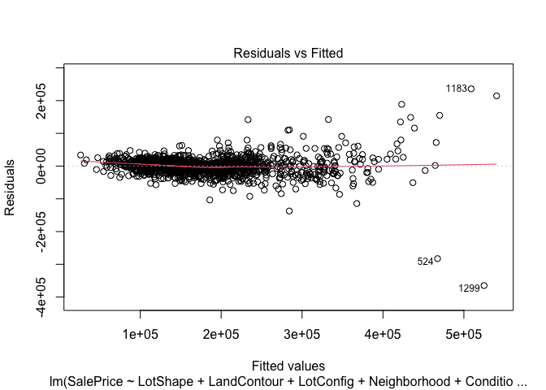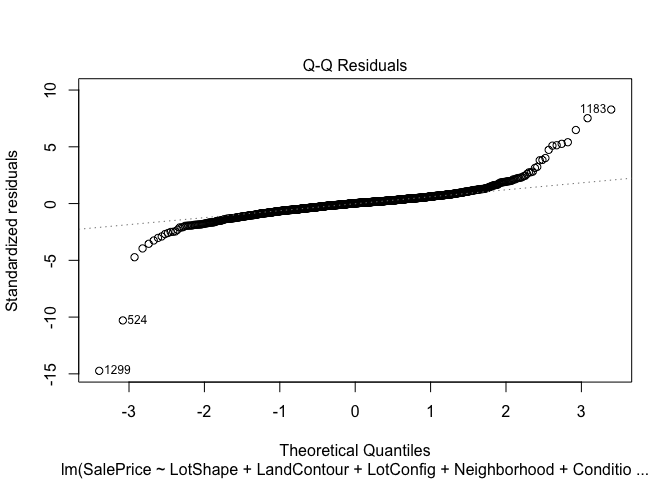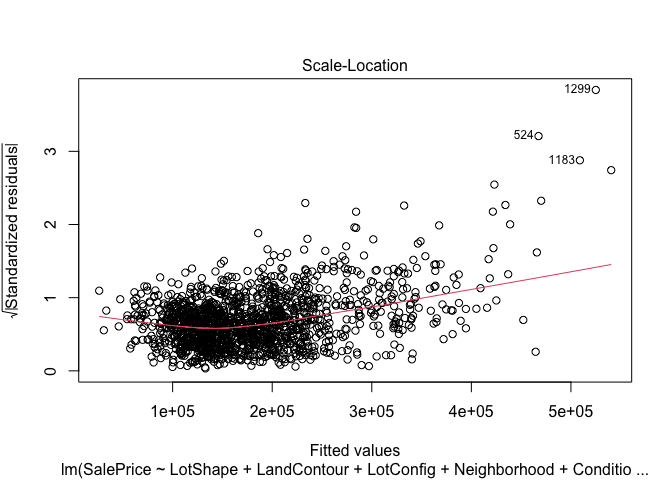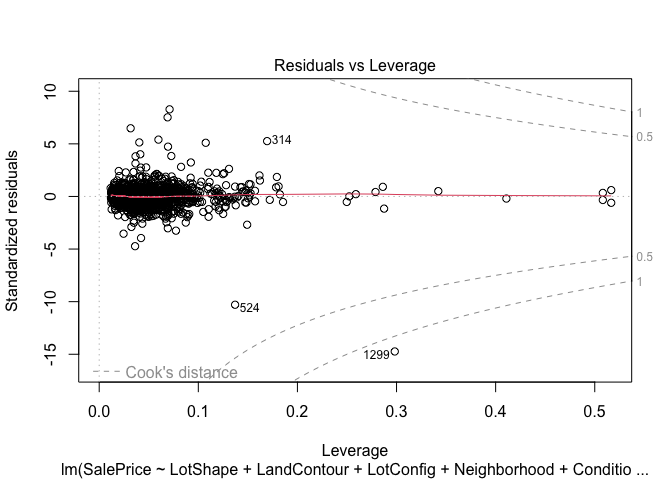

### Comparing to Simpler Model

The backward model selection kept the “Condition1” feature. However,
from the model summary above, we can see that none of the levels
(represented by dummy variables) related to this feature are
statistically significant (P\>0.05 for all level of Condition1).
Therefore, below I will test to see if the simpler model without the
‘Condition1’ feature may actually be better by comparing using an anova.

The anova model comparison gave a p-value of 0.025 which is less than
the alpha of 0.05 and we can conclude that the more complicated model
that includes ‘Condition1’ should be used.

``` r
backward.simpler <- lm(SalePrice ~ LotShape + LandContour + LotConfig + Neighborhood + BldgType + OverallQual + YearBuilt + YearRemodAdd + 
    ExterQual + BsmtQual + BsmtExposure + BsmtFinType1 + TotalBsmtSF + 
    CentralAir + GrLivArea + FullBath + KitchenQual + GarageArea + 
    HasFireplace, data = iowa.homes)

anova(backward.best,backward.simpler)
```

    ## Analysis of Variance Table
    ## 
    ## Model 1: SalePrice ~ LotShape + LandContour + LotConfig + Neighborhood + 
    ##     Condition1 + BldgType + OverallQual + YearBuilt + YearRemodAdd + 
    ##     ExterQual + BsmtQual + BsmtExposure + BsmtFinType1 + TotalBsmtSF + 
    ##     CentralAir + GrLivArea + FullBath + KitchenQual + GarageArea + 
    ##     HasFireplace
    ## Model 2: SalePrice ~ LotShape + LandContour + LotConfig + Neighborhood + 
    ##     BldgType + OverallQual + YearBuilt + YearRemodAdd + ExterQual + 
    ##     BsmtQual + BsmtExposure + BsmtFinType1 + TotalBsmtSF + CentralAir + 
    ##     GrLivArea + FullBath + KitchenQual + GarageArea + HasFireplace
    ##   Res.Df        RSS Df   Sum of Sq      F  Pr(>F)  
    ## 1   1385 1.2108e+12                                
    ## 2   1393 1.2262e+12 -8 -1.5354e+10 2.1954 0.02539 *
    ## ---
    ## Signif. codes:  0 '***' 0.001 '**' 0.01 '*' 0.05 '.' 0.1 ' ' 1

### Prepare training data for lasso and ridge regression

``` r
X.train = model.matrix(full.model,data=iowa.homes) # Saves the implied model design matrix, which includes dummy coding categorical predictors

X.train<-X.train[,-1] # Remove the first column, which is a column of ones.

y.train = iowa.homes$SalePrice # Saves the outcome variable as a vector
```

### Cross validated lasso selection

We can see from the cross validated lasso selection that we get a lambda
min of 546 and a lambda 1se of 3511. The model generated from the lambda
min removed far less variables than the lambda 1se model. This is
expected because as lambda increases, the penalty against parameter
coefficients is larger and more coefficients are reduced to 0 as lambda
gets larger.

``` r
set.seed(202211)

cvfit.lasso.train <- cv.glmnet(x=X.train, y=y.train,alpha=1)

plot(cvfit.lasso.train)
```

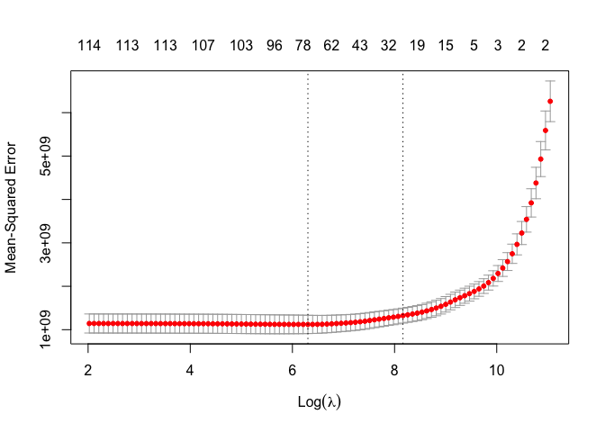

### cross validated lasso lambda min

``` r
# Display your lambda.min here
cvfit.lasso.train$lambda.min
```

    ## [1] 546.3418

``` r
# Display the coefficients associated with lambda.min here
coef(cvfit.lasso.train, s = "lambda.min")
```

    ## 118 x 1 sparse Matrix of class "dgCMatrix"
    ##                                s1
    ## (Intercept)         -2.051384e+05
    ## Id                  -4.679621e-02
    ## MSZoningFV           .           
    ## MSZoningRH           .           
    ## MSZoningRL           8.335815e+02
    ## MSZoningRM           .           
    ## LotShapeIR2          1.209627e+04
    ## LotShapeIR3         -1.712985e+04
    ## LotShapeReg          .           
    ## LandContourHLS       9.365717e+03
    ## LandContourLow       6.020937e+03
    ## LandContourLvl       5.401015e+03
    ## LotConfigCulDSac     8.911098e+03
    ## LotConfigFR2        -6.371433e+03
    ## LotConfigFR3        -1.285049e+04
    ## LotConfigInside      .           
    ## NeighborhoodBlueste  .           
    ## NeighborhoodBrDale   .           
    ## NeighborhoodBrkSide  1.534857e+03
    ## NeighborhoodClearCr  1.183263e+02
    ## NeighborhoodCollgCr  .           
    ## NeighborhoodCrawfor  2.353393e+04
    ## NeighborhoodEdwards -1.195437e+04
    ## NeighborhoodGilbert  .           
    ## NeighborhoodIDOTRR  -6.310051e+03
    ## NeighborhoodMeadowV  .           
    ## NeighborhoodMitchel -5.264499e+03
    ## NeighborhoodNAmes   -2.254112e+03
    ## NeighborhoodNoRidge  5.105366e+04
    ## NeighborhoodNPkVill  2.761407e+03
    ## NeighborhoodNridgHt  3.837577e+04
    ## NeighborhoodNWAmes   .           
    ## NeighborhoodOldTown -8.765743e+03
    ## NeighborhoodSawyer   .           
    ## NeighborhoodSawyerW  .           
    ## NeighborhoodSomerst  1.419219e+04
    ## NeighborhoodStoneBr  4.780151e+04
    ## NeighborhoodSWISU   -3.708532e+03
    ## NeighborhoodTimber   1.139311e+03
    ## NeighborhoodVeenker  2.380059e+04
    ## Condition1Feedr     -3.800739e+03
    ## Condition1Norm       5.966589e+03
    ## Condition1PosA       .           
    ## Condition1PosN      -2.138114e+03
    ## Condition1RRAe      -9.081993e+03
    ## Condition1RRAn       .           
    ## Condition1RRNe       .           
    ## Condition1RRNn       .           
    ## BldgType2fmCon      -5.740647e+03
    ## BldgTypeDuplex      -1.621339e+04
    ## BldgTypeTwnhs       -2.798903e+04
    ## BldgTypeTwnhsE      -2.093169e+04
    ## OverallQual          1.163487e+04
    ## YearBuilt            1.253809e+02
    ## YearRemodAdd         .           
    ## RoofStyleGable      -2.702160e+03
    ## RoofStyleGambrel     .           
    ## RoofStyleHip         1.551167e+03
    ## RoofStyleMansard     .           
    ## RoofStyleShed        .           
    ## MasVnrTypeBrkFace   -3.392462e+00
    ## MasVnrTypeNone       .           
    ## MasVnrTypeStone      2.160338e+03
    ## ExterQualFa          .           
    ## ExterQualGd          .           
    ## ExterQualTA         -3.035715e+03
    ## ExterCondFa         -5.295420e+03
    ## ExterCondGd          .           
    ## ExterCondPo          .           
    ## ExterCondTA          .           
    ## FoundationCBlock     .           
    ## FoundationPConc      .           
    ## FoundationSlab      -2.092229e+03
    ## FoundationStone      .           
    ## FoundationWood      -3.006868e+03
    ## BsmtQualFa          -1.424381e+04
    ## BsmtQualGd          -2.011753e+04
    ## BsmtQualNone        -2.210243e+03
    ## BsmtQualTA          -1.866120e+04
    ## BsmtExposureGd       2.269890e+04
    ## BsmtExposureMn       .           
    ## BsmtExposureNo      -5.955494e+03
    ## BsmtExposureNone    -1.600603e+04
    ## BsmtFinType1BLQ      .           
    ## BsmtFinType1GLQ      3.142195e+03
    ## BsmtFinType1LwQ     -6.154365e+03
    ## BsmtFinType1None    -2.732017e+02
    ## BsmtFinType1Rec     -1.450832e+03
    ## BsmtFinType1Unf     -1.030593e+04
    ## TotalBsmtSF          .           
    ## HeatingQCFa          .           
    ## HeatingQCGd         -1.876089e+03
    ## HeatingQCPo          .           
    ## HeatingQCTA         -2.990557e+03
    ## CentralAirY          6.548522e+03
    ## X1stFlrSF            .           
    ## X2ndFlrSF            .           
    ## GrLivArea            2.835787e+01
    ## FullBath             3.416641e+03
    ## KitchenQualFa       -1.969811e+04
    ## KitchenQualGd       -2.271153e+04
    ## KitchenQualTA       -2.490778e+04
    ## TotRmsAbvGrd         9.234024e+02
    ## GarageTypeAttchd     .           
    ## GarageTypeBasment   -5.799094e+03
    ## GarageTypeBuiltIn    1.986252e+03
    ## GarageTypeCarPort   -2.338061e+03
    ## GarageTypeDetchd     .           
    ## GarageTypeNone       .           
    ## GarageArea           2.513595e+01
    ## X3SsnPorch           .           
    ## YrSold               .           
    ## HasFireplaceyes      4.962261e+03
    ## HasPoolyes          -1.495211e+03
    ## HasBsmtyes           5.368848e+01
    ## TotalSF              1.359085e+01
    ## HouseAge            -1.132219e+01
    ## RemodelAge          -2.074818e+02

### cross validated lasso lambda 1se

``` r
# Display your lambda.1se here
cvfit.lasso.train$lambda.1se
```

    ## [1] 3511.925

``` r
# Display the coefficients associated with lambda.1se here
coef(cvfit.lasso.train, s = "lambda.1se")
```

    ## 118 x 1 sparse Matrix of class "dgCMatrix"
    ##                                s1
    ## (Intercept)         -117907.84409
    ## Id                        .      
    ## MSZoningFV                .      
    ## MSZoningRH                .      
    ## MSZoningRL                .      
    ## MSZoningRM            -6198.40858
    ## LotShapeIR2               .      
    ## LotShapeIR3               .      
    ## LotShapeReg            -311.26393
    ## LandContourHLS            .      
    ## LandContourLow            .      
    ## LandContourLvl            .      
    ## LotConfigCulDSac       2574.94380
    ## LotConfigFR2              .      
    ## LotConfigFR3              .      
    ## LotConfigInside           .      
    ## NeighborhoodBlueste       .      
    ## NeighborhoodBrDale        .      
    ## NeighborhoodBrkSide       .      
    ## NeighborhoodClearCr       .      
    ## NeighborhoodCollgCr       .      
    ## NeighborhoodCrawfor    4402.23924
    ## NeighborhoodEdwards       .      
    ## NeighborhoodGilbert       .      
    ## NeighborhoodIDOTRR        .      
    ## NeighborhoodMeadowV       .      
    ## NeighborhoodMitchel       .      
    ## NeighborhoodNAmes         .      
    ## NeighborhoodNoRidge   30304.95823
    ## NeighborhoodNPkVill       .      
    ## NeighborhoodNridgHt   31805.65154
    ## NeighborhoodNWAmes        .      
    ## NeighborhoodOldTown       .      
    ## NeighborhoodSawyer        .      
    ## NeighborhoodSawyerW       .      
    ## NeighborhoodSomerst       .      
    ## NeighborhoodStoneBr   23121.38744
    ## NeighborhoodSWISU         .      
    ## NeighborhoodTimber        .      
    ## NeighborhoodVeenker       .      
    ## Condition1Feedr           .      
    ## Condition1Norm         1603.70705
    ## Condition1PosA            .      
    ## Condition1PosN            .      
    ## Condition1RRAe            .      
    ## Condition1RRAn            .      
    ## Condition1RRNe            .      
    ## Condition1RRNn            .      
    ## BldgType2fmCon            .      
    ## BldgTypeDuplex            .      
    ## BldgTypeTwnhs         -1653.24261
    ## BldgTypeTwnhsE         -192.19582
    ## OverallQual           16716.32469
    ## YearBuilt                48.84161
    ## YearRemodAdd              .      
    ## RoofStyleGable            .      
    ## RoofStyleGambrel          .      
    ## RoofStyleHip           1725.10479
    ## RoofStyleMansard          .      
    ## RoofStyleShed             .      
    ## MasVnrTypeBrkFace         .      
    ## MasVnrTypeNone            .      
    ## MasVnrTypeStone           .      
    ## ExterQualFa               .      
    ## ExterQualGd               .      
    ## ExterQualTA           -3255.42426
    ## ExterCondFa               .      
    ## ExterCondGd               .      
    ## ExterCondPo               .      
    ## ExterCondTA               .      
    ## FoundationCBlock          .      
    ## FoundationPConc           .      
    ## FoundationSlab            .      
    ## FoundationStone           .      
    ## FoundationWood            .      
    ## BsmtQualFa                .      
    ## BsmtQualGd                .      
    ## BsmtQualNone              .      
    ## BsmtQualTA                .      
    ## BsmtExposureGd        16324.03952
    ## BsmtExposureMn            .      
    ## BsmtExposureNo        -4607.56717
    ## BsmtExposureNone          .      
    ## BsmtFinType1BLQ           .      
    ## BsmtFinType1GLQ        3775.96256
    ## BsmtFinType1LwQ           .      
    ## BsmtFinType1None          .      
    ## BsmtFinType1Rec           .      
    ## BsmtFinType1Unf       -2772.25696
    ## TotalBsmtSF               .      
    ## HeatingQCFa               .      
    ## HeatingQCGd               .      
    ## HeatingQCPo               .      
    ## HeatingQCTA               .      
    ## CentralAirY               .      
    ## X1stFlrSF                 .      
    ## X2ndFlrSF                 .      
    ## GrLivArea                21.21004
    ## FullBath                  .      
    ## KitchenQualFa             .      
    ## KitchenQualGd             .      
    ## KitchenQualTA         -2939.67637
    ## TotRmsAbvGrd              .      
    ## GarageTypeAttchd          .      
    ## GarageTypeBasment         .      
    ## GarageTypeBuiltIn         .      
    ## GarageTypeCarPort         .      
    ## GarageTypeDetchd          .      
    ## GarageTypeNone            .      
    ## GarageArea               32.92969
    ## X3SsnPorch                .      
    ## YrSold                    .      
    ## HasFireplaceyes        4803.01218
    ## HasPoolyes                .      
    ## HasBsmtyes                .      
    ## TotalSF                  22.09747
    ## HouseAge                -26.48892
    ## RemodelAge             -197.27223

### Cross Validated Ridge Regression

Below I perform the cross validated ridge regression. Here we can see
that the lambda min for the ridge regression was 6281 and the lambda 1se
was 123310. Many of the variables are pushed closer to zero in the
lambda 1se model. Again, this is because lambda determines the penalty
size against parameter coefficients and the larger the lambda, the
harsher the penalty. The difference between the ridge regression and the
lasso regression is in the penalty term, where the ridge regression
penalty term pushes coefficients closer to zero as lambda increases, the
lasso regression penalty term can get rid of coefficients all together.

``` r
set.seed(123456) # Sets a recoverable random seed so ensure that the same results will be obtained if the code is run again

cvfit.ridge.train= cv.glmnet(x=X.train, y=y.train,alpha=0) # Conduct cross-validated ridge regression

plot(cvfit.ridge.train)
```

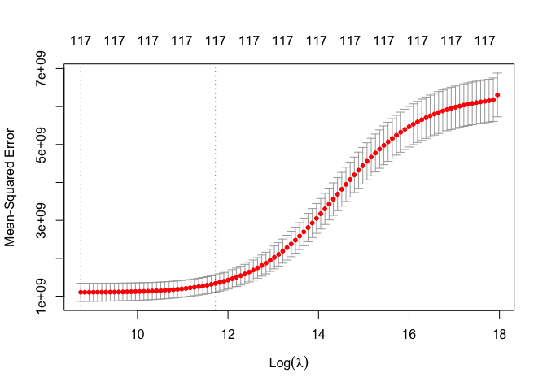

### cross validated ridge lambda min

``` r
cvfit.ridge.train$lambda.min # Display the lambda.min value
```

    ## [1] 6281.603

``` r
coef(cvfit.ridge.train, s = "lambda.min") # Display the "shrunk" coefficients associated with lambda.min
```

    ## 118 x 1 sparse Matrix of class "dgCMatrix"
    ##                                s1
    ## (Intercept)         172877.784261
    ## Id                      -1.516287
    ## MSZoningFV            7573.227531
    ## MSZoningRH             373.680642
    ## MSZoningRL            4770.838148
    ## MSZoningRM            2414.620295
    ## LotShapeIR2          13728.630623
    ## LotShapeIR3         -22123.011973
    ## LotShapeReg            282.307616
    ## LandContourHLS       14500.335252
    ## LandContourLow       10924.610146
    ## LandContourLvl        9433.943837
    ## LotConfigCulDSac      8984.838534
    ## LotConfigFR2        -10545.071014
    ## LotConfigFR3        -23397.840026
    ## LotConfigInside      -1448.891096
    ## NeighborhoodBlueste   6190.089076
    ## NeighborhoodBrDale    1962.181659
    ## NeighborhoodBrkSide   1618.365582
    ## NeighborhoodClearCr  -1166.112809
    ## NeighborhoodCollgCr  -4142.849428
    ## NeighborhoodCrawfor  21752.707144
    ## NeighborhoodEdwards -17814.158862
    ## NeighborhoodGilbert  -5947.886133
    ## NeighborhoodIDOTRR  -11773.229738
    ## NeighborhoodMeadowV  -3295.103151
    ## NeighborhoodMitchel -13292.980803
    ## NeighborhoodNAmes    -8154.548674
    ## NeighborhoodNoRidge  48391.542828
    ## NeighborhoodNPkVill   6601.462918
    ## NeighborhoodNridgHt  34525.820993
    ## NeighborhoodNWAmes   -6640.436723
    ## NeighborhoodOldTown -12103.372469
    ## NeighborhoodSawyer   -6838.740151
    ## NeighborhoodSawyerW    131.927746
    ## NeighborhoodSomerst  10303.138842
    ## NeighborhoodStoneBr  46143.353630
    ## NeighborhoodSWISU    -7490.099728
    ## NeighborhoodTimber     808.267984
    ## NeighborhoodVeenker  26765.023186
    ## Condition1Feedr      -6887.901962
    ## Condition1Norm        5393.696361
    ## Condition1PosA        2247.967117
    ## Condition1PosN       -7077.724618
    ## Condition1RRAe      -16817.429737
    ## Condition1RRAn        3642.231051
    ## Condition1RRNe      -12475.020418
    ## Condition1RRNn        4697.964826
    ## BldgType2fmCon       -9975.294231
    ## BldgTypeDuplex      -18100.528747
    ## BldgTypeTwnhs       -30761.564324
    ## BldgTypeTwnhsE      -21933.334391
    ## OverallQual           9402.381032
    ## YearBuilt               67.257558
    ## YearRemodAdd           102.510625
    ## RoofStyleGable       -1010.077819
    ## RoofStyleGambrel      5825.909116
    ## RoofStyleHip          5294.407105
    ## RoofStyleMansard      8146.624073
    ## RoofStyleShed        12388.337938
    ## MasVnrTypeBrkFace      570.057063
    ## MasVnrTypeNone        2321.161994
    ## MasVnrTypeStone       5854.739698
    ## ExterQualFa         -11980.558026
    ## ExterQualGd          -9593.183257
    ## ExterQualTA         -12264.260757
    ## ExterCondFa          -9810.465791
    ## ExterCondGd           -940.889411
    ## ExterCondPo         -34431.447439
    ## ExterCondTA          -2726.590953
    ## FoundationCBlock      2847.976937
    ## FoundationPConc       2643.256843
    ## FoundationSlab       -1213.901945
    ## FoundationStone       2001.032116
    ## FoundationWood      -10935.375791
    ## BsmtQualFa          -14540.288718
    ## BsmtQualGd          -18810.617025
    ## BsmtQualNone         -5498.896162
    ## BsmtQualTA          -16336.224909
    ## BsmtExposureGd       20872.776431
    ## BsmtExposureMn       -1586.006337
    ## BsmtExposureNo       -7809.884000
    ## BsmtExposureNone     -7150.368329
    ## BsmtFinType1BLQ         -6.024787
    ## BsmtFinType1GLQ       4772.526210
    ## BsmtFinType1LwQ      -8341.112125
    ## BsmtFinType1None     -5181.528348
    ## BsmtFinType1Rec      -3265.312212
    ## BsmtFinType1Unf     -10473.677313
    ## TotalBsmtSF              4.673334
    ## HeatingQCFa          -1076.031315
    ## HeatingQCGd          -4088.804347
    ## HeatingQCPo           5664.669599
    ## HeatingQCTA          -4974.738891
    ## CentralAirY           6936.794458
    ## X1stFlrSF               14.492750
    ## X2ndFlrSF               13.779631
    ## GrLivArea               17.470829
    ## FullBath              4916.510626
    ## KitchenQualFa       -14327.380775
    ## KitchenQualGd       -18083.924782
    ## KitchenQualTA       -18765.466652
    ## TotRmsAbvGrd          1937.147652
    ## GarageTypeAttchd      1754.278066
    ## GarageTypeBasment    -6527.609646
    ## GarageTypeBuiltIn     5434.963382
    ## GarageTypeCarPort    -4073.108346
    ## GarageTypeDetchd      1649.626449
    ## GarageTypeNone        5314.451119
    ## GarageArea              27.756939
    ## X3SsnPorch              20.551294
    ## YrSold                -233.099280
    ## HasFireplaceyes       5817.624780
    ## HasPoolyes           -4642.976047
    ## HasBsmtyes            5397.416901
    ## TotalSF                  8.336520
    ## HouseAge               -69.277710
    ## RemodelAge            -106.379190

``` r
summary(cvfit.ridge.train)
```

    ##            Length Class  Mode     
    ## lambda     100    -none- numeric  
    ## cvm        100    -none- numeric  
    ## cvsd       100    -none- numeric  
    ## cvup       100    -none- numeric  
    ## cvlo       100    -none- numeric  
    ## nzero      100    -none- numeric  
    ## call         4    -none- call     
    ## name         1    -none- character
    ## glmnet.fit  12    elnet  list     
    ## lambda.min   1    -none- numeric  
    ## lambda.1se   1    -none- numeric  
    ## index        2    -none- numeric

### cross validated ridge lambda 1se

``` r
cvfit.ridge.train$lambda.1se # Display the lambda.1se value
```

    ## [1] 123310.4

``` r
coef(cvfit.ridge.train, s = "lambda.1se") # Display the "shrunk" coefficients associated with lambda.1se
```

    ## 118 x 1 sparse Matrix of class "dgCMatrix"
    ##                                s1
    ## (Intercept)         -17992.956832
    ## Id                      -1.356333
    ## MSZoningFV            2639.222396
    ## MSZoningRH           -2197.129180
    ## MSZoningRL            3084.687723
    ## MSZoningRM           -3670.366297
    ## LotShapeIR2           7947.330619
    ## LotShapeIR3          -9546.517027
    ## LotShapeReg          -2562.661163
    ## LandContourHLS        6552.693642
    ## LandContourLow        3545.239049
    ## LandContourLvl          -2.714803
    ## LotConfigCulDSac      5295.920292
    ## LotConfigFR2         -4214.728707
    ## LotConfigFR3         -6024.493713
    ## LotConfigInside      -1274.884775
    ## NeighborhoodBlueste   -108.917885
    ## NeighborhoodBrDale   -2873.888275
    ## NeighborhoodBrkSide    930.341484
    ## NeighborhoodClearCr   2512.293739
    ## NeighborhoodCollgCr  -3519.138247
    ## NeighborhoodCrawfor  10155.689197
    ## NeighborhoodEdwards  -7828.947595
    ## NeighborhoodGilbert  -4776.174194
    ## NeighborhoodIDOTRR   -4779.380148
    ## NeighborhoodMeadowV  -6289.090806
    ## NeighborhoodMitchel  -5540.255325
    ## NeighborhoodNAmes    -3574.834406
    ## NeighborhoodNoRidge  24083.973825
    ## NeighborhoodNPkVill  -2260.055827
    ## NeighborhoodNridgHt  20029.105475
    ## NeighborhoodNWAmes   -2144.815540
    ## NeighborhoodOldTown  -3393.865367
    ## NeighborhoodSawyer   -4144.260837
    ## NeighborhoodSawyerW  -2147.779781
    ## NeighborhoodSomerst   3479.795329
    ## NeighborhoodStoneBr  22008.590270
    ## NeighborhoodSWISU    -3672.062429
    ## NeighborhoodTimber    2794.281425
    ## NeighborhoodVeenker  12189.879554
    ## Condition1Feedr      -4866.616286
    ## Condition1Norm        3181.453911
    ## Condition1PosA        3111.083646
    ## Condition1PosN       -1040.976296
    ## Condition1RRAe       -7302.302161
    ## Condition1RRAn         528.338021
    ## Condition1RRNe       -6220.155235
    ## Condition1RRNn        2403.608562
    ## BldgType2fmCon       -5147.075384
    ## BldgTypeDuplex       -7963.140297
    ## BldgTypeTwnhs        -9659.290448
    ## BldgTypeTwnhsE       -6395.621377
    ## OverallQual           5015.505333
    ## YearBuilt               63.493056
    ## YearRemodAdd           112.104601
    ## RoofStyleGable       -4474.608071
    ## RoofStyleGambrel       -94.498605
    ## RoofStyleHip          4897.650079
    ## RoofStyleMansard      1199.236300
    ## RoofStyleShed         1884.667546
    ## MasVnrTypeBrkFace      459.546875
    ## MasVnrTypeNone       -2330.883304
    ## MasVnrTypeStone       7206.215131
    ## ExterQualFa          -7389.613198
    ## ExterQualGd           1175.572405
    ## ExterQualTA          -6596.797675
    ## ExterCondFa          -4935.741434
    ## ExterCondGd            536.864544
    ## ExterCondPo         -13873.870328
    ## ExterCondTA             87.274410
    ## FoundationCBlock     -2663.866044
    ## FoundationPConc       3653.282599
    ## FoundationSlab       -2592.427647
    ## FoundationStone        105.914200
    ## FoundationWood       -4434.070089
    ## BsmtQualFa           -4513.090634
    ## BsmtQualGd           -3926.313865
    ## BsmtQualNone         -2956.492896
    ## BsmtQualTA           -4466.158394
    ## BsmtExposureGd       12328.154683
    ## BsmtExposureMn         389.155549
    ## BsmtExposureNo       -5256.465446
    ## BsmtExposureNone     -3227.680835
    ## BsmtFinType1BLQ       -793.281646
    ## BsmtFinType1GLQ       6246.097047
    ## BsmtFinType1LwQ      -2689.436898
    ## BsmtFinType1None     -2959.095961
    ## BsmtFinType1Rec      -1759.077024
    ## BsmtFinType1Unf      -3931.181146
    ## TotalBsmtSF              9.312373
    ## HeatingQCFa          -2324.149848
    ## HeatingQCGd          -2518.548806
    ## HeatingQCPo            310.945172
    ## HeatingQCTA          -3673.526453
    ## CentralAirY           5163.167670
    ## X1stFlrSF               11.580811
    ## X2ndFlrSF                8.261124
    ## GrLivArea               12.027081
    ## FullBath              5318.846667
    ## KitchenQualFa        -4399.518662
    ## KitchenQualGd        -2098.490410
    ## KitchenQualTA        -6072.155337
    ## TotRmsAbvGrd          2751.688384
    ## GarageTypeAttchd      1868.221676
    ## GarageTypeBasment    -4147.094426
    ## GarageTypeBuiltIn     7329.669630
    ## GarageTypeCarPort    -7132.913897
    ## GarageTypeDetchd     -2572.864326
    ## GarageTypeNone       -3810.836923
    ## GarageArea              22.475599
    ## X3SsnPorch              10.046845
    ## YrSold                -134.237906
    ## HasFireplaceyes       7103.334969
    ## HasPoolyes            5229.322333
    ## HasBsmtyes            2975.225564
    ## TotalSF                  7.539493
    ## HouseAge               -63.989771
    ## RemodelAge            -113.043653

### Setting up test and validate data

Below I load in the test-validate data set and run the necessary
pre-processing functions on this data set.

``` r
dat.test.valid <- read.csv("data/test.csv", header=TRUE, sep=",")
dat.saleprice <- read.csv("data/sample_submission.csv")

dat.test.valid <- merge(dat.test.valid, dat.saleprice)

# call necessary functions on dat.test 
dat.test.valid <- func_new_binary_vars(dat.test.valid)

bin_cols_to_plot = c("HasMiscFeature", "HasAlley", "HasFence", "HasFireplace", "HasPool", "HasBsmt", "Street", "Utilities", "CentralAir")

# turn new binary variables to factor type
dat.test.valid[bin_cols_to_plot] <- lapply(dat.test.valid[bin_cols_to_plot], as.factor)

dat.test.valid <- func_remove_features_pt2(dat.test.valid)
dat.test.valid <- func_replace_miss_data(dat.test.valid)
dat.test.valid <- func_replace_miss_data_pt2(dat.test.valid)
dat.test.valid <- func_cat_to_factor(dat.test.valid)
dat.test.valid <- func_feature_eng(dat.test.valid)
dat.test.valid <- func_remove_features_pt3(dat.test.valid)
```

### split data into validate and test 50/50

Below I split the test and validate data 50:50

``` r
n <- nrow(dat.test.valid) 

set.seed(202211)
tv.split <- rep(0:1,c(round(n*.5),n-round(n*.5)))
table(tv.split)   
```

    ## tv.split
    ##   0   1 
    ## 730 729

``` r
dat.test <- dat.test.valid[tv.split==1,] 
dat.valid <- dat.test.valid[tv.split==0,] 
```

### Prepare validate data for regression analysis

``` r
X.valid <- model.matrix(full.model,data=dat.valid) # Saves the implied model design matrix, which includes dummy coding categorical predictors

X.valid<-X.valid[,-1] # Remove the first column, which is a column of ones.

# head(X.test) # Confirm that all variables are present and in the expected form - everything looks good!

y.valid = dat.valid$SalePrice # Save the outcome variable as a vector
```

### Running models on validate data

``` r
backward.best.preds <- predict(backward.best, newx=X.valid)

cvlasso.lambda.min.preds <- predict(cvfit.lasso.train, newx=X.valid, s = cvfit.lasso.train$lambda.min)

cvlasso.lambda.1se.preds <- predict(cvfit.lasso.train, newx=X.valid, s = cvfit.lasso.train$lambda.1se)

cvridge.lambda.min.preds <- predict(cvfit.ridge.train, newx=X.valid, s = cvfit.ridge.train$lambda.min)

cvridge.lambda.1se.preds <- predict(cvfit.ridge.train, newx=X.valid, s = cvfit.ridge.train$lambda.1se)
```

### Comparing root mean squared error from models

Below I compare the root mean square error between the different models
that I have created. We can see that the ridge 1se cross validated model
has the lowest mean squared error term (58,818) and this is the model
that I will select based on this value. The 58,818 means that the model
estimations of sale price in the validation data set, were off by
$58,818 on average.

Its possible that the ridge model fits best because of the large amount
of features in the data set and there is likely some correlation between
more of the variables than I was able to identify on my own earlier.
This is an example of where the ridge model can be useful as it reduces
coefficients close to zero, but does not get rid of them as with lasso
regression. The lambda 1se being better than the lambda min is likely
due to the large amount of variance and low bias in the training model,
a larger lambda is likely better for predictions as it introduces more
bias while decreasing variance to regularize the model.

``` r
backward.best.valid <- sqrt(mean((backward.best.preds-y.valid)^2))
backward.best.valid
```

    ## [1] 75501.15

``` r
rmspe.cvlasso.min.valid <-  sqrt(mean((cvlasso.lambda.min.preds-y.valid)^2)) 
rmspe.cvlasso.min.valid
```

    ## [1] 70218.12

``` r
rmspe.cvlasso.1se.valid <-  sqrt(mean((cvlasso.lambda.1se.preds-y.valid)^2)) 
rmspe.cvlasso.1se.valid
```

    ## [1] 63678.86

``` r
rmspe.cvridge.min.valid <-  sqrt(mean((cvridge.lambda.min.preds-y.valid)^2)) 
rmspe.cvridge.min.valid
```

    ## [1] 70647.61

``` r
rmspe.cvridge.1se.valid <-  sqrt(mean((cvridge.lambda.1se.preds-y.valid)^2)) 
rmspe.cvridge.1se.valid
```

    ## [1] 58814.61

### Testing the Model

Below I first prepare the testing data for predicting and then I use the
selected cross validated ridge lambda 1se model to make SalePrice
predictions using the test data. Finally I get the mean squared error of
the predictions ($60,141.44), and then I create histograms of the
predicted sale price overlayed by a histogram of the actual sale price
from the test data set.

``` r
X.test <- model.matrix(full.model,data=dat.test) # Saves the implied model design matrix, which includes dummy coding categorical predictors

X.test<-X.test[,-1] # Remove the first column, which is a column of ones.

y.test = dat.test$SalePrice # Save the outcome variable as a vector
```

``` r
cvridge.lambda.1se.preds.test <- predict(cvfit.ridge.train, newx=X.test, s = cvfit.ridge.train$lambda.1se)

rmspe.cvridge.1se.test <-  sqrt(mean((cvridge.lambda.1se.preds.test-y.test)^2)) 
rmspe.cvridge.1se.test
```

    ## [1] 60141.44

``` r
dat.test['PredSalePrice'] <- cvridge.lambda.1se.preds.test
ggplot(data = dat.test) +
 geom_histogram(aes(x = SalePrice, fill = "Actual Sale Price"), alpha = 0.5) +
 geom_histogram(aes(x = PredSalePrice, fill = "Predicted Sale Price"), alpha = 0.5) 
```

    ## `stat_bin()` using `bins = 30`. Pick better value with `binwidth`.
    ## `stat_bin()` using `bins = 30`. Pick better value with `binwidth`.

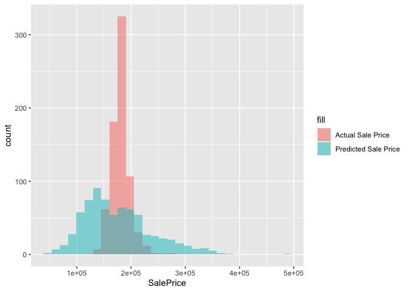

``` r
mean(dat.test$SalePrice)
```

    ## [1] 180775.3

``` r
mean(dat.test$PredSalePrice)
```

    ## [1] 175490.7

``` r
mean(dat.test$SalePrice) - mean(dat.test$PredSalePrice)
```

    ## [1] 5284.549

### Conclusion

The root mean squared error of the model predictions of home sale price
using the test data set was 60141.44. This means that the average
difference between the model prediction and the actual sale price was
$60,141. We can also see the distribution of the predicted sale price
and the actual sale price in the test data in the visual above. Clearly,
the shape of the distributions are noticably different. The predicted
sale price distribution has a relatively large right tail compared with
the actual sale price distribution and the actual sale price
distribution has a larger portion of its data centered around its mean.
While the average difference between the predicted values and the actual
values was 60,141, the mean of the predicated sale price was relatively
close to the mean of the actual sale price. The actual mean was $180,775
and the predicted mean was $175,490, only off by $5,284.

### Discussion

While this model is not perfect, I still believe it could be a useful
tool for getting a ‘ballpark’ estimate of home prices in Ames, Iowa. In
the future, I would have liked to find a way feature engineer and deal
with NA values in a more consolidated, streamlined manner. However, I
have much to learn about feature engineering and handling missing data,
and I look forward to becoming better at this. I also would have liked
to have looked at some transformations (perhaps a box-cox
transformation) of the feature of interest (SalePrice) to explore how a
model with such a transformation would compare to the original model.
Finally, looking for interaction between terms would be another useful
step to consider in the future to get a more accurate model.
